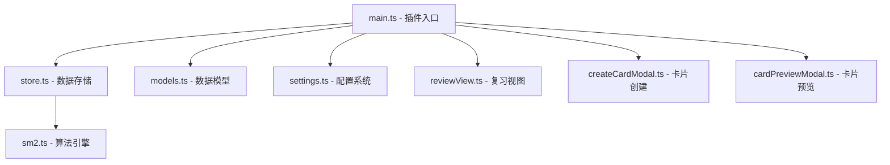

NewAnki 是一个基于 Obsidian 平台的间隔重复复习插件，采用经典的 Anki SM-2 算法实现。该插件旨在将 Obsidian 的笔记系统与高效的记忆卡片复习相结合，为知识管理提供科学的学习工具。

## 项目定位与核心价值

NewAnki 插件的主要目标是为 Obsidian 用户提供无缝的间隔重复学习体验。通过将笔记内容转化为可复习的卡片，用户可以更有效地记忆和掌握知识要点。插件的核心价值体现在以下几个方面：

- **无缝集成**: 与 Obsidian 编辑器深度集成，支持右键菜单快速创建卡片
- **科学算法**: 采用成熟的 SM-2 间隔重复算法，优化记忆效果
- **多模式复习**: 支持全局复习、本地文件复习等多种复习模式
- **可视化界面**: 提供状态栏指示器、徽章系统等直观的进度反馈

Sources: [manifest.json](manifest.json#L1-L10)

## 技术架构概览

NewAnki 采用模块化架构设计，主要包含以下几个核心组件：



每个模块承担着特定的职责：
- **main.ts**: 插件主入口，负责生命周期管理和组件注册
- **store.ts**: 卡片数据的持久化存储和状态管理
- **models.ts**: 定义卡片、复习记录等核心数据模型
- **settings.ts**: 用户配置和算法参数设置
- **reviewView.ts**: 复习界面的自定义视图实现
- **createCardModal.ts**: 卡片创建模态框组件
- **cardPreviewModal.ts**: 卡片预览和编辑功能

Sources: [src/main.ts](src/main.ts#L1-L30)

## 核心数据模型

插件定义了清晰的数据结构来管理复习系统：

| 模型类型 | 主要字段 | 用途说明 |
|---------|---------|---------|
| CardData | cardId, question, answer, sourceFile | 存储卡片的基本内容和元数据 |
| ReviewLogData | cardId, rating, reviewDatetime | 记录每次复习的评分和时间 |
| PluginSettings | learningSteps, intervals, ease | 配置算法的各项参数 |
| State枚举 | New, Learning, Review, Relearning | 定义卡片的不同学习状态 |
| Rating枚举 | Again, Hard, Good, Easy | 定义复习时的评分选项 |

这些数据模型为整个复习系统提供了类型安全的基础，确保数据的一致性和可维护性。

Sources: [src/models.ts](src/models.ts#L1-L50)

## 开发环境与构建工具

项目采用现代化的 TypeScript 开发栈，配置了完整的开发工具链：

- **TypeScript**: 提供类型安全和更好的开发体验
- **esbuild**: 快速的模块打包工具
- **ESLint**: 代码质量检查和规范执行
- **Obsidian API**: 与 Obsidian 平台深度集成

构建脚本支持开发模式和发布模式，确保代码质量和部署效率：

```bash
npm run dev    # 开发模式构建
npm run build  # 生产环境构建
npm run lint   # 代码质量检查
```

Sources: [package.json](package.json#L1-L30)

## 功能特性概览

NewAnki 插件提供了一系列实用功能，满足不同场景下的复习需求：

### 核心复习功能
- **间隔重复算法**: 基于 SM-2 的科学记忆算法
- **多状态管理**: 支持新建、学习、复习、重新学习四种状态
- **进度跟踪**: 详细的复习记录和统计信息

### 用户界面集成
- **状态栏指示器**: 实时显示待复习卡片数量
- **功能区图标**: 快速访问全局复习和预览功能
- **右键菜单**: 在编辑器中快速创建复习卡片

### 配置灵活性
- **算法参数可调**: 支持自定义学习步骤和间隔参数
- **多复习模式**: 全局复习和文件级复习可选
- **界面定制**: 可根据个人偏好调整显示方式

## 学习路径建议

对于初学者开发者，建议按照以下顺序深入了解项目：

1. **[快速入门](2-kuai-su-ru-men)** - 掌握基本的使用方法和开发环境搭建
2. **[核心数据模型](7-he-xin-shu-ju-mo-xing)** - 理解插件的核心数据结构
3. **[SM-2算法实现](8-sm-2suan-fa-shi-xian)** - 学习间隔重复算法的实现原理
4. **[架构设计](6-jia-gou-she-ji)** - 深入了解插件的整体架构设计

通过系统性的学习，开发者可以快速掌握插件的核心概念和技术实现，为进一步的功能扩展和定制开发奠定基础。