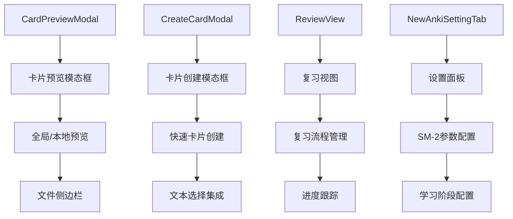
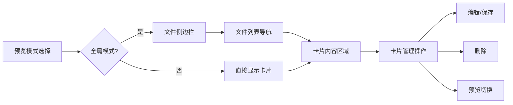
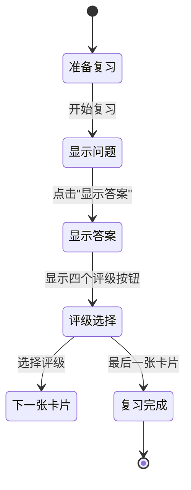

NewAnki 插件的用户界面组件采用模块化设计，提供了卡片预览、复习流程、设置管理等核心功能。这些组件基于 Obsidian 的 UI 框架构建，遵循插件开发的最佳实践。

## 组件架构概览

NewAnki 的用户界面采用分层架构，主要包含四个核心组件：



**组件职责分工**：
- **CardPreviewModal**: 提供卡片预览和管理功能，支持全局和本地两种模式
- **CreateCardModal**: 处理从选中文本快速创建卡片的流程
- **ReviewView**: 实现完整的复习流程界面，包含进度跟踪和评级系统
- **NewAnkiSettingTab**: 配置 SM-2 算法的各项参数

Sources: [cardPreviewModal.ts](src/cardPreviewModal.ts#L14-L33), [createCardModal.ts](src/createCardModal.ts#L4-L26), [reviewView.ts](src/reviewView.ts#L17-L28), [settings.ts](src/settings.ts#L4-L10)

## 卡片预览模态框 (CardPreviewModal)

### 架构设计

CardPreviewModal 是功能最丰富的界面组件，采用**双模式设计**：全局模式和本地模式。全局模式显示所有文件的卡片，本地模式仅显示当前文件的卡片。



**核心功能特性**：
- **动态布局切换**: 根据预览范围自动调整界面布局
- **实时预览**: 支持 Markdown 渲染预览，可切换显示/隐藏
- **批量操作**: 支持重置文件内所有卡片的复习进度
- **内联编辑**: 直接在预览界面编辑卡片内容

Sources: [cardPreviewModal.ts](src/cardPreviewModal.ts#L46-L110)

### 实现模式

组件采用**响应式渲染模式**，通过 `render()` 方法统一管理界面更新：

```typescript
private render(): void {
    const { contentEl } = this;
    contentEl.empty();
    
    // 1. 渲染头部信息
    this.renderHeader(contentEl);
    
    // 2. 渲染工具栏
    this.renderToolbar(contentEl);
    
    // 3. 根据模式渲染内容区域
    if (this.previewScope === "global") {
        this.renderGlobalLayout(contentEl, cards);
    } else {
        this.renderCardList(contentEl, cards);
    }
}
```

**渲染优化策略**：
- **增量更新**: 只更新发生变化的部分，避免全量重绘
- **状态管理**: 使用内部状态控制表单显示/隐藏
- **事件委托**: 合理使用事件监听器，避免内存泄漏

Sources: [cardPreviewModal.ts](src/cardPreviewModal.ts#L174-L280)

## 复习视图 (ReviewView)

### 复习流程状态机

ReviewView 实现了完整的复习状态机，管理从开始复习到完成的整个流程：



**会话管理机制**：
```typescript
interface ReviewSession {
    cards: CardData[];          // 当前会话的卡片列表
    currentIndex: number;       // 当前卡片索引
    total: number;             // 总卡片数
    reviewed: number;          // 已复习卡片数
    isGlobal: boolean;         // 是否为全局复习
    sourceFile: string | null; // 来源文件路径
}
```

Sources: [reviewView.ts](src/reviewView.ts#L8-L15)

### 交互式编辑功能

ReviewView 实现了**内联 Markdown 编辑器**，支持实时预览和编辑：

**编辑模式切换流程**：
1. **预览模式**: 显示渲染后的 Markdown 内容
2. **点击进入编辑**: 显示文本输入框，自动调整高度
3. **保存退出**: 按 Ctrl+Enter 或失去焦点时保存
4. **取消编辑**: 按 Escape 键取消修改

**技术实现亮点**：
- **自动高度调整**: 文本区域根据内容自动调整高度
- **防抖渲染**: 避免频繁的 Markdown 渲染操作
- **错误处理**: 渲染失败时显示友好错误信息

Sources: [reviewView.ts](src/reviewView.ts#L192-L298)

## 设置面板 (NewAnkiSettingTab)

### 参数分类组织

设置面板将 SM-2 算法参数分为两大类别，便于用户理解：

| 参数类别 | 包含参数 | 用途说明 |
|---------|---------|---------|
| 学习阶段 | 学习步骤、毕业间隔、简单间隔 | 控制新卡片的学习流程 |
| 复习参数 | 重学步骤、初始难度因子、最大间隔等 | 控制复习间隔和难度调整 |

**参数验证机制**：
```typescript
text.onChange(async (value) => {
    const steps = value
        .split(",")
        .map(s => parseFloat(s.trim()))
        .filter(n => !isNaN(n) && n > 0);  // 数值验证
    this.plugin.store.settings.learningSteps = steps;
    await this.plugin.store.save();
});
```

Sources: [settings.ts](src/settings.ts#L20-L35)

## 视觉设计系统

### CSS 类名命名规范

NewAnki 采用**BEM 命名规范**，确保样式的一致性和可维护性：

**组件级样式**：
- `.newanki-review-container` - 复习容器
- `.newanki-card-preview-modal` - 预览模态框
- `.newanki-setting-tab` - 设置面板

**元素级样式**：
- `.newanki-progress-bar` - 进度条容器
- `.newanki-progress-fill` - 进度条填充
- `.newanki-rating-btn` - 评级按钮

**修饰符样式**：
- `.newanki-btn-good` - 良好评级按钮
- `.newanki-btn-hard` - 困难评级按钮
- `.newanki-btn-again` - 重来评级按钮

### 响应式设计特性

**自适应布局**：
```css
.newanki-review-container {
    padding: 20px;
    max-width: 700px;
    margin: 0 auto;  /* 居中布局 */
    font-family: var(--font-interface);  /* 使用主题字体 */
}
```

**交互状态反馈**：
```css
.newanki-editable-preview:hover {
    border-color: var(--interactive-accent);  /* 悬停效果 */
    transition: border-color 0.15s ease;      /* 平滑过渡 */
}
```

Sources: [styles.css](styles.css#L26-L59)

## 组件间通信模式

### 事件驱动架构

用户界面组件采用**观察者模式**进行通信，确保数据一致性：

**数据变更通知**：
```typescript
// 在卡片操作后通知相关组件更新
private notifyDataChanged(): void {
    this.onDataChanged?.();
}

// 复习视图中的数据同步
this.onCardsChanged?.();
```

**视图状态同步**：
- 卡片创建/删除后自动刷新预览界面
- 复习进度更新后同步状态栏显示
- 设置变更后立即生效，无需重启插件

Sources: [cardPreviewModal.ts](src/cardPreviewModal.ts#L265-L272), [reviewView.ts](src/reviewView.ts#L348-L369)

## 性能优化策略

### 渲染优化

1. **虚拟滚动**: 对大量卡片列表实现虚拟滚动
2. **懒加载**: Markdown 预览按需渲染
3. **缓存机制**: 重复使用的 DOM 元素进行缓存

### 内存管理

1. **事件监听器清理**: 在组件卸载时清理所有事件监听器
2. **DOM 引用释放**: 及时释放不再使用的 DOM 元素引用
3. **定时器管理**: 合理使用 setTimeout 和清理机制

通过以上架构设计，NewAnki 的用户界面组件提供了流畅、直观的用户体验，同时保持了良好的可维护性和扩展性。