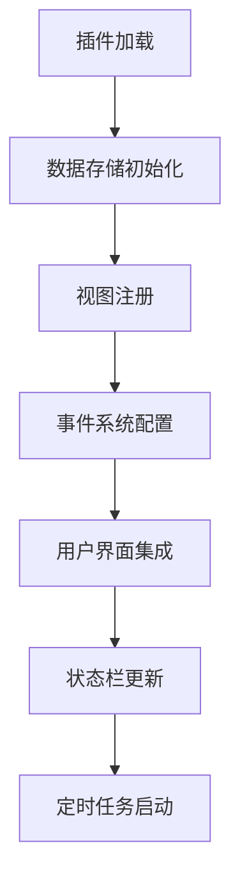
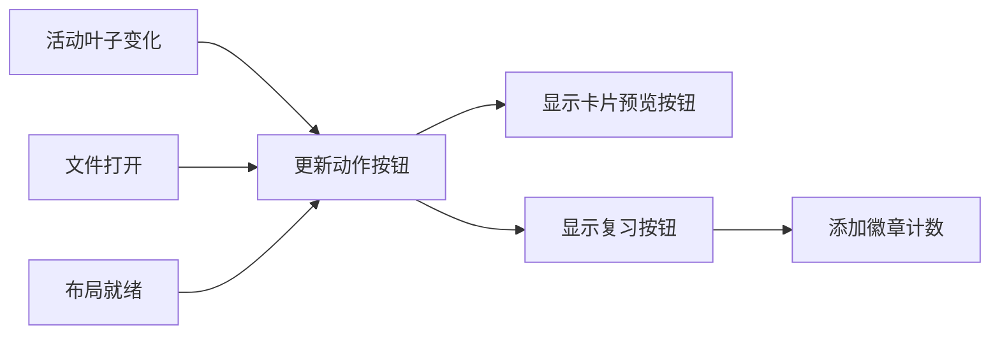

本文档详细分析 NewAnki 插件的 Obsidian 平台集成机制和事件处理架构，涵盖插件生命周期管理、用户界面集成、文件事件处理以及状态同步机制。

## 插件生命周期与核心架构

NewAnki 插件采用经典的 Obsidian 插件架构，通过 `NewAnkiPlugin` 类继承自 `Plugin` 基类实现完整的生命周期管理。插件在 `onload()` 方法中完成所有初始化工作，包括数据加载、视图注册、事件监听和用户界面组件的创建。

**核心初始化流程**：
- 数据存储初始化：创建 `CardStore` 实例并加载持久化数据
- 自定义视图注册：注册复习视图 `ReviewView` 用于卡片复习界面
- 事件系统注册：配置上下文菜单、文件菜单、命令系统和文件事件监听
- 用户界面集成：创建功能区图标、状态栏组件和动作按钮



Sources: [main.ts](src/main.ts#L13-L47)

## 事件系统架构

插件实现了多层次的事件处理机制，涵盖用户交互、文件操作和状态变化等场景。

### 用户交互事件

**上下文菜单集成**：通过 `editor-menu` 事件在文本编辑器右键菜单中添加"制作卡片"选项，支持选中文本的快速卡片创建。

**文件菜单集成**：利用 `file-menu` 事件为 Markdown 文件添加卡片预览和复习功能入口，动态显示卡片数量和到期状态。

**命令系统**：注册了三个核心命令：
- `create-card`: 通过快捷键创建卡片
- `review-current-file`: 复习当前文件的到期卡片
- `review-global-deck`: 启动全局复习

Sources: [main.ts](src/main.ts#L61-L197)

### 文件系统事件

插件监听文件重命名和删除事件，确保卡片数据与文件系统状态保持一致：

| 事件类型 | 处理逻辑 | 数据影响 |
|---------|---------|---------|
| `rename` | 更新卡片关联的文件路径 | 迁移对应文件的所有卡片数据 |
| `delete` | 清理已删除文件的卡片 | 移除对应文件的所有卡片记录 |

Sources: [main.ts](src/main.ts#L278-L298) [store.ts](src/store.ts#L134-L184)

### 工作区状态事件

通过 `active-leaf-change` 和 `file-open` 事件动态更新界面状态，实现智能的动作按钮显示：



Sources: [main.ts](src/main.ts#L202-L254)

## 用户界面集成策略

### 功能区图标系统

插件在 Obsidian 左侧功能区添加了两个图标：
- **全局复习图标**：带徽章显示待复习卡片总数
- **全局卡片预览器**：快速访问所有卡片的预览界面

### 状态栏集成

状态栏实时显示全局待复习卡片数量，通过定时任务每30秒更新一次，确保信息的及时性。

### 动作按钮系统

在文件编辑器的标题栏添加动态动作按钮：
- **局部卡片预览按钮**：显示当前文件的卡片总数
- **复习卡片按钮**：显示当前文件的到期卡片数量，并添加徽章提示

Sources: [main.ts](src/main.ts#L28-L46) [main.ts](src/main.ts#L218-L276)

## 数据同步与状态管理

### 统一状态变更处理

插件采用中心化的状态变更处理机制，通过 `handleCardsChanged()` 方法统一协调所有界面组件的更新：

```typescript
private handleCardsChanged(): void {
    this.updateStatusBar();          // 更新状态栏
    this.updateReviewAction();       // 更新动作按钮
    this.updateGlobalReviewRibbonBadge(); // 更新功能区徽章
}
```

### 存储层事件处理

`CardStore` 类负责处理文件系统变化对卡片数据的影响，包括：
- **文件重名处理**：递归更新所有子文件的卡片路径
- **文件删除清理**：清理文件及其子目录的所有卡片记录
- **数据持久化**：所有变更后自动保存到插件数据存储

Sources: [main.ts](src/main.ts#L54-L58) [store.ts](src/store.ts#L134-L184)

## 视图系统集成

### 自定义视图注册

插件注册了 `REVIEW_VIEW_TYPE` 自定义视图类型，用于在分割布局中显示卡片复习界面：

```typescript
this.registerView(
    REVIEW_VIEW_TYPE,
    (leaf) => new ReviewView(leaf, this.store, () => this.handleCardsChanged())
);
```

### 布局管理

复习功能采用智能的布局管理策略：
- 自动分离当前活动叶子创建复习视图
- 在垂直分割中保持源文件可见
- 复习完成后自动清理视图叶子

Sources: [main.ts](src/main.ts#L17-L20) [main.ts](src/main.ts#L339-L353)

## 事件处理最佳实践

### 资源清理机制

插件在 `onunload()` 方法中实现了完整的资源清理：
- 分离所有复习视图叶子
- 清除动作按钮和事件监听器
- 确保无内存泄漏

### 错误边界处理

所有事件处理都包含适当的错误边界：
- 空选择检查防止无效操作
- 文件类型验证确保操作安全
- 状态一致性检查避免异常状态

Sources: [main.ts](src/main.ts#L49-L52)

通过这种系统化的事件处理架构，NewAnki 插件实现了与 Obsidian 平台的无缝集成，提供了流畅的用户体验和可靠的数据一致性保障。