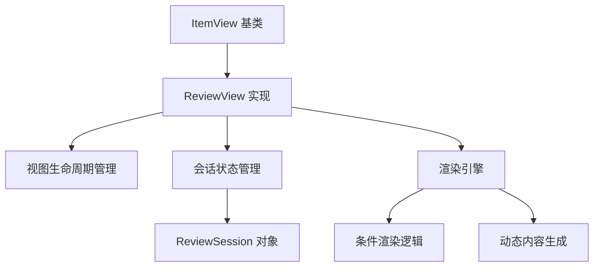
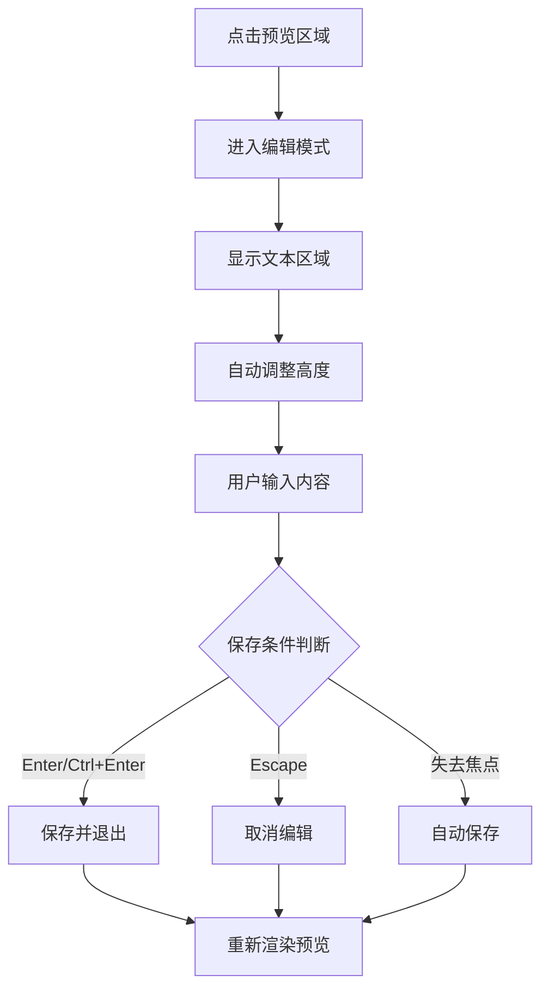

NewAnki 插件的自定义视图系统为卡片复习提供了专业的学习体验界面。本章详细解析复习视图的架构设计、交互模式和扩展机制，帮助开发者理解如何构建和维护 Obsidian 插件中的自定义工作区视图。

## 视图架构与生命周期

复习视图基于 Obsidian 的 `ItemView` 类构建，实现了完整的视图生命周期管理。核心架构采用分层渲染模式，将视图状态、数据模型和用户界面清晰分离。

**视图类型注册与标识**：每个自定义视图必须定义唯一的视图类型标识符 `REVIEW_VIEW_TYPE = "newanki-review-view"`，用于在 Obsidian 工作区中注册和识别视图实例。Sources: [reviewView.ts](src/reviewView.ts#L6-L6)

**生命周期方法实现**：
- `getViewType()`: 返回视图类型标识符
- `getDisplayText()`: 定义视图在标签页中显示的文本
- `getIcon()`: 设置视图的图标标识
- `onOpen()`: 视图打开时的初始化逻辑
- `onClose()`: 视图关闭时的清理工作



复习会话通过 `ReviewSession` 接口进行状态管理，跟踪当前复习进度、卡片列表和源文件信息，确保复习过程的连续性和可恢复性。Sources: [reviewView.ts](src/reviewView.ts#L8-L15)

## 分层渲染引擎

复习视图采用智能的条件渲染系统，根据会话状态动态切换不同的界面模式，提供流畅的用户体验。

### 渲染状态机

视图渲染遵循严格的状态转换逻辑：

| 状态条件 | 渲染模式 | 用户界面组件 |
|---------|---------|-------------|
| `session === null` | 空状态 | 欢迎界面和操作指引 |
| `cards.length === 0` | 无卡片状态 | 完成提示和统计信息 |
| `currentIndex >= cards.length` | 复习完成 | 总结界面和关闭选项 |
| 正常复习流程 | 卡片展示 | 问题/答案区域和评分按钮 |

Sources: [reviewView.ts](src/reviewView.ts#L60-L85)

### 进度跟踪系统

进度条组件采用双层级设计：文本标签显示具体数字统计，视觉进度条提供直观的完成度反馈。进度计算基于已复习卡片数与总卡片数的比例，实时更新视觉效果。

```css
.newanki-progress-bar {
    width: 100%;
    height: 6px;
    background: var(--background-modifier-border);
    border-radius: 3px;
    overflow: hidden;
}

.newanki-progress-fill {
    height: 100%;
    background: var(--interactive-accent);
    border-radius: 3px;
    transition: width 0.3s ease;
}
```

Sources: [styles.css](styles.css#L46-L59)

## 可编辑 Markdown 内容渲染

复习视图的核心创新在于实现了内联可编辑的 Markdown 内容渲染系统，支持用户在复习过程中直接修改卡片内容。

### 双模式编辑界面

系统在预览模式和编辑模式之间无缝切换：

**预览模式**：使用 Obsidian 的 `MarkdownRenderer` 将 Markdown 内容渲染为富文本，支持完整的 Markdown 语法和插件扩展。
**编辑模式**：切换到纯文本编辑器，提供语法高亮和自动调整高度的文本区域。

Sources: [reviewView.ts](src/reviewView.ts#L192-L298)

### 编辑交互流程



编辑系统实现了智能的保存策略：
- **即时保存**：失去焦点时自动保存修改
- **快捷键支持**：Ctrl+Enter 快速保存，Escape 取消编辑
- **防抖处理**：避免频繁的保存操作影响性能

## 评分系统与 SM-2 算法集成

评分按钮系统将用户反馈与间隔重复算法深度集成，提供科学的学习进度管理。

### 多维度评分选项

系统提供四个评分等级，每个等级对应不同的学习间隔和难度评估：

| 评分等级 | 标签文本 | CSS 类名 | 颜色主题 | 算法含义 |
|---------|---------|----------|----------|----------|
| Rating.Again | 重来 | newanki-btn-again | 红色 (#e74c3c) | 重新学习当前卡片 |
| Rating.Hard | 困难 | newanki-btn-hard | 橙色 (#e67e22) | 难度较高，缩短间隔 |
| Rating.Good | 良好 | newanki-btn-good | 绿色 (#27ae60) | 正常掌握，标准间隔 |
| Rating.Easy | 简单 | newanki-btn-easy | 蓝色 (#2980b9) | 轻松掌握，延长间隔 |

Sources: [reviewView.ts](src/reviewView.ts#L316-L345)

### 评分处理流程

评分操作触发完整的算法处理链：
1. 调用 `reviewCard()` 函数应用 SM-2 算法
2. 更新卡片的学习状态和下次复习时间
3. 根据毕业状态（移至复习阶段）决定卡片处理方式
4. 更新会话进度和界面状态

Sources: [reviewView.ts](src/reviewView.ts#L348-L369)

## 源文件导航与上下文集成

复习视图与 Obsidian 编辑器深度集成，支持智能的源文件导航和内容高亮功能。

### 自动源文件定位

系统维护源文件叶片的引用，在卡片切换时自动导航到对应的源文件位置：

```typescript
private async scrollToCardSource(): Promise<void> {
    if (!this.session || !this.sourceLeaf) return;
    
    const card = this.session.cards[this.session.currentIndex]!;
    const file = this.app.vault.getAbstractFileByPath(card.sourceFile);
    
    // 智能文件打开逻辑
    if (file instanceof TFile) {
        await this.sourceLeaf.openFile(file);
        this.highlightCardInEditor(card);
    }
}
```

Sources: [reviewView.ts](src/reviewView.ts#L393-L412)

### 精确内容高亮

使用 Obsidian 编辑器 API 实现精确的文本选择和高亮：
- 根据卡片的行号信息定位具体内容范围
- 设置编辑器选择区域并滚动到可视范围
- 保持复习上下文与源文件的同步

Sources: [reviewView.ts](src/reviewView.ts#L414-L433)

## 响应式设计与视觉规范

复习视图采用现代化的 CSS 设计系统，确保在不同设备和主题下的良好视觉效果。

### 组件化样式架构

样式系统基于 CSS 自定义属性和组件化类名设计：

```css
/* 卡片容器设计 */
.newanki-card {
    background: var(--background-primary);
    border: 1px solid var(--background-modifier-border);
    border-radius: 12px;
    padding: 28px;
    margin-bottom: 24px;
    box-shadow: 0 2px 8px rgba(0, 0, 0, 0.06);
}

/* 交互状态反馈 */
.newanki-rating-btn:hover {
    opacity: 0.85;
    transform: translateY(-1px);
}

.newanki-rating-btn:active {
    transform: translateY(0);
}
```

Sources: [styles.css](styles.css#L62-L69) [styles.css](styles.css#L278-L285)

### 可访问性考虑

设计系统充分考虑可访问性需求：
- 足够的颜色对比度确保文本可读性
- 交互元素提供明确的状态反馈
- 支持键盘导航和屏幕阅读器

## 扩展与自定义指南

复习视图系统设计为可扩展的架构，支持开发者根据特定需求进行定制化开发。

### 自定义渲染组件

开发者可以通过重写渲染方法添加新的界面组件：

```typescript
// 示例：添加自定义统计信息组件
private renderCustomStats(container: HTMLElement): void {
    const statsEl = container.createDiv({ cls: "newanki-custom-stats" });
    // 自定义渲染逻辑
}
```

### 事件系统集成

视图与插件的事件系统深度集成，支持外部状态监听和响应：

```typescript
// 卡片变化回调机制
private onCardsChanged?: () => void;

// 外部状态更新触发界面刷新
this.onCardsChanged?.();
```

Sources: [reviewView.ts](src/reviewView.ts#L19-L20) [reviewView.ts](src/reviewView.ts#L351-L351)

复习视图系统展示了如何在 Obsidian 插件生态中构建专业级的学习工具界面，其架构设计和实现模式为类似插件的开发提供了有价值的参考。