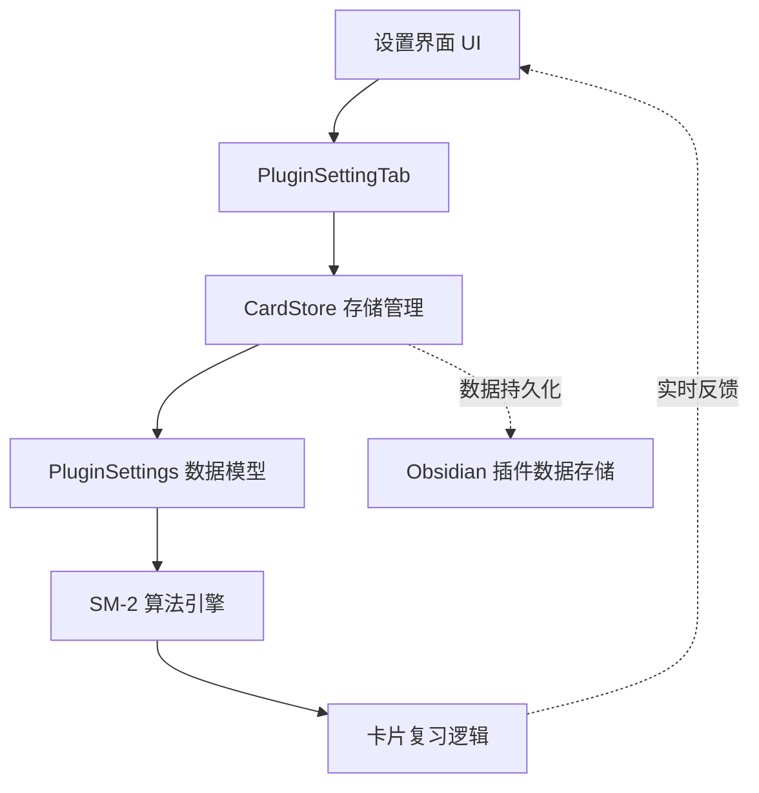

NewAnki 插件采用 Obsidian 标准插件设置架构，提供精细化的 SM-2 算法参数配置和用户体验定制。该系统通过类型安全的 TypeScript 接口定义配置结构，结合响应式 UI 组件实现实时设置更新。Sources: [settings.ts](src/settings.ts#L1-L10)

## 架构设计概览

配置系统采用分层架构，包含数据模型层、存储管理层和用户界面层。数据流遵循单向绑定模式，确保设置变更的原子性和一致性。



这种设计确保了配置变更的即时生效和数据的可靠持久化。Sources: [main.ts](src/main.ts#L36-L37)

## 核心配置数据结构

### PluginSettings 接口定义

配置系统通过 TypeScript 接口明确定义所有可配置参数，提供类型安全和代码提示支持：

```typescript
export interface PluginSettings {
    learningSteps: number[];          // 学习步骤（分钟）
    graduatingInterval: number;      // 毕业间隔（天）
    easyInterval: number;            // 简单间隔（天）
    relearningSteps: number[];       // 重学步骤（分钟）
    minimumInterval: number;         // 最小间隔（天）
    maximumInterval: number;         // 最大间隔（天）
    startingEase: number;           // 初始难度因子
    easyBonus: number;              // 简单奖励系数
    intervalModifier: number;        // 间隔修改器
    hardInterval: number;            // 困难间隔系数
    newInterval: number;            // 遗忘后新间隔系数
}
```

每个参数都经过精心设计，对应 SM-2 算法的特定环节，确保算法的完整性和可配置性。Sources: [models.ts](src/models.ts#L38-L50)

### 默认配置值

系统提供经过优化的默认配置，基于 Anki 经典参数和实际使用经验：

| 参数名称 | 默认值 | 说明 | 影响范围 |
|---------|--------|------|----------|
| `learningSteps` | `[1, 10]` | 新卡片学习步骤（分钟） | 学习阶段节奏 |
| `graduatingInterval` | `1` | 毕业间隔（天） | 首次复习时间 |
| `easyInterval` | `4` | 简单间隔（天） | 快速掌握卡片 |
| `relearningSteps` | `[10]` | 重学步骤（分钟） | 遗忘恢复过程 |
| `minimumInterval` | `1` | 最小间隔（天） | 复习频率下限 |
| `maximumInterval` | `36500` | 最大间隔（天） | 复习频率上限 |
| `startingEase` | `2.5` | 初始难度因子 | 间隔增长基准 |
| `easyBonus` | `1.3` | 简单奖励系数 | 简单回答奖励 |
| `intervalModifier` | `1.0` | 间隔修改器 | 全局间隔调整 |
| `hardInterval` | `1.2` | 困难间隔系数 | 困难回答惩罚 |
| `newInterval` | `0.0` | 遗忘后新间隔系数 | 遗忘处理策略 |

这些默认值平衡了学习效率和记忆持久性，适合大多数用户的使用场景。Sources: [models.ts](src/models.ts#L52-L64)

## 设置界面实现

### 插件设置标签页

NewAnkiSettingTab 类继承自 Obsidian 的 PluginSettingTab，提供标准化的设置界面：

```typescript
export class NewAnkiSettingTab extends PluginSettingTab {
    plugin: NewAnkiPlugin;

    constructor(app: App, plugin: NewAnkiPlugin) {
        super(app, plugin);
        this.plugin = plugin;
    }

    display(): void {
        // 界面构建逻辑
    }
}
```

设置界面采用分组布局，将相关参数组织在一起，提升用户体验。Sources: [settings.ts](src/settings.ts#L4-L10)

### 设置控件实现模式

每个设置项都遵循统一的实现模式，确保数据验证和实时保存：

```typescript
new Setting(containerEl)
    .setName("参数名称")
    .setDesc("参数描述")
    .addText((text) =>
        text
            .setPlaceholder("默认值")
            .setValue(String(currentValue))
            .onChange(async (value) => {
                // 数据验证
                const validatedValue = validateValue(value);
                if (validatedValue !== null) {
                    // 更新设置
                    this.plugin.store.settings.parameter = validatedValue;
                    // 持久化保存
                    await this.plugin.store.save();
                }
            })
    );
```

这种模式确保了设置变更的原子性和数据完整性。Sources: [settings.ts](src/settings.ts#L20-L35)

## 数据存储与管理

### CardStore 存储管理器

CardStore 类负责配置数据的加载、保存和访问控制：

```typescript
export class CardStore {
    private plugin: Plugin;
    private data: PluginData;

    async load(): Promise<void> {
        const saved = await this.plugin.loadData();
        if (saved) {
            this.data = Object.assign({}, DEFAULT_PLUGIN_DATA, saved);
        }
    }

    async save(): Promise<void> {
        await this.plugin.saveData(this.data);
    }

    get settings(): PluginSettings {
        return this.data.settings;
    }
}
```

存储管理器采用惰性加载策略，仅在需要时访问持久化存储。Sources: [store.ts](src/store.ts#L4-L36)

### 数据合并策略

系统采用智能数据合并策略，确保向后兼容性：

```typescript
async load(): Promise<void> {
    const saved = await this.plugin.loadData();
    if (saved) {
        this.data = Object.assign({}, DEFAULT_PLUGIN_DATA, saved);
        // 确保缺失字段使用默认值
        if (!this.data.settings) {
            this.data.settings = { ...DEFAULT_PLUGIN_DATA.settings };
        }
    }
}
```

这种策略确保了插件升级时配置数据的平滑迁移。Sources: [store.ts](src/store.ts#L13-L24)

## 配置验证机制

### 类型安全验证

每个设置参数都包含严格的类型验证逻辑：

| 参数类型 | 验证逻辑 | 错误处理 |
|---------|---------|----------|
| 数值数组 | `split(",").map(parseFloat).filter(!isNaN)` | 过滤无效值 |
| 整数参数 | `parseInt(value), !isNaN(n) && n > 0` | 拒绝非正整数 |
| 浮点数参数 | `parseFloat(value), !isNaN(n) && n >= min` | 范围检查 |
| 比例系数 | `parseFloat(value), n >= 0 && n <= 1` | 0-1范围验证 |

这种验证机制防止了无效配置导致的算法异常。Sources: [settings.ts](src/settings.ts#L27-L33)

### 业务逻辑约束

关键参数包含业务逻辑约束，确保算法正确性：

- **startingEase**: 必须 ≥ 1.3，避免间隔过短
- **easyBonus**: 必须 ≥ 1.0，确保奖励效果
- **newInterval**: 限制在 0-1 范围内，控制遗忘处理强度

这些约束基于 SM-2 算法的数学原理，保障了学习效果。Sources: [settings.ts](src/settings.ts#L96-L101)

## 系统集成点

### 插件初始化集成

配置系统在插件启动时自动初始化：

```typescript
async onload(): Promise<void> {
    this.store = new CardStore(this);
    await this.store.load(); // 加载配置数据
    
    // 注册设置标签页
    this.addSettingTab(new NewAnkiSettingTab(this.app, this));
}
```

这种集成方式确保了配置数据的及时可用性。Sources: [main.ts](src/main.ts#L13-L15)

### 实时配置更新

设置变更通过事件机制实时传播到各个组件：

```typescript
.onChange(async (value) => {
    this.plugin.store.settings.parameter = validatedValue;
    await this.plugin.store.save(); // 触发存储更新
    // 相关组件自动响应配置变更
})
```

配置变更无需重启插件即可立即生效。Sources: [settings.ts](src/settings.ts#L33-L34)

## 配置参数详细说明

### 学习阶段参数组

**学习步骤（learningSteps）**
- **用途**: 定义新卡片的学习阶段时间间隔
- **格式**: 逗号分隔的分钟数数组，如 "1,10"
- **效果**: 1分钟后第一次复习，10分钟后第二次复习
- **验证**: 正数分钟值，自动过滤无效输入

**毕业间隔（graduatingInterval）**
- **用途**: 通过最后学习步骤后的首次复习间隔
- **单位**: 天数
- **推荐值**: 1天，确保及时巩固
- **约束**: 必须为正整数

**简单间隔（easyInterval）**
- **用途**: 学习阶段直接按「简单」的复习间隔
- **策略**: 快速通道，跳过中间学习步骤
- **效果**: 4天后直接进入复习阶段
- **验证**: 正数天数约束

### 复习参数组

**重学步骤（relearningSteps）**
- **用途**: 遗忘卡片重新学习的时间间隔
- **默认**: 10分钟单次复习
- **策略**: 简化重学流程，提高效率
- **格式**: 与学习步骤相同的数组格式

**间隔范围参数**
- **minimumInterval**: 保证最低复习频率（1天）
- **maximumInterval**: 防止间隔无限增长（100年）
- **作用**: 维持合理的记忆曲线边界

**难度调节参数**
- **startingEase**: 初始难度基准（2.5倍增长）
- **easyBonus**: 简单回答奖励（额外1.3倍）
- **hardInterval**: 困难回答惩罚（仅1.2倍）
- **效果**: 实现个性化的间隔调整

**全局调节参数**
- **intervalModifier**: 全局间隔倍率（1.0为基准）
- **newInterval**: 遗忘后保留原间隔比例（0为重置）
- **用途**: 宏观控制复习节奏和遗忘处理策略

## 最佳实践指南

### 参数调优建议

根据不同的学习需求，推荐以下配置方案：

| 学习目标 | 关键参数调整 | 预期效果 |
|---------|-------------|----------|
| 快速掌握 | learningSteps: [1,5], easyInterval: 2 | 加速初期学习 |
| 长期记忆 | maximumInterval: 73000, intervalModifier: 1.2 | 延长记忆周期 |
| 困难材料 | startingEase: 2.0, hardInterval: 1.1 | 降低增长速率 |
| 复习优化 | easyBonus: 1.5, newInterval: 0.5 | 强化奖励机制 |

### 配置备份与恢复

用户可以通过以下方式管理配置：
1. **自动备份**: 配置随插件数据自动保存
2. **手动导出**: 通过 Obsidian 插件数据文件备份
3. **重置恢复**: 删除配置数据文件恢复默认值

## 扩展性设计

配置系统为未来功能扩展预留了接口：
- **模块化参数组**: 支持按功能模块添加新参数
- **验证器扩展**: 可自定义参数验证逻辑
- **UI 组件复用**: 设置控件模式支持快速扩展

这种设计确保了配置系统的长期可维护性和扩展性。Sources: [settings.ts](src/settings.ts#L199-L200)