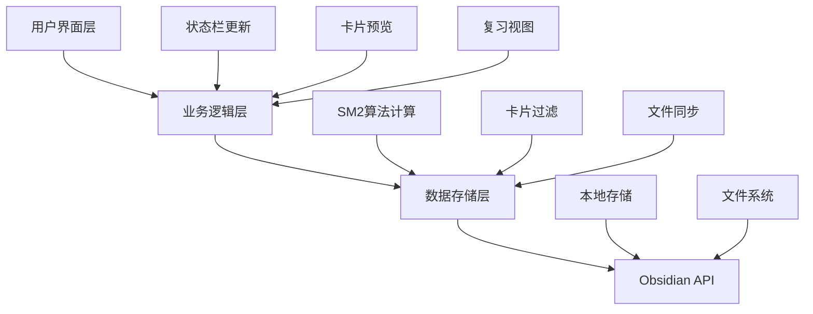

本页面深入分析 NewAnki 插件的性能优化策略和监控机制。作为 Obsidian 插件，NewAnki 需要处理大量卡片数据、实时状态更新和复杂的间隔重复计算，因此性能优化是系统设计的重要考量。

## 核心性能架构

NewAnki 采用分层架构设计，将数据存储、计算逻辑和用户界面分离，确保各层职责清晰且性能可控。



Sources: [main.ts](src/main.ts#L13-L47), [store.ts](src/store.ts#L4-L28)

### 数据存储优化

插件采用高效的数据结构设计，将卡片按文件路径分组存储，避免全量数据遍历：

```typescript
// 按文件路径索引的卡片存储结构
interface PluginData {
    settings: PluginSettings;
    cards: Record<string, CardData[]>;  // 文件路径 -> 卡片数组
}
```

这种设计使得文件级别的卡片操作时间复杂度为 O(1)，而全局操作通过遍历所有文件路径实现，避免了不必要的全量数据加载。Sources: [models.ts](src/models.ts#L66-L69)

## 计算性能优化

### SM2算法优化

SM2间隔重复算法经过精心优化，避免不必要的计算和内存分配：

```typescript
// 使用深拷贝避免原始数据污染
function deepCopyCard(card: CardData): CardData {
    return JSON.parse(JSON.stringify(card));
}

// 模糊化间隔计算，减少重复计算
function getFuzzedInterval(interval: number, maximumInterval: number): number {
    // 优化计算逻辑，避免多次数学运算
    if (interval < 2.5) {
        return interval;
    }
    // ... 模糊化逻辑
}
```

算法实现中采用了提前返回和条件分支优化，针对不同评分状态进行针对性计算，避免不必要的数学运算。Sources: [sm2.ts](src/sm2.ts#L16-L73)

### 日期计算优化

日期计算采用本地化处理，避免频繁的时区转换：

```typescript
private isCardDue(card: CardData, now: Date): boolean {
    const dueMs = Date.parse(card.due);
    
    // 复习卡片按天计算，避免时间精度问题
    if (card.state === State.Review) {
        return this.getLocalDayStartMs(new Date(dueMs)) <= this.getLocalDayStartMs(now);
    }
    
    // 学习卡片保持时间精度
    return dueMs <= now.getTime();
}

private getLocalDayStartMs(date: Date): number {
    return new Date(date.getFullYear(), date.getMonth(), date.getDate()).getTime();
}
```

这种设计既保证了复习卡片按天计算的用户体验，又保持了学习卡片的时间精度要求。Sources: [store.ts](src/store.ts#L60-L77)

## 界面渲染性能

### 增量更新策略

用户界面采用增量更新策略，避免全量重渲染：

```typescript
// 状态栏和徽章采用定时更新，避免频繁重绘
this.registerInterval(
    window.setInterval(() => {
        this.updateStatusBar();
        this.updateGlobalReviewRibbonBadge();
    }, 30000)  // 30秒间隔
);
```

状态栏和徽章每30秒更新一次，平衡了实时性和性能需求。Sources: [main.ts](src/main.ts#L41-L46)

### Markdown渲染优化

卡片预览采用异步渲染和队列机制，避免渲染阻塞：

```typescript
const renderPreview = async (markdown: string) => {
    if (rendering) {
        renderQueued = true;  // 队列机制避免并发渲染
        return;
    }
    rendering = true;
    try {
        do {
            renderQueued = false;
            preview.empty();
            if (markdown) {
                await MarkdownRenderer.render(this.app, markdown, preview, sourcePath, this);
            }
        } while (renderQueued);  // 处理队列中的渲染请求
    } finally {
        rendering = false;
    }
};
```

这种设计确保了在快速编辑时不会出现渲染冲突，同时保持界面的响应性。Sources: [reviewView.ts](src/reviewView.ts#L213-L244)

## 内存管理优化

### 事件监听器管理

插件采用精确的事件监听器管理，避免内存泄漏：

```typescript
private clearReviewAction(): void {
    // 精确移除事件监听器
    if (this.reviewActionEl) {
        this.reviewActionEl.remove();
        this.reviewActionEl = null;
    }
    // 清理遗留的DOM元素
    document.querySelectorAll<HTMLElement>(".view-action.newanki-review-action")
        .forEach((el) => el.remove());
}
```

在文件切换和视图关闭时，插件会精确清理相关的事件监听器和DOM元素。Sources: [main.ts](src/main.ts#L256-L276)

### 数据缓存策略

卡片数据采用懒加载和缓存策略：

```typescript
getCardsForFile(filePath: string): CardData[] {
    return this.data.cards[filePath] ?? [];  // 按需加载
}

getAllCards(): CardData[] {
    const all: CardData[] = [];
    for (const cards of Object.values(this.data.cards)) {
        all.push(...cards);  // 惰性合并
    }
    return all;
}
```

这种设计避免了不必要的数据加载，只在需要时才进行数据合并操作。Sources: [store.ts](src/store.ts#L38-L58)

## 文件操作性能

### 批量文件处理

文件重命名和删除操作采用批量处理策略：

```typescript
async handleFileRename(oldPath: string, newPath: string): Promise<boolean> {
    let changed = false;
    const entries = Object.entries(this.data.cards);
    
    for (const [path, cards] of entries) {
        // 批量处理所有相关卡片
        if (path === oldPath || path.startsWith(`${oldPath}/`)) {
            // 迁移卡片数据
            const targetPath = path === oldPath ? newPath : path.replace(`${oldPath}/`, `${newPath}/`);
            // ... 迁移逻辑
            changed = true;
        }
    }
    
    if (changed) {
        await this.save();  // 批量保存
    }
    return changed;
}
```

这种批量处理策略减少了文件I/O操作次数，提高了文件操作的性能。Sources: [store.ts](src/store.ts#L134-L167)

## 性能监控机制

### 状态监控

插件内置了多种状态监控机制：

| 监控指标 | 监控方式 | 更新频率 | 用途 |
|---------|---------|---------|------|
| 待复习卡片数 | 状态栏显示 | 30秒 | 用户提醒 |
| 文件卡片数 | 右键菜单 | 实时 | 上下文感知 |
| 全局复习徽章 | 功能区徽章 | 30秒 | 快速访问 |
| 复习进度 | 进度条 | 每次评分 | 用户体验 |

### 错误处理与日志

系统采用健壮的错误处理机制：

```typescript
try {
    await MarkdownRenderer.render(this.app, markdown, preview, sourcePath, this);
} catch (error) {
    preview.empty();
    preview.createEl("div", {
        cls: "newanki-preview-error",
        text: "Markdown 预览渲染失败",
    });
    console.error("NewAnki preview render failed:", error);
}
```

所有关键操作都有错误捕获和日志记录，便于性能问题排查。Sources: [reviewView.ts](src/reviewView.ts#L234-L241)

## 最佳实践建议

基于代码分析，建议开发者在使用和扩展 NewAnki 时注意以下性能优化点：

1. **避免频繁的全量数据操作**：尽量使用文件级别的数据操作
2. **合理设置更新间隔**：状态更新应平衡实时性和性能
3. **注意内存管理**：及时清理事件监听器和DOM引用
4. **优化SM2计算**：对于大量卡片，考虑批量计算优化

这些优化策略确保了 NewAnki 插件在大型知识库中也能保持良好的性能表现。