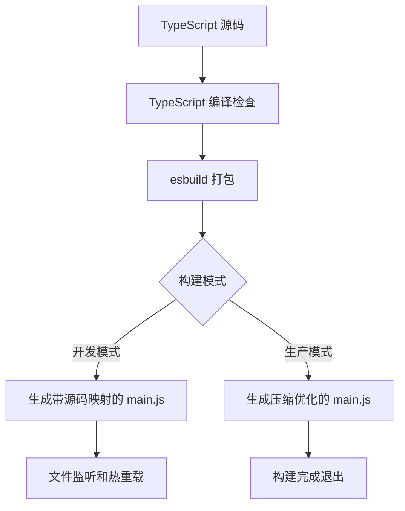

本文档详细介绍了 NewAnki 插件的开发环境配置、构建流程、代码质量控制和版本管理策略。作为 Obsidian 插件开发的标准工作流，该流程结合了现代前端开发工具链，确保代码质量和开发效率。

## 开发环境配置

NewAnki 插件采用标准的 TypeScript + Node.js 开发环境，通过 npm 脚本管理整个开发流程。开发环境的核心依赖包括：

- **TypeScript 5.8.3**：提供类型安全开发体验
- **esbuild 0.25.5**：高性能的 JavaScript 打包工具
- **ESLint**：代码质量检查和规范执行
- **Obsidian API**：插件与 Obsidian 的集成接口

开发环境的配置通过 `package.json` 文件定义，包含了构建、测试、版本管理等完整的工作流脚本。Sources: [package.json](package.json#L7-L12)

## 构建系统架构

NewAnki 采用 esbuild 作为主要的构建工具，结合 TypeScript 编译器实现类型检查和代码转换。构建系统采用双模式设计：开发模式支持热重载和源码映射，生产模式进行代码压缩和优化。



构建流程的核心配置在 `esbuild.config.mjs` 中实现，支持以下关键特性：
- **外部依赖排除**：Obsidian 和相关 CodeMirror 模块作为外部依赖
- **源码映射**：开发模式下启用内联源码映射便于调试
- **代码压缩**：生产模式下启用代码压缩优化
- **树摇优化**：自动移除未使用的代码

Sources: [esbuild.config.mjs](esbuild.config.mjs#L14-L42)

## 开发工作流

### 开发模式启动
开发人员通过 `npm run dev` 命令启动开发服务器，该命令执行以下操作：
1. 启动 esbuild 上下文
2. 启用文件监听模式
3. 生成带源码映射的构建文件
4. 保持进程运行等待文件变更

### 生产构建流程
生产构建通过 `npm run build` 命令执行完整构建流程：
1. TypeScript 类型检查（无输出）
2. esbuild 生产模式打包
3. 代码压缩和优化
4. 构建完成后退出进程

构建脚本的详细配置如下表所示：

| 命令 | 功能描述 | 适用场景 |
|------|----------|----------|
| `npm run dev` | 启动开发服务器，支持热重载 | 日常开发 |
| `npm run build` | 执行完整生产构建 | 发布前构建 |
| `npm run version` | 自动更新版本号 | 版本发布 |
| `npm run lint` | 代码质量检查 | 代码审查 |

Sources: [package.json](package.json#L7-L10)

## 代码质量保障

### TypeScript 配置
项目采用严格的 TypeScript 配置，确保代码类型安全：
- **严格模式**：启用所有严格类型检查选项
- **模块解析**：使用 Node.js 模块解析策略
- **源码映射**：内联源码映射便于调试
- **现代目标**：编译目标设置为 ES6+

TypeScript 配置特别针对 Obsidian 插件开发进行了优化，包括 DOM 和 ES6+ 库的支持。Sources: [tsconfig.json](tsconfig.json#L2-L26)

### ESLint 代码规范
代码质量通过 ESLint 进行保障，配置特点包括：
- **Obsidian 插件规范**：集成 `eslint-plugin-obsidianmd` 推荐配置
- **TypeScript 支持**：完整的 TypeScript ESLint 集成
- **文件排除**：自动排除构建产物和配置文件

ESLint 配置确保了代码风格的一致性和最佳实践的遵循。Sources: [eslint.config.mts](eslint.config.mts#L6-L34)

## 版本管理策略

### 自动化版本更新
项目实现了自动化的版本管理流程，通过 `version-bump.mjs` 脚本实现：
1. 读取当前 npm 包版本
2. 更新 `manifest.json` 中的插件版本
3. 在 `versions.json` 中记录版本兼容性信息

### 版本兼容性记录
`versions.json` 文件维护了插件版本与 Obsidian 最小应用版本的映射关系，确保用户安装的插件版本与其 Obsidian 版本兼容。Sources: [version-bump.mjs](version-bump.mjs#L3-L17)

## 持续集成配置

项目通过 GitHub Actions 实现持续集成，配置位于 `.github/workflows/lint.yml`。CI 流程包括：
- 代码拉取和环境设置
- 依赖安装和缓存优化
- ESLint 代码质量检查
- 构建验证测试

## 开发最佳实践

### 文件组织结构
```
src/
├── main.ts              # 插件主入口
├── models.ts           # 数据模型定义
├── settings.ts         # 设置界面
├── store.ts           # 状态管理
├── sm2.ts             # SM-2 算法实现
├── createCardModal.ts # 卡片创建模态框
├── cardPreviewModal.ts # 卡片预览模态框
├── reviewView.ts       # 复习视图组件
```

### 开发调试技巧
1. **源码映射调试**：开发模式下生成的源码映射支持浏览器调试
2. **热重载开发**：文件变更自动触发重建，无需手动重启 Obsidian
3. **类型安全开发**：TypeScript 提供完整的类型检查和智能提示

## 后续学习路径

完成本流程了解后，建议继续学习：
- [测试与调试技巧](16-ce-shi-yu-diao-shi-ji-qiao)：掌握插件测试和调试方法
- [发布与分发指南](17-fa-bu-yu-fen-fa-zhi-nan)：了解插件发布流程
- [架构设计](6-jia-gou-she-ji)：深入理解插件整体架构

本开发与构建流程为 NewAnki 插件提供了稳定高效的开发环境，确保了代码质量和开发体验的一致性。