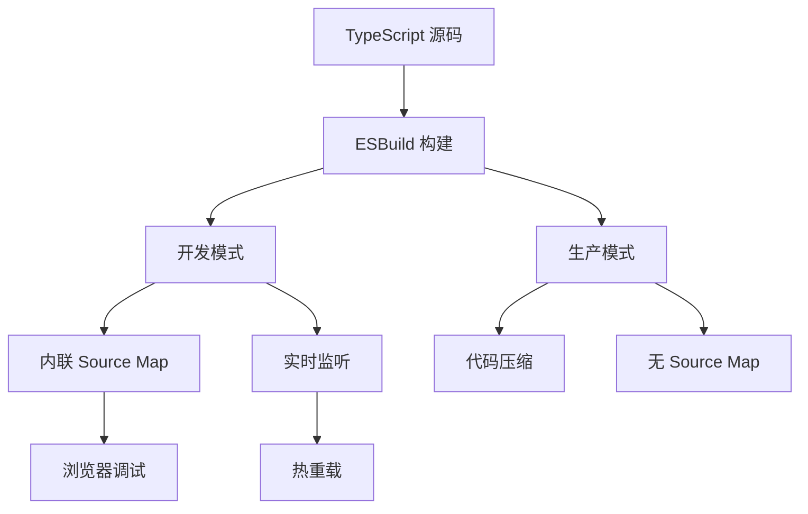
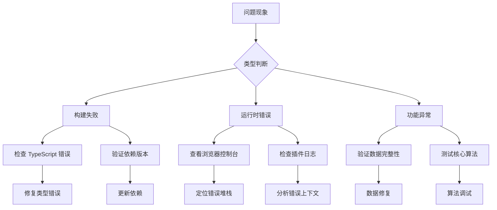

本文档详细介绍了 NewAnki 插件的测试与调试方法，涵盖从开发环境配置到生产环境调试的全方位技术方案。作为 Obsidian 插件开发的高级参考，本文重点介绍如何构建可靠的测试策略和高效的调试流程。

## 开发环境配置与调试工具

NewAnki 插件采用现代化的 TypeScript 开发栈，配备了完善的开发工具链。开发环境的关键配置包括：

- **TypeScript 严格模式**：启用 `noImplicitAny`、`strictNullChecks` 等严格类型检查，提前捕获类型错误
- **ESLint 代码规范**：集成 Obsidian 插件专用规则集，确保代码质量一致性
- **Source Map 支持**：开发模式下启用内联 Source Map，便于调试 TypeScript 源码



项目的构建配置在 `esbuild.config.mjs` 中实现了开发/生产环境的差异化处理，开发模式下保留完整的调试信息。Sources: [esbuild.config.mjs](esbuild.config.mjs#L38-L42)

## 持续集成与自动化测试

NewAnki 采用 GitHub Actions 实现持续集成，确保代码质量：

### 构建矩阵测试
项目在 Node.js 20.x 和 22.x 两个版本上进行构建测试，验证跨版本兼容性。构建流程包括：
1. 依赖安装 (`npm ci`)
2. 类型检查 (`npm run build`)
3. 代码规范检查 (`npm run lint`)


Sources: [.github/workflows/lint.yml](.github/workflows/lint.yml#L13-L27)

### 代码质量保障
ESLint 配置集成了 Obsidian 插件开发的最佳实践，包括：
- TypeScript 严格类型检查
- Obsidian API 使用规范
- 模块导入和导出规范

Sources: [eslint.config.mts](eslint.config.mts#L24-L34)

## 调试技术与错误处理策略

### 运行时错误监控
插件采用多层错误处理机制：

1. **异步操作异常捕获**：所有异步操作都包含错误处理逻辑
2. **数据加载容错**：存储系统实现数据格式兼容性处理
3. **用户界面错误提示**：通过 Obsidian Notice 系统提供友好的错误反馈

```typescript
// 示例：数据加载的容错处理
async load(): Promise<void> {
    const saved = await this.plugin.loadData();
    if (saved) {
        this.data = Object.assign({}, DEFAULT_PLUGIN_DATA, saved);
        // 确保必要字段存在
        if (!this.data.cards) {
            this.data.cards = {};
        }
    }
}
```

Sources: [src/store.ts](src/store.ts#L13-L24)

### 浏览器开发者工具调试
利用浏览器开发者工具进行深度调试：

| 调试工具 | 用途 | 技巧 |
|---------|------|------|
| Console 面板 | 日志输出和错误追踪 | 使用 `console.debug()` 输出调试信息 |
| Sources 面板 | TypeScript 源码调试 | 利用 Source Map 映射到源码 |
| Network 面板 | 文件操作监控 | 观察插件数据文件的读写 |
| Application 面板 | 本地存储检查 | 查看插件配置和数据状态 |

## 单元测试与集成测试策略

### SM-2 算法测试
核心算法模块需要重点测试：

```typescript
// SM-2 算法的测试用例设计
describe('SM-2 Algorithm', () => {
    it('should calculate correct intervals for learning cards', () => {
        // 测试学习阶段间隔计算
    });
    
    it('should handle rating transitions correctly', () => {
        // 测试评分状态转换
    });
    
    it('should apply fuzzing within expected ranges', () => {
        // 测试间隔模糊化算法
    });
});
```

Sources: [src/sm2.ts](src/sm2.ts#L20-L49)

### 数据模型验证
数据模型需要严格的类型检查和边界测试：

| 测试类型 | 测试目标 | 验证方法 |
|---------|---------|----------|
| 类型安全 | TypeScript 接口定义 | 编译时类型检查 |
| 数据完整性 | 卡片数据模型 | 单元测试验证字段 |
| 边界条件 | 间隔计算算法 | 极端值测试 |
| 状态转换 | 卡片状态机 | 状态转换测试 |

Sources: [src/models.ts](src/models.ts#L14-L27)

## 性能监控与优化调试

### 内存使用监控
插件需要监控的关键性能指标：

1. **卡片存储占用**：监控本地存储的数据量增长
2. **视图渲染性能**：复习视图的渲染效率
3. **事件处理延迟**：用户交互的响应时间

### 性能优化策略
- **数据懒加载**：只在需要时加载卡片数据
- **视图缓存**：复用已创建的视图实例
- **事件防抖**：避免频繁的事件处理

## 故障排除与问题诊断

### 常见问题诊断流程



### 调试信息收集
遇到问题时需要收集的关键信息：

1. **Obsidian 版本**：插件兼容性信息
2. **错误堆栈**：完整的错误调用栈
3. **插件配置**：当前的设置状态
4. **数据快照**：问题发生时的数据状态

## 高级调试技巧

### 条件断点调试
在浏览器开发者工具中设置条件断点：

```javascript
// 在卡片调度逻辑中设置条件断点
if (card.state === State.Learning && rating === Rating.Again) {
    debugger; // 只在特定条件下触发
}
```

### 性能分析器使用
利用 Chrome DevTools 的 Performance 面板：
- 记录用户操作流程的性能数据
- 分析函数调用时间和内存分配
- 识别性能瓶颈和优化机会

### 网络请求调试
监控插件与 Obsidian API 的交互：
- 文件读写操作的性能
- 视图创建和销毁的生命周期
- 事件系统的消息传递

通过系统化的测试策略和深入的调试技巧，可以确保 NewAnki 插件的稳定性和性能，为最终用户提供流畅的间隔重复学习体验。