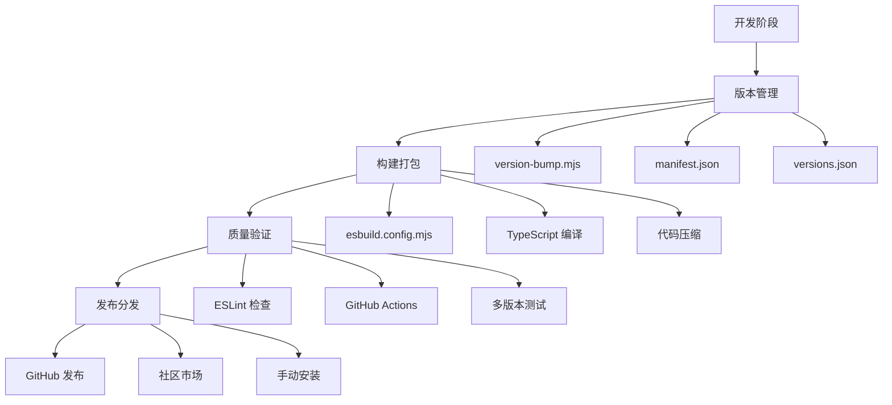

本指南详细介绍了 NewAnki 插件的发布流程、版本管理、构建配置和分发策略。作为 Obsidian 插件开发者，了解这些流程对于确保插件的稳定发布和用户顺利安装至关重要。

## 发布架构概览

NewAnki 插件采用现代化的发布流程，集成了版本控制、自动化构建和持续集成。整个发布体系基于以下核心组件：



Sources: [package.json](package.json#L7-L12), [manifest.json](manifest.json#L1-L9)

## 版本管理系统

### 版本号管理策略

NewAnki 采用语义化版本控制（SemVer）策略，版本号格式为 `主版本.次版本.修订版本`。版本管理通过以下文件协同工作：

| 文件 | 作用 | 更新时机 |
|------|------|----------|
| `package.json` | 定义项目版本和构建脚本 | 每次发布前 |
| `manifest.json` | 定义插件元数据和兼容性 | 版本更新时 |
| `versions.json` | 记录历史版本兼容性 | 自动维护 |

版本更新流程通过 `version-bump.mjs` 脚本自动化处理，该脚本会：
1. 从 `package.json` 读取目标版本号
2. 更新 `manifest.json` 中的版本字段
3. 维护 `versions.json` 中的版本兼容性映射

Sources: [version-bump.mjs](version-bump.mjs#L3-L17), [versions.json](versions.json#L1-L3)

### 兼容性配置

插件通过 `manifest.json` 定义最小 Obsidian 应用版本要求，确保向后兼容：

```json
{
    "id": "newanki",
    "name": "NewAnki", 
    "version": "1.0.0",
    "minAppVersion": "0.15.0",
    "isDesktopOnly": false
}
```

`versions.json` 文件记录了每个插件版本对应的最小 Obsidian 版本，便于社区市场自动处理兼容性检查。

Sources: [manifest.json](manifest.json#L2-L8)

## 构建与打包流程

### 构建配置

NewAnki 使用 ESBuild 作为构建工具，配置位于 `esbuild.config.mjs`。构建系统支持两种模式：

| 模式 | 命令 | 特点 |
|------|------|------|
| 开发模式 | `npm run dev` | 启用源码映射，支持热重载 |
| 生产模式 | `npm run build` | 代码压缩，移除调试信息 |

构建配置的关键特性包括：
- **外部依赖排除**：将 Obsidian API 和相关 CodeMirror 模块标记为外部依赖
- **Tree Shaking**：自动移除未使用的代码
- **格式转换**：将 ES 模块转换为 CommonJS 格式

Sources: [esbuild.config.mjs](esbuild.config.mjs#L12-L42)

### 构建脚本

`package.json` 中定义了完整的构建脚本集合：

```json
{
    "scripts": {
        "dev": "node esbuild.config.mjs",
        "build": "tsc -noEmit -skipLibCheck && node esbuild.config.mjs production",
        "version": "node version-bump.mjs && git add manifest.json versions.json",
        "lint": "eslint ."
    }
}
```

构建流程包含 TypeScript 类型检查、代码打包和质量检查三个步骤。

Sources: [package.json](package.json#L7-L12)

## 持续集成与质量保证

### GitHub Actions 配置

项目配置了自动化的 CI/CD 流水线，在每次推送和拉取请求时执行：

```yaml
name: Node.js build
on:
    push:
        branches: ["**"]
    pull_request: 
        branches: ["**"]
```

流水线执行以下验证步骤：
1. 多版本 Node.js 环境测试（20.x 和 22.x）
2. 依赖安装和缓存优化
3. 构建流程验证
4. 代码规范检查

Sources: [lint.yml](.github/workflows/lint.yml#L1-L28)

### 代码质量工具

项目集成了 ESLint 用于代码质量检查，配置基于 Obsidian 插件开发规范：

- 使用 `eslint-plugin-obsidianmd` 插件
- 支持 TypeScript 和现代 JavaScript 特性
- 集成到构建流程中确保代码质量

Sources: [package.json](package.json#L15-L24)

## 分发策略

### 社区市场发布

插件发布到 Obsidian 社区市场需要满足以下要求：

1. **版本兼容性**：确保 `minAppVersion` 设置合理
2. **文档完整性**：提供清晰的 README 和使用说明
3. **功能稳定性**：通过自动化测试验证核心功能
4. **许可证合规**：使用合适的开源许可证

### 手动安装方式

对于无法访问社区市场的用户，支持手动安装：

1. 下载发布版本的 ZIP 文件
2. 解压到 Obsidian 插件目录（`.obsidian/plugins/newanki/`）
3. 在 Obsidian 设置中启用插件

### 开发版本分发

开发版本可以通过以下方式获取：
- GitHub Releases 页面下载预编译版本
- 从源码构建：`git clone && npm install && npm run build`

Sources: [package.json](package.json#L1-L5)

## 发布检查清单

在发布新版本前，请确保完成以下检查：

### 前置检查
- [ ] 更新 `package.json` 中的版本号
- [ ] 运行 `npm run version` 自动更新版本文件
- [ ] 验证 `minAppVersion` 兼容性设置

### 构建验证
- [ ] 执行 `npm run build` 成功完成
- [ ] 运行 `npm run lint` 通过代码检查
- [ ] 验证生成的文件结构完整性

### 功能测试
- [ ] 在目标 Obsidian 版本中测试核心功能
- [ ] 验证卡片创建、复习等关键流程
- [ ] 检查界面组件的兼容性

### 文档更新
- [ ] 更新 CHANGELOG 记录变更内容
- [ ] 检查 README 中的版本信息
- [ ] 更新截图和演示内容

Sources: [version-bump.mjs](version-bump.mjs#L5-L9)

## 故障排除

### 常见构建问题

| 问题 | 原因 | 解决方案 |
|------|------|----------|
| 类型检查失败 | TypeScript 配置问题 | 检查 `tsconfig.json` 配置 |
| 依赖解析错误 | 外部模块配置不当 | 验证 `esbuild.config.mjs` 中的 external 列表 |
| 版本冲突 | 版本文件不一致 | 运行 `npm run version` 同步版本信息 |

### 发布后问题处理

如果发布后发现问题，可以通过以下流程处理：
1. 立即发布修订版本修复问题
2. 在 GitHub Issues 中标记已知问题
3. 更新文档说明临时解决方案
4. 在下个版本中彻底修复

通过遵循本指南的发布流程，可以确保 NewAnki 插件的稳定发布和良好用户体验。

**建议的下一步阅读**：要深入了解开发流程，请参考[开发与构建流程](15-kai-fa-yu-gou-jian-liu-cheng)；如需了解代码质量标准，请查看[代码规范与质量](25-dai-ma-gui-fan-yu-zhi-liang)。