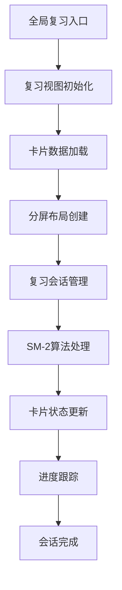
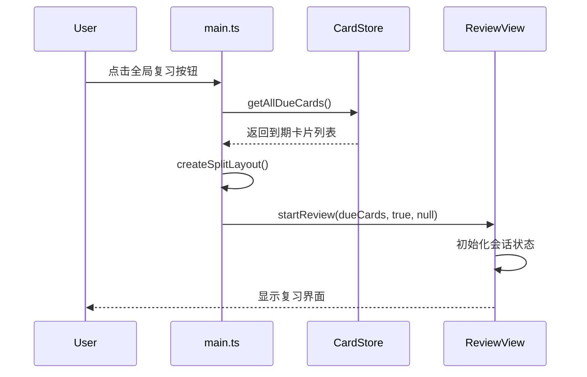

全局复习系统是 NewAnki 插件的核心功能，实现了跨文件的间隔重复学习流程。该系统基于 SuperMemo-2 算法，通过智能调度和可视化界面，帮助用户高效复习所有到期的卡片。Sources: [reviewView.ts](src/reviewView.ts#L1-L20)

## 系统架构概述

全局复习系统采用模块化设计，核心组件包括复习视图、算法引擎和状态管理三部分。复习会话通过分屏布局实现，左侧显示复习界面，右侧同步显示源文件内容。



系统支持两种复习模式：全局复习（所有文件）和本地复习（单个文件），通过统一的界面提供一致的复习体验。Sources: [main.ts](src/main.ts#L319-L337)

## 核心数据结构

### 复习会话模型
系统使用 `ReviewSession` 接口管理复习会话状态，包含完整的复习上下文信息：

```typescript
interface ReviewSession {
    cards: CardData[];          // 待复习卡片列表
    currentIndex: number;       // 当前卡片索引
    total: number;             // 总卡片数
    reviewed: number;          // 已复习卡片数
    isGlobal: boolean;         // 是否为全局复习
    sourceFile: string | null; // 源文件路径（全局复习时为null）
}
```

该模型支持会话的暂停、恢复和进度跟踪，确保复习状态的持久性。Sources: [reviewView.ts](src/reviewView.ts#L8-L15)

### 算法调度结果
SM-2 算法返回的调度结果包含完整的卡片更新信息：

```typescript
interface ScheduleResult {
    card: CardData;           // 更新后的卡片数据
    rating: Rating;           // 用户评分
    reviewDatetime: string;   // 复习时间戳
}
```

每个评分操作都会触发完整的算法计算，更新卡片的间隔、难度系数和下次复习时间。Sources: [sm2.ts](src/sm2.ts#L3-L7)

## 复习流程实现

### 会话启动流程
全局复习通过 `startGlobalReview()` 方法启动，流程如下：

1. **数据获取**：从存储中获取所有到期的卡片
2. **布局创建**：创建分屏布局，左侧复习视图，右侧源文件
3. **视图初始化**：设置源文件叶子和复习参数
4. **会话开始**：调用 `startReview()` 启动复习会话



系统会自动打开第一个卡片的源文件，并建立源文件与复习视图的同步关系。Sources: [main.ts](src/main.ts#L319-L337)

### 卡片展示与交互
复习界面采用渐进式展示策略，分阶段显示问题和答案：

| 阶段 | 显示内容 | 可用操作 |
|------|----------|----------|
| 问题阶段 | 仅显示问题 | 显示答案、删除卡片 |
| 答案阶段 | 显示问题和答案 | 四个评分按钮 |

每个卡片支持内联编辑，用户可以直接在复习界面修改卡片内容。系统会自动同步修改到存储中。Sources: [reviewView.ts](src/reviewView.ts#L127-L181)

### 评分处理机制
用户评分触发完整的算法处理链条：

1. **算法计算**：调用 `reviewCard()` 根据评分计算新的间隔
2. **状态更新**：更新卡片的状态、间隔和下次复习时间
3. **会话管理**：根据卡片是否毕业决定是否移除当前卡片
4. **界面刷新**：更新进度条和显示下一张卡片

```typescript
private async handleRating(card: CardData, rating: Rating): Promise<void> {
    const result = reviewCard(card, rating, this.store.settings);
    await this.store.updateCard(result.card);
    
    if (this.session) {
        const updatedCard = result.card;
        const graduated = updatedCard.state === State.Review;
        
        if (graduated) {
            this.session.reviewed++;  // 毕业卡片计数
        } else {
            this.session.cards.push(updatedCard);  // 重新学习卡片放回队列
        }
        
        this.session.currentIndex++;
        this.answerRevealed = false;
        this.render();
    }
}
```

这种设计确保了学习卡片和复习卡片的不同处理逻辑。Sources: [reviewView.ts](src/reviewView.ts#L348-L369)

## SM-2 算法实现

### 核心算法逻辑
系统实现了完整的 SM-2 算法，支持四种卡片状态的处理：

| 卡片状态 | 处理逻辑 | 间隔计算 |
|----------|----------|----------|
| Learning | 学习阶段，分钟级间隔 | 学习步骤配置 |
| Review | 复习阶段，天级间隔 | 基于难度系数的指数增长 |
| Relearning | 重新学习阶段 | 重新学习步骤配置 |

算法考虑了逾期复习的情况，对间隔计算进行适当调整：

```typescript
if (daysOverdue >= 1) {
    newIvl = Math.min(
        settings.maximumInterval,
        Math.round((ci + daysOverdue / 2.0) * ease * settings.intervalModifier)
    );
}
```

这种设计使算法更加适应实际使用场景。Sources: [sm2.ts](src/sm2.ts#L147-L159)

### 间隔模糊化
为防止模式化复习，系统实现了间隔模糊化算法：

```typescript
function getFuzzedInterval(interval: number, maximumInterval: number): number {
    if (interval < 2.5) return interval;
    
    const FUZZ_RANGES = [
        { start: 2.5, end: 7.0, factor: 0.15 },
        { start: 7.0, end: 20.0, factor: 0.1 },
        { start: 20.0, end: Infinity, factor: 0.05 },
    ];
    
    // 根据间隔范围应用不同的模糊因子
    let delta = 1.0;
    for (const range of FUZZ_RANGES) {
        delta += range.factor * Math.max(Math.min(interval, range.end) - range.start, 0.0);
    }
    
    return Math.random() * (maxIvl - minIvl + 1) + minIvl;
}
```

模糊化范围随间隔增长而减小，确保长期记忆的稳定性。Sources: [sm2.ts](src/sm2.ts#L20-L49)

## 用户界面设计

### 进度可视化
复习界面提供清晰的进度反馈：

```typescript
private renderProgress(container: HTMLElement): void {
    const session = this.session!;
    const remaining = session.cards.length - session.currentIndex;
    const progressWrap = container.createDiv({ cls: "newanki-progress" });
    
    const label = progressWrap.createDiv({ cls: "newanki-progress-label" });
    label.setText(`已完成 ${session.reviewed} / ${session.total}，剩余 ${remaining}`);
    
    const barInner = progressWrap.createDiv({ cls: "newanki-progress-fill" });
    const pct = (session.reviewed / session.total) * 100;
    barInner.style.width = `${pct}%`;
}
```

进度条和文字标签共同提供多维度的进度信息。Sources: [reviewView.ts](src/reviewView.ts#L111-L125)

### 评分按钮设计
四个评分按钮显示预期的下次复习间隔，帮助用户做出合理决策：

| 评分 | 按钮标签 | 颜色主题 | 间隔预览 |
|------|----------|----------|----------|
| Again | 重来 | 红色 | 立即重新学习 |
| Hard | 困难 | 橙色 | 较短间隔 |
| Good | 良好 | 绿色 | 标准间隔 |
| Easy | 简单 | 蓝色 | 较长间隔 |

每个按钮都显示格式化后的时间间隔（分钟、小时、天、月、年），提供直观的反馈。Sources: [reviewView.ts](src/reviewView.ts#L312-L346)

## 源文件同步机制

### 自动导航与高亮
系统实现智能的源文件同步功能：

1. **自动文件切换**：当切换到不同文件的卡片时，自动打开对应文件
2. **精确定位**：高亮显示卡片在源文件中的具体位置
3. **滚动同步**：确保卡片内容在可视区域内

```typescript
private highlightCardInEditor(card: CardData): void {
    const editor = view.editor;
    const endLineText = editor.getLine(card.lineEnd) ?? "";
    
    editor.setSelection(
        { line: card.lineStart, ch: 0 },
        { line: card.lineEnd, ch: endLineText.length }
    );
    editor.scrollIntoView({
        from: { line: card.lineStart, ch: 0 },
        to: { line: card.lineEnd, ch: endLineText.length },
    }, true);
}
```

这种设计增强了复习的上下文关联性。Sources: [reviewView.ts](src/reviewView.ts#L414-L433)

## 性能优化策略

### 增量式渲染
复习界面采用增量式渲染策略，避免不必要的重绘：

- **条件渲染**：根据会话状态决定显示内容（空状态、进行中、完成）
- **局部更新**：评分操作后只更新必要的界面部分
- **延迟加载**：Markdown 预览采用异步渲染

### 内存管理
系统通过合理的数据结构设计优化内存使用：

- **会话状态分离**：复习会话状态与卡片数据分离
- **适时清理**：会话结束后及时释放资源
- **批量操作**：卡片更新采用批量提交策略

## 扩展性设计

全局复习系统的架构支持多种扩展场景：

1. **自定义算法**：通过实现不同的 `reviewCard` 函数支持其他间隔重复算法
2. **界面主题**：CSS 类名设计支持主题定制
3. **数据源扩展**：存储接口抽象支持不同的数据后端
4. **复习模式**：会话模型支持多种复习策略的实现

系统为高级用户和开发者提供了充分的定制空间，确保长期的可维护性和扩展性。Sources: [reviewView.ts](src/reviewView.ts#L17-L28)

全局复习系统通过精心的架构设计和算法实现，为用户提供了高效、智能的间隔重复学习体验，是 NewAnki 插件的核心价值所在。