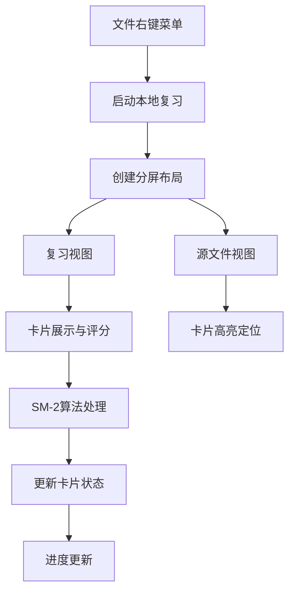

本地文件复习是 NewAnki 插件的核心功能之一，它允许用户在单个 Markdown 文件中进行卡片复习。与全局复习不同，本地文件复习专注于当前文件中的卡片，提供了更集中的学习体验和上下文关联的复习环境。

## 功能架构概述

本地文件复习功能基于分屏布局设计，将复习界面与源文件编辑器并排显示，实现无缝的上下文切换和卡片定位。



本地文件复习的核心组件包括：
- **ReviewView**: 复习界面主组件
- **CardStore**: 卡片数据管理
- **文件菜单集成**: 右键菜单和命令面板入口
- **分屏布局管理**: 复习与编辑的协同工作

Sources: [main.ts](src/main.ts#L95-L123), [reviewView.ts](src/reviewView.ts#L17-L446)

## 启动机制与入口点

本地文件复习提供了多种启动方式，确保用户可以在不同场景下快速访问复习功能。

### 文件右键菜单入口
当用户在文件资源管理器中右键点击 Markdown 文件时，系统会检测该文件中的卡片数量，动态显示复习入口：

```typescript
// 文件菜单注册
private registerFileMenu(): void {
    this.registerEvent(
        this.app.workspace.on("file-menu", (menu, file) => {
            if (!(file instanceof TFile) || file.extension !== "md") return;

            const cardCount = this.store.getCardCount(file.path);
            const dueCount = this.store.getDueCardCount(file.path);

            if (cardCount > 0) {
                menu.addItem((item) => {
                    item.setTitle(`复习卡片 (${dueCount}/${cardCount} 到期)`)
                        .setIcon("layers")
                        .onClick(() => {
                            this.startFileReview(file.path);
                        });
                });
            }
        })
    );
}
```

Sources: [main.ts](src/main.ts#L95-L123)

### 编辑器动作按钮
当用户打开包含卡片的 Markdown 文件时，编辑器右上角会自动显示复习按钮：

```typescript
private updateReviewAction(): void {
    const view = this.app.workspace.getActiveViewOfType(MarkdownView);
    if (!view?.file) return;

    const dueCount = this.store.getDueCardCount(view.file.path);
    const cardCount = this.store.getCardCount(view.file.path);

    if (cardCount <= 0) return;

    this.reviewActionEl = view.addAction("layers", `复习卡片 (${dueCount}/${cardCount} 到期)`, () => {
        if (view.file) {
            this.startFileReview(view.file.path);
        }
    });
}
```

Sources: [main.ts](src/main.ts#L218-L254)

### 命令面板入口
用户可以通过命令面板快速启动当前文件的复习：

```typescript
this.addCommand({
    id: "review-current-file",
    name: "复习当前文件的卡片",
    checkCallback: (checking: boolean) => {
        const view = this.app.workspace.getActiveViewOfType(MarkdownView);
        if (!view?.file) return false;

        const dueCount = this.store.getDueCardCount(view.file.path);
        if (dueCount === 0) return false;

        if (!checking) {
            this.startFileReview(view.file.path);
        }
        return true;
    },
});
```

Sources: [main.ts](src/main.ts#L173-L188)

## 复习会话管理

### 会话状态模型
本地文件复习使用 `ReviewSession` 接口来管理复习进度和状态：

```typescript
interface ReviewSession {
    cards: CardData[];
    currentIndex: number;
    total: number;
    reviewed: number;
    isGlobal: boolean;
    sourceFile: string | null;
}
```

Sources: [reviewView.ts](src/reviewView.ts#L8-L15)

### 会话初始化
当用户启动本地文件复习时，系统会筛选出当前文件中到期的卡片并初始化会话：

```typescript
private async startFileReview(filePath: string): Promise<void> {
    const dueCards = this.store.getDueCardsForFile(filePath);
    if (dueCards.length === 0) {
        new Notice("当前文件没有到期的卡片。");
        return;
    }

    const { reviewLeaf, sourceLeaf } = await this.createSplitLayout();
    
    const file = this.app.vault.getAbstractFileByPath(filePath);
    if (file instanceof TFile) {
        await sourceLeaf.openFile(file);
    }

    const reviewView = reviewLeaf.view as ReviewView;
    reviewView.setSourceLeaf(sourceLeaf);
    reviewView.startReview(dueCards, false, filePath);
}
```

Sources: [main.ts](src/main.ts#L300-L317)

## 复习界面设计

### 进度显示系统
复习界面顶部显示详细的进度信息，帮助用户了解当前复习状态：

```typescript
private renderProgress(container: HTMLElement): void {
    const session = this.session!;
    const remaining = session.cards.length - session.currentIndex;
    const progressWrap = container.createDiv({ cls: "newanki-progress" });

    const label = progressWrap.createDiv({ cls: "newanki-progress-label" });
    label.setText(`已完成 ${session.reviewed} / ${session.total}，剩余 ${remaining}`);

    const barOuter = progressWrap.createDiv({ cls: "newanki-progress-bar" });
    const barInner = barOuter.createDiv({ cls: "newanki-progress-fill" });
    const pct = (session.reviewed / session.total) * 100;
    barInner.style.width = `${pct}%`;
}
```

Sources: [reviewView.ts](src/reviewView.ts#L111-L125)

### 卡片展示与交互
卡片内容采用可编辑的 Markdown 渲染，支持实时预览和编辑：

| 功能特性 | 实现方式 | 用户价值 |
|---------|---------|---------|
| 问题/答案分节显示 | 使用 CSS 类名区分不同区域 | 清晰的视觉层次 |
| 可编辑 Markdown | 内联编辑器与预览模式切换 | 即时内容修正 |
| 卡片来源信息 | 全局复习时显示文件路径 | 上下文关联 |
| 删除功能 | 确认对话框保护机制 | 防止误操作 |

Sources: [reviewView.ts](src/reviewView.ts#L127-L181)

### 评分按钮系统
基于 SM-2 算法的四档评分系统，每个按钮显示对应的复习间隔：

```typescript
private renderRatingButtons(container: HTMLElement, card: CardData): void {
    const intervals = getNextIntervals(card, this.store.settings);
    const btnWrap = container.createDiv({ cls: "newanki-rating-buttons" });

    const ratingLabels: Record<number, string> = {
        [Rating.Again]: "重来",
        [Rating.Hard]: "困难",
        [Rating.Good]: "良好",
        [Rating.Easy]: "简单",
    };

    for (const preview of intervals) {
        const btnCol = btnWrap.createDiv({ cls: "newanki-rating-col" });
        btnCol.createEl("div", { text: preview.label, cls: "newanki-interval-label" });

        const btn = btnCol.createEl("button", {
            text: ratingLabels[preview.rating],
            cls: `newanki-rating-btn newanki-btn-${preview.rating}`,
        });

        btn.addEventListener("click", async () => {
            await this.handleRating(card, preview.rating);
        });
    }
}
```

Sources: [reviewView.ts](src/reviewView.ts#L312-L346)

## 上下文关联功能

### 自动卡片定位
本地文件复习的核心特性是自动定位当前复习卡片在源文件中的位置：

```typescript
private async scrollToCardSource(): Promise<void> {
    if (!this.session || this.session.currentIndex >= this.session.cards.length) return;
    if (!this.sourceLeaf) return;

    const card = this.session.cards[this.session.currentIndex]!;
    const file = this.app.vault.getAbstractFileByPath(card.sourceFile);
    if (!(file instanceof TFile)) return;

    // 确保源文件已打开
    const currentView = this.sourceLeaf.view;
    const currentFile = currentView instanceof MarkdownView ? currentView.file : null;
    
    if (!currentFile || currentFile.path !== card.sourceFile) {
        await this.sourceLeaf.openFile(file);
        setTimeout(() => this.highlightCardInEditor(card), 300);
    } else {
        this.highlightCardInEditor(card);
    }
}
```

Sources: [reviewView.ts](src/reviewView.ts#L393-L412)

### 精确文本高亮
系统会精确选中卡片对应的文本范围，提供视觉反馈：

```typescript
private highlightCardInEditor(card: CardData): void {
    if (!this.sourceLeaf) return;
    const view = this.sourceLeaf.view;
    if (!(view instanceof MarkdownView)) return;

    const editor = view.editor;
    const endLineText = editor.getLine(card.lineEnd) ?? "";

    editor.setSelection(
        { line: card.lineStart, ch: 0 },
        { line: card.lineEnd, ch: endLineText.length }
    );
    editor.scrollIntoView({
        from: { line: card.lineStart, ch: 0 },
        to: { line: card.lineEnd, ch: endLineText.length },
    }, true);
}
```

Sources: [reviewView.ts](src/reviewView.ts#L414-L433)

## 数据管理与状态同步

### 卡片筛选逻辑
本地文件复习基于文件路径进行卡片筛选，确保只显示当前文件的卡片：

```typescript
getDueCardsForFile(filePath: string): CardData[] {
    const now = new Date();
    return this.getCardsForFile(filePath).filter((c) => this.isCardDue(c, now));
}

private isCardDue(card: CardData, now: Date): boolean {
    const dueMs = Date.parse(card.due);
    if (Number.isNaN(dueMs)) return false;

    // Review cards are day-based in UX: once the due date arrives, show it all day.
    if (card.state === State.Review) {
        return this.getLocalDayStartMs(new Date(dueMs)) <= this.getLocalDayStartMs(now);
    }

    // Learning/Relearning cards remain time-based.
    return dueMs <= now.getTime();
}
```

Sources: [store.ts](src/store.ts#L42-L73)

### 状态同步机制
复习过程中的所有操作都会实时同步到数据存储，并更新相关界面：

```typescript
private async handleRating(card: CardData, rating: Rating): Promise<void> {
    const result = reviewCard(card, rating, this.store.settings);
    await this.store.updateCard(result.card);
    this.onCardsChanged?.(); // 触发状态栏、徽章等更新

    if (this.session) {
        const updatedCard = result.card;
        const graduated = updatedCard.state === State.Review;

        if (graduated) {
            this.session.reviewed++;
        } else {
            this.session.cards.push(updatedCard); // 重新学习卡片加入队列
        }

        this.session.currentIndex++;
        this.answerRevealed = false;
        this.render();
        this.scrollToCardSource();
    }
}
```

Sources: [reviewView.ts](src/reviewView.ts#L348-L369)

## 用户体验优化

### 智能文件处理
系统会正确处理文件重命名和删除操作，确保卡片数据的完整性：

```typescript
async handleFileRename(oldPath: string, newPath: string): Promise<boolean> {
    let changed = false;
    const entries = Object.entries(this.data.cards);
    const oldPrefix = `${oldPath}/`;
    const newPrefix = `${newPath}/`;

    for (const [path, cards] of entries) {
        const isExact = path === oldPath;
        const isChild = path.startsWith(oldPrefix);
        if (!isExact && !isChild) continue;

        const targetPath = isExact ? newPath : path.replace(oldPrefix, newPrefix);
        const migrated = cards.map((c) => ({
            ...c,
            sourceFile: targetPath,
        }));

        // 迁移卡片数据到新路径
        if (this.data.cards[targetPath]) {
            this.data.cards[targetPath] = [...this.data.cards[targetPath], ...migrated];
        } else {
            this.data.cards[targetPath] = migrated;
        }
        delete this.data.cards[path];
        changed = true;
    }

    if (changed) await this.save();
    return changed;
}
```

Sources: [store.ts](src/store.ts#L134-L167)

### 复习完成处理
当所有卡片复习完成后，系统会显示完成界面并提供关闭选项：

```typescript
private renderComplete(container: HTMLElement): void {
    const wrap = container.createDiv({ cls: "newanki-complete" });
    wrap.createEl("div", { text: "🎉", cls: "newanki-complete-icon" });
    wrap.createEl("h3", { text: "复习完成！" });
    wrap.createEl("p", { text: `本次共复习了 ${this.session!.reviewed} 张卡片。` });

    const closeBtn = wrap.createEl("button", { text: "关闭", cls: "newanki-close-btn" });
    closeBtn.addEventListener("click", () => {
        this.leaf.detach();
    });
}
```

Sources: [reviewView.ts](src/reviewView.ts#L94-L109)

本地文件复习功能通过精心的架构设计和用户体验优化，为 Obsidian 用户提供了高效、直观的间隔重复学习体验。其上下文关联特性使得复习过程与笔记创作无缝衔接，真正实现了"在学习中复习，在复习中学习"的理念。

**推荐阅读**：了解更多关于 [全局复习系统](18-quan-ju-fu-xi-xi-tong) 和 [SM-2算法实现](8-sm-2suan-fa-shi-xian) 的详细信息。