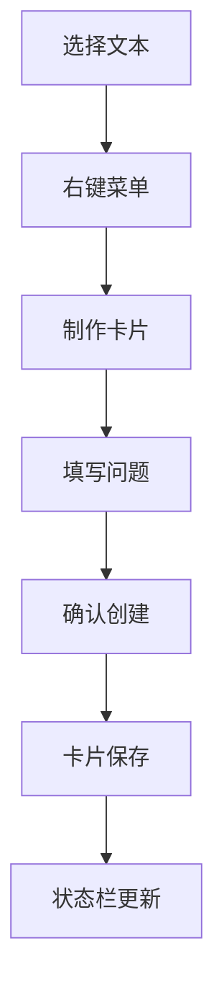

欢迎使用 NewAnki 插件！这是一个基于 Anki SM-2 算法的 Obsidian 间隔重复复习插件。本指南将帮助您快速上手插件的安装、配置和基本使用。

## 项目概述

NewAnki 是一个功能完整的间隔重复复习系统，专为 Obsidian 设计。它支持多种制卡方式、本地和全局复习系统，以及完整的 SM-2 算法实现。

**核心功能特性**：
- **右键制卡**：在编辑器中选择文本后右键快速创建复习卡片
- **分屏复习**：为单个 Markdown 文件创建专属复习视图
- **全局复习 Deck**：统一管理所有文件的复习卡片
- **SM-2 算法**：基于科学记忆曲线的智能复习调度
- **实时状态显示**：状态栏和功能区图标显示待复习卡片数量

Sources: [manifest.json](manifest.json#L1-L9)

## 开发环境准备

### 系统要求
- **Node.js**：版本 16.0 或更高
- **Obsidian**：版本 0.15.0 或更高
- **操作系统**：Windows、macOS 或 Linux

### 项目结构概览
```
newanki/
├── src/                    # TypeScript 源代码
│   ├── main.ts            # 插件主入口
│   ├── models.ts          # 数据模型定义
│   ├── store.ts           # 数据存储管理
│   ├── sm2.ts             # SM-2 算法实现
│   ├── createCardModal.ts # 制卡模态框
│   ├── cardPreviewModal.ts# 卡片预览模态框
│   ├── reviewView.ts      # 复习视图组件
│   └── settings.ts        # 设置界面
├── manifest.json          # 插件清单文件
├── package.json           # 项目依赖配置
├── esbuild.config.mjs     # 构建配置文件
└── styles.css            # 样式文件
```

Sources: [package.json](package.json#L1-L30), [esbuild.config.mjs](esbuild.config.mjs#L1-L50)

## 快速安装与运行

### 1. 克隆并安装依赖
```bash
# 克隆项目到 Obsidian 插件目录
git clone <repository-url> .obsidian/plugins/newanki

# 进入插件目录
cd .obsidian/plugins/newanki

# 安装依赖
npm install
```

### 2. 开发模式编译
```bash
# 启动开发模式（自动监听文件变化）
npm run dev
```

### 3. 启用插件
1. 打开 Obsidian
2. 进入设置 → 社区插件
3. 启用 NewAnki 插件
4. 重启 Obsidian 生效

Sources: [README.md](README.md#L15-L27)

## 核心功能快速体验

### 创建第一个复习卡片

1. **选择文本**：在任意 Markdown 文件中选中一段文本
2. **右键制卡**：右键菜单选择"制作卡片"
3. **填写问题**：在弹出的模态框中输入问题描述
4. **确认创建**：点击确认按钮完成卡片创建



Sources: [main.ts](src/main.ts#L61-L93)

### 开始复习

**本地文件复习**：
- 在文件资源管理器中右键 Markdown 文件
- 选择"复习卡片"开始该文件的专属复习

**全局复习**：
- 点击左侧功能区图标（图层图标）
- 或使用快捷键命令"全局复习"

**复习界面操作**：
- **困难**：需要更多复习
- **一般**：正常记忆水平
- **简单**：掌握良好
- **跳过**：暂时跳过当前卡片

Sources: [main.ts](src/main.ts#L96-L123)

## 配置个性化参数

NewAnki 提供了丰富的 SM-2 算法参数配置：

| 参数类别 | 配置项 | 默认值 | 说明 |
|---------|--------|--------|------|
| 学习阶段 | 学习步骤 | 1,10 分钟 | 新卡片的学习间隔 |
| 学习阶段 | 毕业间隔 | 1 天 | 通过学习阶段后的首次复习间隔 |
| 学习阶段 | 简单间隔 | 4 天 | 学习阶段直接按"简单"的间隔 |
| 复习参数 | 最小间隔 | 1 天 | 复习间隔的最小值 |
| 复习参数 | 最大间隔 | 36500 天 | 复习间隔的最大值 |
| 复习参数 | 初始难度 | 2.5 | 新卡片的初始难度系数 |

Sources: [settings.ts](src/settings.ts#L18-L69)

## 快捷键命令系统

NewAnki 提供了便捷的键盘操作：

| 命令 | 快捷键 | 功能描述 |
|------|--------|----------|
| 制作卡片 | 自定义 | 为选中文本创建复习卡片 |
| 复习当前文件的卡片 | 自定义 | 快速开始当前文件的复习 |
| 全局复习 | 自定义 | 打开全局复习界面 |

Sources: [main.ts](src/main.ts#L142-L197)

## 下一步学习建议

完成快速入门后，建议按以下顺序深入学习：

1. **[卡片创建与管理](3-qia-pian-chuang-jian-yu-guan-li)**：详细了解制卡流程和卡片管理
2. **[复习系统配置](4-fu-xi-xi-tong-pei-zhi)**：深入理解 SM-2 算法参数调优
3. **[界面导航与操作](5-jie-mian-dao-hang-yu-cao-zuo)**：掌握所有用户界面功能

如果您是开发者，可以继续学习技术详解部分，了解插件的架构设计和实现原理。

## 常见问题快速解决

**Q: 插件无法启用？**
A: 检查 Obsidian 版本是否 ≥ 0.15.0，并确认已正确安装依赖。

**Q: 卡片创建失败？**
A: 确保已选中文本，且文件路径有效。

**Q: 复习界面不显示？**
A: 检查是否有到期的复习卡片，空文件不会显示复习选项。

Sources: [main.ts](src/main.ts#L176-L181)

现在您已经掌握了 NewAnki 插件的基本使用方法。开始创建您的第一个复习卡片，体验智能记忆系统的强大功能吧！