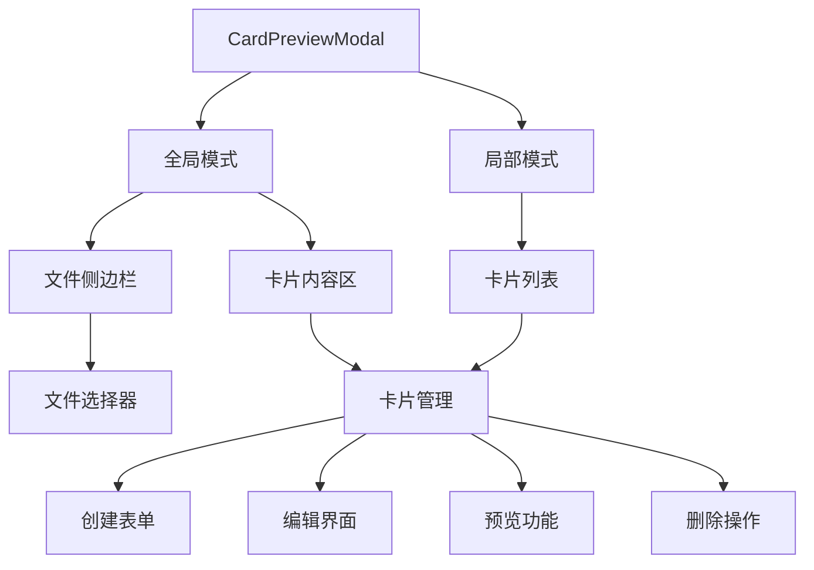

卡片预览模态框是 NewAnki 插件的核心管理界面，提供了全局和局部两种预览模式，支持卡片的创建、编辑、删除和预览功能。该组件采用双栏布局设计，集成了 Markdown 渲染引擎，为开发者提供了完整的卡片生命周期管理能力。

## 架构设计

卡片预览模态框基于 Obsidian 的 Modal 基类构建，采用分层渲染架构，支持两种预览范围：



模态框通过 `PreviewScope` 类型区分工作模式，全局模式显示所有 Markdown 文件中的卡片，局部模式仅显示当前文件的卡片。Sources: [cardPreviewModal.ts](src/cardPreviewModal.ts#L5-L12)

## 核心功能实现

### 模态框初始化与配置

模态框构造函数接收完整的配置选项，包括存储实例、预览范围和文件路径：

```typescript
interface CardPreviewModalOptions {
    store: CardStore;
    scope: PreviewScope;
    filePath?: string;
    onDataChanged?: () => void;
}
```

初始化时，模态框会设置 CSS 类名 `newanki-card-preview-modal` 并加载 Markdown 渲染组件。Sources: [cardPreviewModal.ts](src/cardPreviewModal.ts#L27-L44)

### 双模式渲染策略

模态框根据预览范围采用不同的渲染策略：

| 模式 | 布局结构 | 功能特点 | 适用场景 |
|------|----------|----------|----------|
| 全局模式 | 侧边栏 + 内容区 | 文件导航、批量管理 | 系统级卡片管理 |
| 局部模式 | 单一列表 | 专注当前文件 | 文件内卡片操作 |

全局模式下，左侧显示 Markdown 文件列表，右侧显示选中文件的卡片。局部模式则直接显示当前文件的卡片列表。Sources: [cardPreviewModal.ts](src/cardPreviewModal.ts#L46-L110)

### 卡片创建与编辑系统

模态框集成了完整的卡片 CRUD 操作：

**创建表单特性**：
- 动态文本域自动调整高度
- 全局模式支持文件选择器
- 实时表单验证
- Markdown 语法支持

**编辑界面功能**：
- 内联编辑问题与答案
- 实时 Markdown 预览切换
- 批量操作支持
- 进度重置功能（局部模式）

```typescript
// 卡片数据结构
const card: CardData = {
    cardId: this.generateId(),
    question,          // 问题文本
    answer,            // 答案文本（支持 Markdown）
    sourceFile,        // 来源文件路径
    state: State.Learning, // 学习状态
    due: new Date().toISOString(), // 到期时间
    createdAt: new Date().toISOString(), // 创建时间
};
```

Sources: [cardPreviewModal.ts](src/cardPreviewModal.ts#L174-L280)

### Markdown 实时预览引擎

模态框集成了 Obsidian 的原生 Markdown 渲染器，提供实时预览功能：

```typescript
private async renderMarkdown(markdown: string, container: HTMLElement, sourcePath: string): Promise<void> {
    await MarkdownRenderer.render(
        this.app,
        markdown,
        container,
        sourcePath,
        this.markdownComponent
    );
}
```

预览系统支持错误处理和空内容显示，确保用户体验的稳定性。Sources: [cardPreviewModal.ts](src/cardPreviewModal.ts#L446-L470)

## 交互设计模式

### 状态管理机制

模态框维护多个内部状态变量，确保界面一致性：

| 状态变量 | 类型 | 作用 | 触发更新 |
|----------|------|------|----------|
| `showCreateForm` | boolean | 控制创建表单显示 | 用户点击"添加卡片" |
| `selectedGlobalFile` | string | 全局模式选中的文件 | 文件列表点击 |
| `createQuestion/Answer` | string | 创建表单内容 | 文本输入事件 |
| `previewVisible` | boolean | 卡片预览状态 | 预览按钮点击 |

### 事件处理流程

模态框采用响应式事件处理模式：

1. **用户交互** → 更新内部状态
2. **状态变更** → 触发 `render()` 方法
3. **重新渲染** → 更新 DOM 结构
4. **数据持久化** → 调用存储接口

这种设计确保了界面状态与数据模型的一致性。Sources: [cardPreviewModal.ts](src/cardPreviewModal.ts#L328-L388)

## 技术实现细节

### 文件路径管理

模态框通过多种方法获取和管理文件路径：

```typescript
private getGlobalFilePaths(): string[] {
    return this.app.vault
        .getMarkdownFiles()
        .map(f => f.path)
        .sort((a, b) => a.localeCompare(b, "zh-CN"));
}
```

支持中文文件名排序，确保文件列表的本地化显示。Sources: [cardPreviewModal.ts](src/cardPreviewModal.ts#L420-L438)

### 自动尺寸调整

文本域组件实现了自动高度调整功能：

```typescript
private autoResizeTextarea(textarea: HTMLTextAreaElement): void {
    textarea.style.height = "auto";
    textarea.style.height = `${textarea.scrollHeight}px`;
}
```

该功能在输入时动态调整文本域高度，提供更好的编辑体验。Sources: [cardPreviewModal.ts](src/cardPreviewModal.ts#L441-L444)

### 数据变更通知

模态框通过回调机制通知外部组件数据变更：

```typescript
private notifyDataChanged(): void {
    this.onDataChanged?.();
}
```

这种设计使得模态框可以与其他组件（如状态栏、复习视图）保持数据同步。Sources: [cardPreviewModal.ts](src/cardPreviewModal.ts#L478-L480)

## 性能优化策略

1. **按需渲染**：仅在状态变更时重新渲染受影响的部分
2. **组件复用**：Markdown 渲染组件在模态框生命周期内复用
3. **事件委托**：合理使用事件监听器，避免内存泄漏
4. **懒加载**：预览内容仅在用户请求时渲染

卡片预览模态框作为 NewAnki 插件的核心管理界面，通过精心的架构设计和功能实现，为开发者提供了强大而灵活的卡片管理能力。其模块化设计和可扩展性为后续功能迭代奠定了坚实基础。