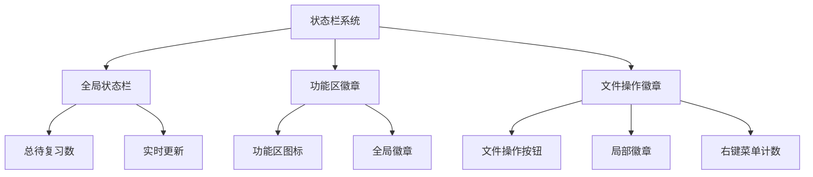

NewAnki插件的状态栏与徽章系统提供了实时的复习状态可视化，通过多层次的UI组件向用户展示卡片复习进度。系统采用分层架构设计，从全局状态栏到局部文件操作按钮，实现了全方位的状态监控。

## 系统架构概述

状态栏与徽章系统采用三层架构设计，分别对应不同的使用场景和粒度级别：



系统通过事件驱动的更新机制，确保所有UI组件在卡片状态变化时保持同步。Sources: [src/main.ts](src/main.ts#L10-L12)

## 全局状态栏实现

全局状态栏位于Obsidian窗口底部，提供整个插件的复习状态概览：

### 初始化与配置
```typescript
private statusBarEl: HTMLElement | null = null;

// 在插件加载时初始化状态栏
this.statusBarEl = this.addStatusBarItem();
this.updateStatusBar();
```

状态栏组件通过`addStatusBarItem()`方法创建，并立即调用更新函数显示初始状态。Sources: [src/main.ts](src/main.ts#L38-L39)

### 状态更新逻辑
```typescript
private updateStatusBar(): void {
    const total = this.store.getTotalDueCount();
    if (this.statusBarEl) {
        if (total > 0) {
            this.statusBarEl.setText(`NewAnki: ${total} 张待复习`);
        } else {
            this.statusBarEl.setText("");
        }
    }
}
```

状态栏采用智能显示策略，当没有待复习卡片时自动隐藏文本，避免占用不必要的空间。更新频率为30秒一次，确保信息实时性。Sources: [src/main.ts](src/main.ts#L357-L366)

## 功能区徽章系统

功能区徽章附着在左侧功能区图标上，提供直观的全局复习提醒：

### 功能区图标注册
```typescript
this.globalReviewRibbonEl = this.addRibbonIcon("layers", "NewAnki 全局复习", () => {
    this.startGlobalReview();
});
this.globalReviewRibbonEl.addClass("newanki-global-review-ribbon");
```

系统注册了两个功能区图标：全局复习和全局卡片预览器，分别对应不同的功能入口。Sources: [src/main.ts](src/main.ts#L28-L34)

### 徽章动态更新
```typescript
private updateGlobalReviewRibbonBadge(): void {
    if (!this.globalReviewRibbonEl) return;

    if (this.globalReviewBadgeEl) {
        this.globalReviewBadgeEl.remove();
        this.globalReviewBadgeEl = null;
    }

    const totalDue = this.store.getTotalDueCount();
    if (totalDue <= 0) return;

    this.globalReviewBadgeEl = this.globalReviewRibbonEl.createEl("span", {
        text: totalDue >= 100 ? "99+" : String(totalDue),
        cls: "newanki-badge newanki-ribbon-badge",
    });
    this.globalReviewBadgeEl.setAttr("aria-label", `全局待复习 ${totalDue} 张`);
}
```

徽章系统采用动态创建和销毁策略，仅在存在待复习卡片时显示徽章。支持大数字显示优化（99+），确保UI整洁。Sources: [src/main.ts](src/main.ts#L368-L384)

## 文件操作徽章系统

文件操作徽章集成在Markdown编辑器的标题栏操作按钮中，提供文件级别的复习状态：

### 操作按钮注册机制
```typescript
private updateReviewAction(): void {
    this.clearReviewAction();

    const view = this.app.workspace.getActiveViewOfType(MarkdownView);
    if (!view?.file) return;

    const dueCount = this.store.getDueCardCount(view.file.path);
    const cardCount = this.store.getCardCount(view.file.path);

    // 注册局部预览操作按钮
    this.localPreviewActionEl = view.addAction(
        "list",
        `局部卡片预览 (${cardCount})`,
        () => {
            if (view.file) {
                this.openLocalCardPreview(view.file.path);
            }
        }
    );

    // 注册复习操作按钮（仅在存在卡片时）
    if (cardCount <= 0) return;

    this.reviewActionEl = view.addAction("layers", `复习卡片 (${dueCount}/${cardCount} 到期)`, () => {
        if (view.file) {
            this.startFileReview(view.file.path);
        }
    });

    // 动态创建徽章
    if (dueCount > 0) {
        const badge = this.reviewActionEl.createEl("span", {
            text: dueCount >= 100 ? "99+" : String(dueCount),
            cls: "newanki-badge",
        });
        badge.setAttr("aria-label", `待复习 ${dueCount} 张`);
    }
}
```

文件操作徽章系统实现了智能的条件渲染，根据文件中的卡片数量动态决定是否显示操作按钮和徽章。Sources: [src/main.ts](src/main.ts#L218-L254)

### 事件监听与自动更新
```typescript
private registerReviewAction(): void {
    this.registerEvent(
        this.app.workspace.on("active-leaf-change", () => {
            this.updateReviewAction();
        })
    );
    this.registerEvent(
        this.app.workspace.on("file-open", () => {
            this.updateReviewAction();
        })
    );
    this.app.workspace.onLayoutReady(() => {
        this.updateReviewAction();
    });
}
```

系统监听工作区活跃标签页变化和文件打开事件，确保操作按钮和徽章随当前活动文件实时更新。Sources: [src/main.ts](src/main.ts#L202-L216)

## 视觉设计规范

徽章系统采用统一的视觉设计语言，确保在不同场景下的一致性：

### CSS样式定义
```css
.newanki-review-action .newanki-badge,
.newanki-global-review-ribbon .newanki-ribbon-badge {
    position: absolute;
    top: -4px;
    right: -4px;
    min-width: 16px;
    height: 16px;
    padding: 0 4px;
    border-radius: 8px;
    background: #e74c3c;
    color: #fff;
    font-size: 10px;
    font-weight: 700;
    line-height: 16px;
    text-align: center;
    pointer-events: none;
    box-sizing: border-box;
}
```

徽章采用红色背景配白色文字，确保高对比度和可读性。绝对定位确保徽章正确附着在父元素右上角。Sources: [styles.css](styles.css#L7-L24)

### 响应式设计特性
| 特性 | 实现方式 | 效果 |
|------|----------|------|
| 大数字优化 | `totalDue >= 100 ? "99+" : String(totalDue)` | 避免徽章过大影响布局 |
| 条件显示 | `if (totalDue <= 0) return;` | 无待复习时隐藏徽章 |
| 无障碍支持 | `setAttr("aria-label", ...)` | 为屏幕阅读器提供语义信息 |

## 性能优化策略

系统采用多项性能优化措施确保流畅的用户体验：

### 更新频率控制
```typescript
this.registerInterval(
    window.setInterval(() => {
        this.updateStatusBar();
        this.updateGlobalReviewRibbonBadge();
    }, 30000) // 30秒更新间隔
);
```

状态栏和功能区徽章采用30秒更新间隔，平衡实时性和性能消耗。Sources: [src/main.ts](src/main.ts#L41-L46)

### 内存管理
```typescript
private clearReviewAction(): void {
    if (this.reviewActionEl) {
        this.reviewActionEl.remove();
        this.reviewActionEl = null;
    }
    // 清理残留的操作按钮元素
    document.querySelectorAll<HTMLElement>([...]).forEach((el) => el.remove());
}
```

系统在更新操作按钮时主动清理旧元素，避免内存泄漏和重复元素问题。Sources: [src/main.ts](src/main.ts#L256-L276)

## 集成事件处理

状态栏与徽章系统深度集成到插件的核心事件流中：

### 统一状态更新入口
```typescript
private handleCardsChanged(): void {
    this.updateStatusBar();
    this.updateReviewAction();
    this.updateGlobalReviewRibbonBadge();
}
```

所有卡片相关的状态变化（创建、删除、复习）都会触发统一的状态更新，确保UI一致性。Sources: [src/main.ts](src/main.ts#L54-L58)

状态栏与徽章系统通过精心的架构设计和实现细节，为NewAnki插件提供了专业级的用户体验。系统不仅功能完善，还在性能和可维护性方面达到了生产级标准。