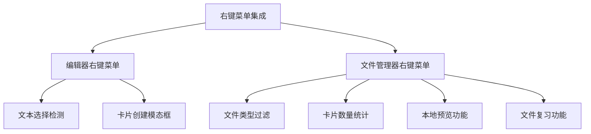
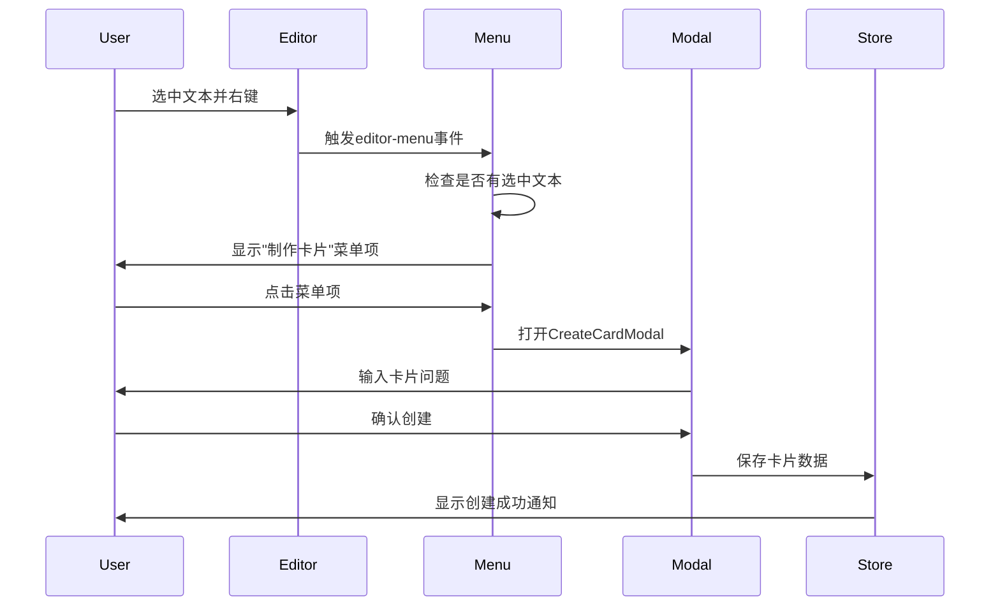
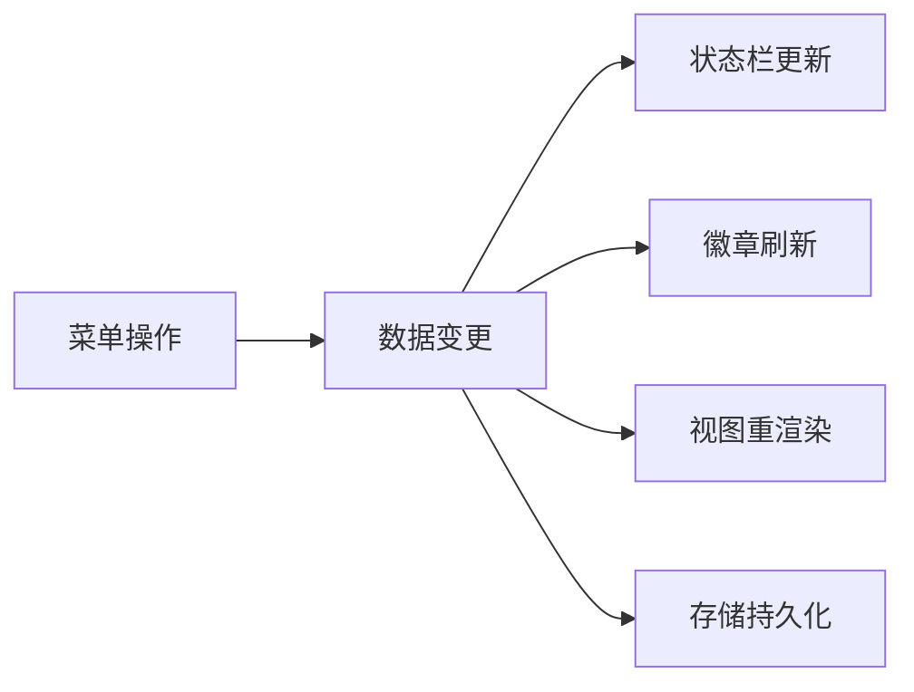

NewAnki插件通过两种主要的右键菜单机制提供便捷的卡片操作体验：编辑器右键菜单和文件管理器右键菜单。这些菜单项根据上下文智能显示，为用户提供快速创建卡片、预览和复习的功能入口。

## 架构设计概览

右键菜单集成采用分层的事件监听架构，通过Obsidian的标准API实现上下文感知的菜单项注册。系统包含两个主要菜单类型：编辑器菜单（基于文本选择）和文件菜单（基于文件操作）。



## 编辑器右键菜单实现

编辑器右键菜单是卡片创建的主要入口，当用户在Markdown编辑器中选中文本后，通过右键菜单可以快速创建新卡片。该功能通过监听`editor-menu`事件实现上下文感知。

**核心实现逻辑**：
- 检测当前编辑器是否有文本被选中
- 获取选中文本内容和光标位置信息
- 动态添加"制作卡片"菜单项
- 触发卡片创建模态框

```typescript
private registerEditorContextMenu(): void {
    this.registerEvent(
        this.app.workspace.on("editor-menu", (menu, editor, view) => {
            const selection = editor.getSelection();
            if (!selection) return;

            menu.addItem((item) => {
                item.setTitle("制作卡片")
                    .setIcon("plus-circle")
                    .onClick(() => {
                        // 获取文件信息和光标位置
                        const file = view.file;
                        const cursor = editor.getCursor("from");
                        const cursorTo = editor.getCursor("to");
                        
                        // 打开卡片创建模态框
                        new CreateCardModal(
                            this.app,
                            selection,
                            file.path,
                            cursor.line,
                            cursorTo.line,
                            async (card) => {
                                await this.store.addCard(card);
                                new Notice("卡片已创建！");
                                this.handleCardsChanged();
                            }
                        ).open();
                    });
            });
        })
    );
}
```

**菜单项触发流程**：


Sources: [main.ts](src/main.ts#L61-L93)

## 文件管理器右键菜单

文件管理器右键菜单为文件级别的卡片操作提供入口，支持基于单个文件的卡片预览和复习功能。该功能通过监听`file-menu`事件实现文件类型过滤和卡片数量统计。

**智能菜单项显示策略**：
- 仅对Markdown文件（.md扩展名）显示菜单项
- 动态显示卡片数量和到期卡片数量
- 根据文件中的卡片数量决定是否显示复习选项

```typescript
private registerFileMenu(): void {
    this.registerEvent(
        this.app.workspace.on("file-menu", (menu, file) => {
            // 文件类型过滤
            if (!(file instanceof TFile) || file.extension !== "md") return;

            // 卡片数量统计
            const cardCount = this.store.getCardCount(file.path);
            const dueCount = this.store.getDueCardCount(file.path);

            // 卡片预览菜单项（始终显示）
            menu.addItem((item) => {
                item.setTitle(`卡片预览 (${cardCount})`)
                    .setIcon("list")
                    .onClick(() => {
                        this.openLocalCardPreview(file.path);
                    });
            });

            // 复习菜单项（仅当有卡片时显示）
            if (cardCount > 0) {
                menu.addItem((item) => {
                    item.setTitle(`复习卡片 (${dueCount}/${cardCount} 到期)`)
                        .setIcon("layers")
                        .onClick(() => {
                            this.startFileReview(file.path);
                        });
                });
            }
        })
    );
}
```

**文件菜单功能对比表**：

| 菜单项 | 显示条件 | 图标 | 功能描述 |
|--------|----------|------|----------|
| 卡片预览 | 所有.md文件 | list | 打开当前文件的卡片预览模态框 |
| 复习卡片 | 文件中有卡片 | layers | 启动基于当前文件的卡片复习 |

Sources: [main.ts](src/main.ts#L96-L123)

## 模态框集成架构

右键菜单触发的功能通过专门的模态框组件实现，确保用户体验的一致性和功能的完整性。

### 卡片创建模态框

创建卡片模态框提供直观的界面用于定义卡片的问题和答案，同时自动捕获选中文本作为答案内容。

**模态框特性**：
- 自动显示选中文本作为答案预览
- 问题输入框支持多行文本
- 智能验证确保问题不为空
- 集成文件路径和行号信息

```typescript
export class CreateCardModal extends Modal {
    constructor(
        app: App,
        answer: string,           // 自动捕获的选中文本
        sourceFile: string,       // 源文件路径
        lineStart: number,        // 起始行号
        lineEnd: number,          // 结束行号
        onSubmit: (card: CardData) => void
    ) {
        // 初始化逻辑
    }
}
```

Sources: [createCardModal.ts](src/createCardModal.ts#L12-L26)

### 卡片预览模态框

卡片预览模态框提供文件级别的卡片管理界面，支持查看、编辑和重置卡片复习进度。

**预览模态框功能**：
- 分全局和本地两种预览模式
- 支持按文件筛选卡片（全局模式）
- 提供卡片重置和批量操作功能
- 实时显示卡片状态和复习进度

```typescript
interface CardPreviewModalOptions {
    store: CardStore;
    scope: PreviewScope;          // "global" | "local"
    filePath?: string;            // 本地模式时指定文件路径
    onDataChanged?: () => void;   // 数据变更回调
}
```

Sources: [cardPreviewModal.ts](src/cardPreviewModal.ts#L7-L12)

## 智能上下文感知

右键菜单集成具备强大的上下文感知能力，根据不同的操作场景动态调整菜单项的内容和可用性。

**上下文检测机制**：

| 上下文类型 | 检测条件 | 可用菜单项 |
|------------|----------|------------|
| 编辑器选中文本 | `editor.getSelection()` 有值 | 制作卡片 |
| Markdown文件 | 文件扩展名为.md | 卡片预览、复习卡片 |
| 文件中有卡片 | `store.getCardCount() > 0` | 复习卡片 |

**动态内容更新**：
- 菜单项标题实时显示卡片数量：`卡片预览 (3)`
- 复习菜单项显示到期卡片比例：`复习卡片 (2/3 到期)`
- 无卡片时自动隐藏复习选项

Sources: [main.ts](src/main.ts#L99-L122)

## 集成事件处理

右键菜单功能与插件的其他组件深度集成，确保数据一致性和状态同步。

**事件响应链**：


**关键集成点**：
- 卡片创建后触发`handleCardsChanged()`更新所有UI组件
- 文件重命名和删除时自动更新卡片关联路径
- 复习进度变更实时反映在菜单项状态中

Sources: [main.ts](src/main.ts#L278-L298)

## 性能优化策略

右键菜单集成采用多项性能优化措施，确保在大规模卡片库中的响应速度。

**优化技术**：
- 懒加载：菜单项仅在需要时创建和注册
- 缓存机制：卡片数量统计结果缓存避免重复计算
- 事件防抖：高频操作采用节流控制
- 内存管理：及时清理未使用的菜单项元素

**资源管理**：
```typescript
private clearReviewAction(): void {
    // 清理视图动作元素
    if (this.reviewActionEl) {
        this.reviewActionEl.remove();
        this.reviewActionEl = null;
    }
    // 清理残留的DOM元素
    document.querySelectorAll('.view-action.newanki-review-action').forEach(el => el.remove());
}
```

Sources: [main.ts](src/main.ts#L256-L276)

右键菜单集成作为NewAnki插件的重要用户交互入口，通过精心设计的上下文感知机制和流畅的操作流程，为用户提供了高效便捷的卡片管理体验。这种设计既符合Obsidian插件的开发规范，又充分考虑了闪卡学习场景的实际需求。