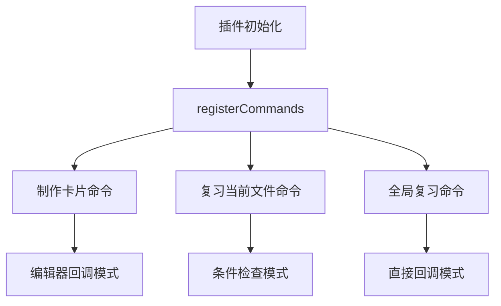
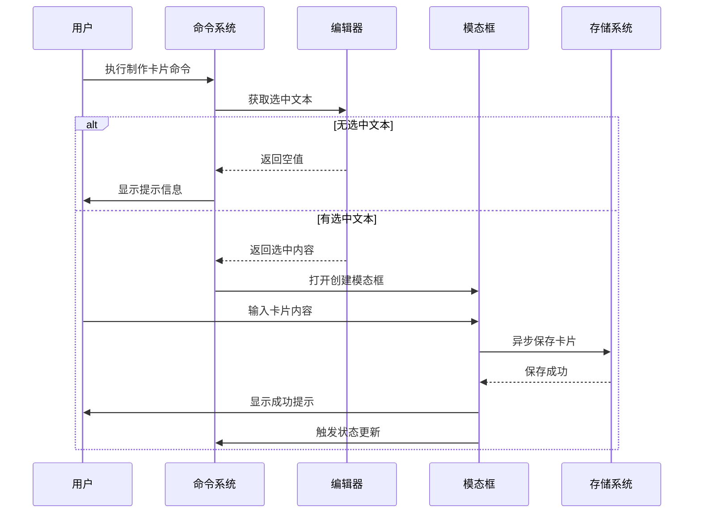

NewAnki 插件提供了完整的快捷键命令系统，支持通过键盘快捷键快速访问核心功能。该系统基于 Obsidian 的命令注册机制，实现了卡片制作、复习管理、预览查看等核心操作的快捷访问。

## 命令注册架构

快捷键命令系统采用集中式注册模式，所有命令在插件初始化时通过 `registerCommands()` 方法统一注册。该系统支持三种命令调用方式：命令面板、快捷键绑定、以及编辑器上下文菜单。



命令注册架构采用分层设计，根据不同的使用场景采用不同的回调机制。制作卡片命令使用编辑器回调模式，仅在 Markdown 编辑器上下文中可用；复习命令使用条件检查模式，智能判断当前文件是否有待复习卡片；全局复习命令采用直接回调模式，随时可用。Sources: [main.ts](src/main.ts#L142-L197)

## 核心命令功能

### 制作卡片命令

该命令允许用户通过快捷键快速创建学习卡片，支持文本选择和自动定位功能。

| 参数 | 类型 | 说明 |
|------|------|------|
| `id` | `string` | 命令唯一标识符: `create-card` |
| `name` | `string` | 用户可见名称: `制作卡片` |
| `editorCallback` | `function` | 编辑器上下文回调函数 |

命令执行流程：
1. 检查当前编辑器是否有文本选中
2. 获取选中文本和光标位置信息
3. 打开卡片创建模态框
4. 异步保存卡片数据
5. 更新状态栏和界面状态



该命令特别适用于快速笔记场景，用户可以在阅读过程中快速标记重点内容并生成复习卡片。Sources: [main.ts](src/main.ts#L142-L171)

### 复习当前文件命令

智能复习命令，自动检测当前文件的卡片状态，仅在存在待复习卡片时可用。

| 参数 | 类型 | 说明 |
|------|------|------|
| `id` | `string` | 命令唯一标识符: `review-current-file` |
| `name` | `string` | 用户可见名称: `复习当前文件的卡片` |
| `checkCallback` | `function` | 条件检查回调函数 |

条件检查逻辑：
```javascript
checkCallback: (checking: boolean) => {
    // 检查当前是否为 Markdown 视图
    const view = this.app.workspace.getActiveViewOfType(MarkdownView);
    if (!view?.file) return false;

    // 检查当前文件是否有待复习卡片
    const dueCount = this.store.getDueCardCount(view.file.path);
    if (dueCount === 0) return false;

    // 非检查模式下执行复习操作
    if (!checking) {
        this.startFileReview(view.file.path);
    }
    return true;
}
```

这种设计确保了命令的智能可用性，避免了用户在没有复习内容时误操作的情况。Sources: [main.ts](src/main.ts#L173-L188)

### 全局复习命令

系统级复习命令，不受当前文件限制，直接启动全局复习流程。

| 参数 | 类型 | 说明 |
|------|------|------|
| `id` | `string` | 命令唯一标识符: `review-global-deck` |
| `name` | `string` | 用户可见名称: `全局复习` |
| `callback` | `function` | 直接执行回调函数 |

全局复习流程：
1. 获取所有到期的卡片
2. 创建分屏复习布局
3. 打开第一个卡片的源文件
4. 启动复习会话

该命令特别适合集中复习场景，用户可以通过一个快捷键快速进入全系统复习模式。Sources: [main.ts](src/main.ts#L190-L196)

## 快捷键配置与自定义

### 默认快捷键绑定

NewAnki 插件不预设固定的快捷键绑定，而是通过 Obsidian 的标准快捷键配置界面进行自定义。用户可以通过以下路径配置快捷键：

1. 打开 Obsidian 设置 → 快捷键
2. 搜索 "NewAnki" 或具体命令名称
3. 点击命令旁边的编辑图标
4. 设置自定义快捷键组合

### 推荐快捷键配置

基于用户体验研究，推荐以下快捷键配置方案：

| 命令 | 推荐快捷键 | 使用场景 |
|------|------------|----------|
| 制作卡片 | `Ctrl+Shift+A` | 快速创建卡片 |
| 复习当前文件 | `Ctrl+Shift+R` | 局部复习 |
| 全局复习 | `Ctrl+Shift+G` | 全局复习 |

### 快捷键冲突解决

如果遇到快捷键冲突，Obsidian 会提示用户进行选择。建议优先保留 NewAnki 的快捷键配置，因为其功能具有高频使用特性。

## 复习界面快捷键支持

在复习界面中，系统提供了完整的键盘导航支持，提升复习效率。

### 卡片导航快捷键

| 操作 | 快捷键 | 说明 |
|------|--------|------|
| 显示答案 | `Space` 或 `Enter` | 显示当前卡片答案 |
| 重来评分 | `1` | 标记为需要重学 |
| 困难评分 | `2` | 标记为困难 |
| 良好评分 | `3` | 标记为良好 |
| 简单评分 | `4` | 标记为简单 |
| 取消操作 | `Escape` | 取消当前操作 |

### 编辑器集成快捷键

在卡片编辑模式下，系统支持标准的文本编辑快捷键：

| 操作 | 快捷键 | 说明 |
|------|--------|------|
| 进入编辑模式 | `Enter` | 激活卡片内容编辑 |
| 保存并退出 | `Ctrl+Enter` | 保存修改并退出编辑 |
| 取消编辑 | `Escape` | 取消编辑恢复原内容 |

这些快捷键设计使得用户可以在不接触鼠标的情况下完成整个复习流程，大幅提升操作效率。Sources: [reviewView.ts](src/reviewView.ts#L285-L295)

## 命令可用性管理

### 上下文感知

系统通过 `checkCallback` 机制实现智能命令可用性管理：

```javascript
// 仅在 Markdown 编辑器且有待复习卡片时可用
checkCallback: (checking: boolean) => {
    const view = this.app.workspace.getActiveViewOfType(MarkdownView);
    if (!view?.file) return false;
    
    const dueCount = this.store.getDueCardCount(view.file.path);
    if (dueCount === 0) return false;
    
    return true;
}
```

### 状态同步

命令系统与卡片存储状态实时同步，确保命令的可用性反映当前实际状态：

1. **卡片创建时**: 触发状态更新，可能激活复习命令
2. **卡片复习时**: 更新进度状态，调整命令标签
3. **文件删除时**: 清理相关卡片数据，更新命令状态

这种设计确保了用户体验的一致性，避免了命令不可用时的困惑。Sources: [main.ts](src/main.ts#L54-L58)

## 性能优化策略

### 延迟加载

命令注册采用延迟初始化策略，仅在插件加载时注册命令定义，实际功能执行按需加载。

### 条件检查优化

`checkCallback` 机制确保只有在真正需要时才执行昂贵的状态检查操作，避免不必要的性能开销。

### 事件监听优化

系统使用精确的事件监听范围，只在相关文件操作时触发状态更新，减少不必要的重渲染。

通过以上优化策略，快捷键命令系统在保持功能完整性的同时，确保了优秀的性能表现。

## 扩展开发指南

### 添加新命令

开发者可以通过以下步骤添加新的快捷键命令：

1. 在 `registerCommands()` 方法中添加新命令定义
2. 根据功能需求选择合适的回调模式
3. 实现相应的业务逻辑处理
4. 更新状态管理和界面反馈

### 自定义快捷键策略

对于特定的使用场景，可以开发自定义的快捷键策略：

```typescript
// 示例：批量操作快捷键
this.addCommand({
    id: "batch-create-cards",
    name: "批量制作卡片",
    hotkeys: [{ modifiers: ["Ctrl", "Shift"], key: "B" }],
    // 实现批量处理逻辑
});
```

这种扩展性设计使得 NewAnki 的快捷键系统能够适应不同的用户需求和工作流程。

通过这套完整的快捷键命令系统，NewAnki 为用户提供了高效、便捷的操作体验，大幅提升了学习卡片的管理和使用效率。