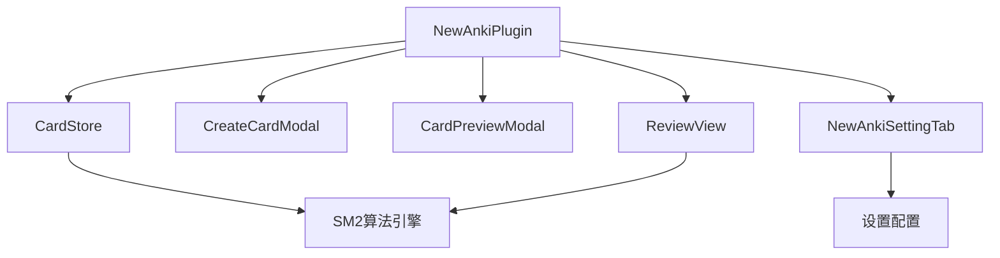

本文档为中级开发者提供 newanki 插件的完整 API 参考，涵盖核心模块的接口定义、数据模型、服务类和方法调用。通过系统化的 API 分类和详细说明，帮助开发者理解插件架构并进行扩展开发。

## 核心模块架构概述

newanki 插件采用模块化架构设计，主要包含以下核心模块：



**模块职责说明**：
- **NewAnkiPlugin**: 插件主入口，负责生命周期管理和事件注册
- **CardStore**: 数据存储服务，管理卡片CRUD操作
- **SM2算法引擎**: 实现间隔重复算法的核心逻辑
- **UI组件**: 提供卡片创建、预览、复习等用户界面

Sources: [main.ts](src/main.ts#L8-L47)

## 数据模型接口

### 卡片状态枚举 (State)
```typescript
export enum State {
    Learning = 1,      // 学习阶段
    Review = 2,        // 复习阶段  
    Relearning = 3,    // 重新学习阶段
}
```
**状态流转**：Learning → Review → Relearning → Review

### 复习评分枚举 (Rating)
```typescript
export enum Rating {
    Again = 1,    // 忘记
    Hard = 2,     // 困难
    Good = 3,     // 良好
    Easy = 4,     // 简单
}
```

### 卡片数据结构 (CardData)
```typescript
export interface CardData {
    cardId: string;           // 唯一标识符
    question: string;         // 问题内容
    answer: string;          // 答案内容
    sourceFile: string;      // 源文件路径
    lineStart: number;       // 起始行号
    lineEnd: number;         // 结束行号
    state: State;           // 当前状态
    step: number | null;     // 学习步骤（仅学习阶段）
    ease: number | null;     // 难度系数
    due: string;            // 到期时间（ISO格式）
    currentInterval: number | null;  // 当前间隔天数
    createdAt: string;      // 创建时间
}
```

### 插件设置接口 (PluginSettings)
```typescript
export interface PluginSettings {
    learningSteps: number[];        // 学习阶段间隔（分钟）
    graduatingInterval: number;     // 毕业间隔（天）
    easyInterval: number;           // 简单间隔（天）
    relearningSteps: number[];      // 重新学习间隔（分钟）
    minimumInterval: number;        // 最小间隔（天）
    maximumInterval: number;        // 最大间隔（天）
    startingEase: number;           // 初始难度系数
    easyBonus: number;              // 简单奖励系数
    intervalModifier: number;       // 间隔调整系数
    hardInterval: number;           // 困难间隔系数
    newInterval: number;            // 新卡片间隔系数
}
```

Sources: [models.ts](src/models.ts#L1-L74)

## 存储服务 API (CardStore)

### 数据管理方法

#### 加载与保存
```typescript
async load(): Promise<void>          // 从存储加载数据
async save(): Promise<void>          // 保存数据到存储
```

#### 卡片查询方法
```typescript
getCardsForFile(filePath: string): CardData[]              // 获取文件所有卡片
getDueCardsForFile(filePath: string): CardData[]           // 获取文件到期卡片
getAllCards(): CardData[]                                  // 获取所有卡片
getAllDueCards(): CardData[]                               // 获取所有到期卡片
getFilesWithCards(): string[]                              // 获取包含卡片的文件列表
```

#### 卡片管理方法
```typescript
async addCard(card: CardData): Promise<void>               // 添加新卡片
async updateCard(card: CardData): Promise<void>            // 更新卡片
async deleteCard(cardId: string, filePath: string): Promise<void>  // 删除卡片
async resetReviewProgressForFile(filePath: string): Promise<number> // 重置复习进度
```

#### 文件操作处理
```typescript
async handleFileRename(oldPath: string, newPath: string): Promise<boolean>
async handleFileDelete(filePath: string): Promise<boolean>
```

#### 统计方法
```typescript
getCardCount(filePath: string): number                     // 文件卡片数量
getDueCardCount(filePath: string): number                  // 文件到期卡片数量  
getTotalCardCount(): number                                // 总卡片数量
getTotalDueCount(): number                                 // 总到期卡片数量
```

Sources: [store.ts](src/store.ts#L13-L200)

## SM-2 算法 API

### 核心算法函数
```typescript
export function reviewCard(
    card: CardData,
    rating: Rating,
    settings: PluginSettings,
    reviewDatetime?: string
): ScheduleResult
```

**参数说明**：
- `card`: 要复习的卡片数据
- `rating`: 用户评分（Again/Hard/Good/Easy）
- `settings`: 算法配置参数
- `reviewDatetime`: 复习时间（可选，默认当前时间）

**返回值** (ScheduleResult):
```typescript
interface ScheduleResult {
    card: CardData;         // 更新后的卡片数据
    rating: Rating;         // 用户评分
    reviewDatetime: string; // 复习时间
}
```

### 间隔预览功能
```typescript
export interface IntervalPreview {
    rating: Rating;                // 评分类型
    interval: number;              // 间隔数值
    unit: "minutes" | "days";      // 时间单位
    label: string;                 // 显示标签
}
```

**算法特性**：
- 支持学习、复习、重新学习三种状态
- 实现间隔随机化（fuzzing）避免模式化
- 处理逾期复习的间隔调整
- 支持自定义难度系数调整

Sources: [sm2.ts](src/sm2.ts#L69-L292)

## 插件主类 API (NewAnkiPlugin)

### 生命周期方法
```typescript
async onload(): Promise<void>      // 插件加载
onunload(): void                   // 插件卸载
```

### 事件注册方法
```typescript
private registerEditorContextMenu(): void   // 注册编辑器右键菜单
private registerFileMenu(): void            // 注册文件菜单
private registerCommands(): void            // 注册命令
private registerFileEvents(): void          // 注册文件事件
private registerReviewAction(): void        // 注册复习操作
```

### 复习流程控制
```typescript
private startFileReview(filePath: string): Promise<void>    // 启动文件复习
private startGlobalReview(): Promise<void>                  // 启动全局复习
private createSplitLayout(): Promise<{ reviewLeaf: WorkspaceLeaf, sourceLeaf: WorkspaceLeaf }>  // 创建分屏布局
```

### UI 操作方法
```typescript
private openGlobalCardPreview(): void       // 打开全局卡片预览
private openLocalCardPreview(filePath: string): void  // 打开本地卡片预览
private updateStatusBar(): void             // 更新状态栏
private updateGlobalReviewRibbonBadge(): void  // 更新功能区徽章
```

Sources: [main.ts](src/main.ts#L13-L386)

## 命令系统 API

插件提供以下命令供用户调用：

| 命令ID | 名称 | 功能描述 |
|--------|------|----------|
| `create-card` | 制作卡片 | 从选中文本创建新卡片 |
| `review-current-file` | 复习当前文件的卡片 | 启动当前文件的复习会话 |
| `review-global-deck` | 全局复习 | 启动所有文件的复习会话 |

**命令注册示例**：
```typescript
this.addCommand({
    id: "create-card",
    name: "制作卡片",
    editorCallback: (editor: Editor, view: MarkdownView) => {
        // 命令实现逻辑
    }
});
```

Sources: [main.ts](src/main.ts#L142-L197)

## 配置系统 API

### 设置标签页 (NewAnkiSettingTab)
```typescript
export class NewAnkiSettingTab extends PluginSettingTab {
    constructor(app: App, plugin: NewAnkiPlugin);
    display(): void;  // 渲染设置界面
}
```

### 默认配置值
```typescript
export const DEFAULT_SETTINGS: PluginSettings = {
    learningSteps: [1, 10],
    graduatingInterval: 1,
    easyInterval: 4,
    relearningSteps: [10],
    minimumInterval: 1,
    maximumInterval: 36500,
    startingEase: 2.5,
    easyBonus: 1.3,
    intervalModifier: 1.0,
    hardInterval: 1.2,
    newInterval: 0.0,
};
```

Sources: [models.ts](src/models.ts#L52-L64)

## 扩展开发指南

### 自定义算法实现
开发者可以替换默认的 SM-2 算法，只需实现相同的接口：
```typescript
interface CustomAlgorithm {
    reviewCard(card: CardData, rating: Rating, settings: PluginSettings): ScheduleResult;
}
```

### 数据存储扩展
支持自定义存储后端，通过继承 CardStore 类：
```typescript
class CustomCardStore extends CardStore {
    async load(): Promise<void> {
        // 自定义加载逻辑
    }
    async save(): Promise<void> {
        // 自定义保存逻辑
    }
}
```

### UI 组件定制
所有模态框和视图组件均可扩展：
```typescript
class CustomReviewView extends ReviewView {
    // 自定义复习界面逻辑
}
```

## 错误处理与调试

### 常见错误类型
- **数据加载失败**: 检查存储权限和文件完整性
- **算法计算异常**: 验证配置参数的有效范围
- **UI 渲染错误**: 检查 DOM 元素选择器和事件绑定

### 调试建议
- 使用浏览器开发者工具查看控制台日志
- 检查 Obsidian 开发者控制台的插件错误信息
- 验证卡片数据的完整性和一致性

本 API 参考文档为开发者提供了 newanki 插件的完整技术接口说明，涵盖了从数据模型到用户界面的所有关键组件。通过理解这些 API，开发者可以有效地进行插件定制、功能扩展和问题排查。