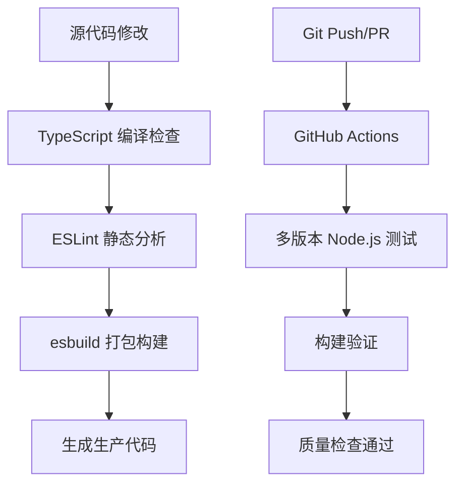

本文档详细介绍了 NewAnki 插件的代码规范体系和质量管理机制，涵盖代码风格、静态检查、构建流程和持续集成等方面，为开发者提供统一的代码质量保障标准。

## 代码规范体系

NewAnki 插件采用多层次的代码规范体系，确保代码质量和一致性：

### ESLint 配置
项目使用 TypeScript ESLint 作为主要的静态代码分析工具，配置了 Obsidian 插件的推荐规则集：

```typescript
import tseslint from 'typescript-eslint';
import obsidianmd from "eslint-plugin-obsidianmd";
import globals from "globals";

export default tseslint.config(
  {
    languageOptions: {
      globals: {
        ...globals.browser,
      },
      parserOptions: {
        projectService: {
          allowDefaultProject: ['eslint.config.js', 'manifest.json']
        },
        tsconfigRootDir: import.meta.dirname,
        extraFileExtensions: ['.json']
      },
    },
  },
  ...obsidianmd.configs.recommended,
  globalIgnores([
    "node_modules", "dist", "esbuild.config.mjs", 
    "version-bump.mjs", "versions.json", "main.js",
  ]),
);
```

该配置集成了 Obsidian 插件的特定规则，确保代码符合 Obsidian 生态系统的开发标准。Sources: [eslint.config.mts](eslint.config.mts#L1-L35)

### TypeScript 严格模式
TypeScript 配置启用了多项严格检查选项，强制类型安全：

```json
{
  "compilerOptions": {
    "noImplicitAny": true,
    "noImplicitThis": true,
    "noImplicitReturns": true,
    "strictNullChecks": true,
    "strictBindCallApply": true,
    "noUncheckedIndexedAccess": true,
    "useUnknownInCatchVariables": true
  }
}
```

这些配置确保在编译时捕获潜在的类型错误和逻辑问题。Sources: [tsconfig.json](tsconfig.json#L1-L31)

## 代码风格规范

### 编辑器配置
项目使用 `.editorconfig` 统一代码格式化标准：

```ini
[*]
charset = utf-8
end_of_line = lf
insert_final_newline = true
indent_style = tab
indent_size = 4
tab_width = 4
```

该配置确保跨不同编辑器和开发环境下的代码格式一致性。Sources: [.editorconfig](.editorconfig#L1-L11)

### 文件编码与换行符
- **字符编码**: 统一使用 UTF-8
- **换行符**: 使用 LF（Unix 风格）
- **缩进**: 使用制表符（tab），宽度为 4 个空格
- **文件尾**: 强制插入最终换行符

## 构建与质量检查流程

### 开发脚本
package.json 中定义了完整的开发和质量检查脚本：

| 脚本命令 | 功能描述 | 执行内容 |
|---------|---------|---------|
| `npm run dev` | 开发模式构建 | 使用 esbuild 进行增量构建 |
| `npm run build` | 生产构建 | TypeScript 类型检查 + esbuild 构建 |
| `npm run lint` | 代码质量检查 | 执行 ESLint 静态分析 |
| `npm run version` | 版本管理 | 更新 manifest.json 和版本信息 |

Sources: [package.json](package.json#L7-L13)

### 构建流程架构



## 持续集成与自动化

### GitHub Actions 工作流
项目配置了自动化的 CI/CD 流水线：

```yaml
name: Node.js build
on:
  push:
    branches: ["**"]
  pull_request:
    branches: ["**"]

jobs:
  build:
    runs-on: ubuntu-latest
    strategy:
      matrix:
        node-version: [20.x, 22.x]
    steps:
      - uses: actions/checkout@v4
      - run: npm ci
      - run: npm run build --if-present
      - run: npm run lint
```

该工作流在每次推送和拉取请求时自动执行，支持多版本 Node.js 测试。Sources: [.github/workflows/lint.yml](.github/workflows/lint.yml#L1-L29)

### 质量检查矩阵
CI 流程包含以下关键检查点：

1. **依赖安装**: 使用 `npm ci` 确保依赖一致性
2. **构建验证**: 执行 TypeScript 编译和打包
3. **代码规范检查**: 运行 ESLint 静态分析
4. **多环境兼容性**: 测试 Node.js 20.x 和 22.x 版本

## 开发工具集成

### 开发依赖配置
项目使用现代化的开发工具链：

| 工具 | 版本 | 用途 |
|------|------|------|
| TypeScript | ^5.8.3 | 类型安全的 JavaScript 超集 |
| ESLint | 8.35.1 | 代码质量检查工具 |
| esbuild | 0.25.5 | 高性能 JavaScript 打包器 |
| Obsidian ESLint Plugin | 0.1.9 | Obsidian 插件开发规范 |

Sources: [package.json](package.json#L15-L29)

### 模块系统配置
项目采用 ES 模块系统：
- `"type": "module"` 启用 ES 模块支持
- 使用现代 JavaScript 特性（ES6+）
- 支持 Tree Shaking 优化

## 最佳实践建议

### 代码提交前检查
建议开发者在提交代码前执行以下检查：
```bash
npm run build  # 类型检查和构建验证
npm run lint   # 代码规范检查
```

### 版本管理规范
- 使用 `npm run version` 自动更新版本信息
- 遵循语义化版本控制（Semantic Versioning）
- 确保 manifest.json 和版本文件同步更新

### 忽略文件策略
ESLint 配置中合理设置了忽略规则，避免对构建产物和配置文件进行不必要的检查：
- 构建输出目录（dist/）
- 依赖目录（node_modules/）
- 配置文件（esbuild.config.mjs 等）

通过这套完整的代码规范体系，NewAnki 插件确保了代码质量的一致性和可维护性，为团队协作和项目可持续发展提供了坚实基础。

**建议继续阅读**: [开发与构建流程](15-kai-fa-yu-gou-jian-liu-cheng) 了解详细的开发工作流，或 [测试与调试技巧](16-ce-shi-yu-diao-shi-ji-qiao) 掌握质量保障实践。