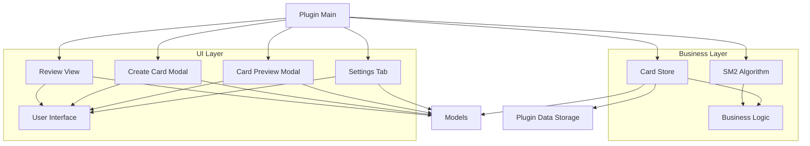

本指南面向高级开发者，深入解析NewAnki插件的扩展开发架构、核心组件设计模式和高级定制功能。通过理解本插件的模块化架构，开发者可以基于现有代码进行功能扩展或二次开发。

## 插件架构概述

NewAnki采用经典的Obsidian插件架构，基于MVVM模式设计，实现了数据存储、业务逻辑和用户界面的清晰分离。核心架构采用分层设计，各层职责明确，便于扩展和维护。



Sources: [main.ts](src/main.ts#L8-L47), [models.ts](src/models.ts#L1-L75)

## 核心组件架构

### 主插件类 (NewAnkiPlugin)

主插件类是整个插件的入口点，负责初始化所有组件并管理插件生命周期。它实现了Obsidian插件的标准接口，包括`onload()`和`onunload()`方法。

**关键特性：**
- **事件驱动架构**：通过Obsidian的事件系统响应文件操作和界面变化
- **模块化初始化**：将不同功能的初始化逻辑分离到独立方法中
- **状态管理**：统一管理插件状态和用户界面更新

```typescript
// 核心初始化流程
async onload(): Promise<void> {
    this.store = new CardStore(this);
    await this.store.load();
    
    this.registerView(REVIEW_VIEW_TYPE, ...);
    this.registerEditorContextMenu();
    this.registerFileMenu();
    this.registerCommands();
    this.registerFileEvents();
    this.registerReviewAction();
}
```

Sources: [main.ts](src/main.ts#L13-L47)

### 数据存储层 (CardStore)

CardStore类负责管理插件的所有数据，包括卡片数据、设置配置和持久化存储。它采用单例模式设计，确保数据的一致性和完整性。

**核心功能：**
- **数据持久化**：使用Obsidian的`loadData()`和`saveData()`API
- **文件关联管理**：跟踪卡片与源文件的映射关系
- **数据迁移支持**：处理文件重命名和删除时的数据迁移

```typescript
export class CardStore {
    private plugin: Plugin;
    private data: PluginData;
    
    async load(): Promise<void> {
        const saved = await this.plugin.loadData();
        if (saved) {
            this.data = Object.assign({}, DEFAULT_PLUGIN_DATA, saved);
        }
    }
}
```

Sources: [store.ts](src/store.ts#L4-L28)

## 用户界面组件架构

### 复习视图 (ReviewView)

复习视图是实现分屏复习功能的核心组件，继承自Obsidian的`ItemView`类。它负责管理复习会话状态、渲染复习界面和处理用户交互。

**架构特点：**
- **状态管理**：使用`ReviewSession`接口管理复习进度
- **响应式渲染**：根据复习状态动态更新界面
- **源文件同步**：支持与源Markdown文件的实时同步

```typescript
interface ReviewSession {
    cards: CardData[];
    currentIndex: number;
    total: number;
    reviewed: number;
    isGlobal: boolean;
    sourceFile: string | null;
}
```

Sources: [reviewView.ts](src/reviewView.ts#L8-L16)

### 模态框组件

NewAnki包含两种主要的模态框组件，分别用于卡片创建和预览：

| 组件类型 | 功能描述 | 核心特性 |
|---------|---------|---------|
| CreateCardModal | 卡片创建界面 | 支持文本选择、位置记录、实时预览 |
| CardPreviewModal | 卡片预览和管理 | 支持全局/局部预览、批量操作、状态筛选 |

Sources: [createCardModal.ts](src/createCardModal.ts#L1-L50), [cardPreviewModal.ts](src/cardPreviewModal.ts#L1-L50)

## 配置系统架构

### 设置界面 (NewAnkiSettingTab)

设置界面采用Obsidian的标准设置框架，提供丰富的SM-2算法参数配置选项。所有设置都实时保存并立即生效。

**配置分类：**
- **学习阶段参数**：学习步骤、毕业间隔、简单间隔
- **复习参数**：重学步骤、初始难度因子、间隔限制
- **高级参数**：间隔修改器、困难间隔系数、新间隔系数

```typescript
new Setting(containerEl)
    .setName("学习步骤（分钟）")
    .setDesc("新卡片的学习步骤，用逗号分隔。例如: 1,10")
    .addText((text) =>
        text.setValue(this.plugin.store.settings.learningSteps.join(","))
            .onChange(async (value) => {
                // 实时保存设置
            })
    );
```

Sources: [settings.ts](src/settings.ts#L20-L35)

## 扩展开发模式

### 1. 添加新的用户界面组件

扩展NewAnki插件时，可以遵循以下模式添加新的UI组件：

```typescript
// 1. 定义新的视图类型
export const NEW_VIEW_TYPE = "newanki-custom-view";

// 2. 创建自定义视图类
export class CustomView extends ItemView {
    getViewType(): string { return NEW_VIEW_TYPE; }
    getDisplayText(): string { return "自定义视图"; }
    
    async onOpen(): Promise<void> {
        // 初始化界面
    }
}

// 3. 在主插件中注册视图
this.registerView(NEW_VIEW_TYPE, (leaf) => new CustomView(leaf));
```

### 2. 扩展数据模型

要添加新的数据字段，需要更新数据模型和存储逻辑：

```typescript
// 扩展CardData接口
export interface CardData {
    // 现有字段...
    customField?: string;  // 新增自定义字段
}

// 更新存储逻辑
async addCustomField(cardId: string, value: string): Promise<void> {
    const card = this.findCardById(cardId);
    if (card) {
        card.customField = value;
        await this.updateCard(card);
    }
}
```

### 3. 集成新的算法变体

NewAnki支持替换或扩展SM-2算法：

```typescript
// 创建自定义算法实现
export class CustomAlgorithm {
    static reviewCard(card: CardData, rating: Rating, settings: PluginSettings): CardData {
        // 实现自定义算法逻辑
        return { ...card, /* 更新后的字段 */ };
    }
}

// 在复习视图中使用自定义算法
const updatedCard = CustomAlgorithm.reviewCard(card, rating, this.store.settings);
```

## 构建和部署

### 开发环境配置

NewAnki使用esbuild作为构建工具，支持开发和生产两种模式：

```javascript
// esbuild配置关键参数
const context = await esbuild.context({
    entryPoints: ["src/main.ts"],
    bundle: true,
    external: ["obsidian", "electron", /* Obsidian依赖 */],
    format: "cjs",
    target: "es2018",
    sourcemap: prod ? false : "inline",
    outfile: "main.js",
    minify: prod,
});
```

Sources: [esbuild.config.mjs](esbuild.config.mjs#L14-L42)

### 清单文件配置

`manifest.json`文件定义了插件的基本信息和支持的Obsidian版本：

```json
{
    "id": "newanki",
    "name": "NewAnki",
    "version": "1.0.0",
    "minAppVersion": "0.15.0",
    "description": "Obsidian间隔重复复习插件",
    "author": "",
    "isDesktopOnly": false
}
```

Sources: [manifest.json](manifest.json#L1-L9)

## 最佳实践建议

### 1. 事件处理模式
- 使用Obsidian的事件系统而非直接DOM操作
- 合理管理事件监听器的注册和注销
- 避免内存泄漏，确保在`onunload()`中清理资源

### 2. 数据持久化策略
- 采用增量更新而非全量保存
- 实现数据迁移兼容性
- 添加数据完整性校验

### 3. 用户界面设计
- 遵循Obsidian的设计语言和交互模式
- 提供无障碍访问支持
- 实现响应式布局适应不同屏幕尺寸

通过理解上述架构和开发模式，开发者可以高效地扩展NewAnki插件功能，或基于其架构开发新的Obsidian插件。