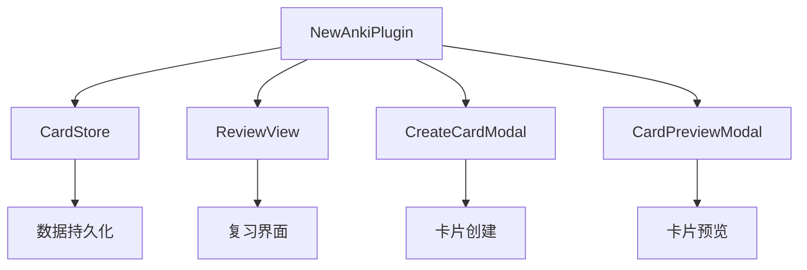

本文档总结了 NewAnki 插件开发中的最佳实践，涵盖架构设计、代码组织、性能优化和用户体验等方面。这些实践基于对现有代码的深入分析，旨在帮助开发者构建高质量的 Obsidian 插件。

## 插件架构设计模式

NewAnki 插件采用了清晰的分层架构，实现了数据存储、业务逻辑和用户界面的有效分离。这种设计模式确保了代码的可维护性和可扩展性。

**核心架构模式**：
- **单一职责原则**：每个类都有明确的职责边界，如 `CardStore` 负责数据管理，`ReviewView` 负责界面渲染
- **依赖注入**：插件实例通过构造函数注入到各个组件中，实现松耦合
- **事件驱动**：使用 Obsidian 的事件系统处理文件操作和用户交互



Sources: [main.ts](src/main.ts#L1-L50)

## 数据管理最佳实践

插件采用了稳健的数据管理策略，确保卡片数据的完整性和一致性。

**数据持久化策略**：
- **增量保存**：每次卡片操作后立即保存，避免数据丢失
- **默认值处理**：加载数据时自动填充缺失的默认设置
- **文件路径迁移**：智能处理文件重命名和删除操作

**数据结构设计**：
```typescript
// 使用嵌套对象存储文件与卡片的映射关系
cards: Record<string, CardData[]>

// 为每个卡片生成唯一标识符
cardId: string
```

Sources: [store.ts](src/store.ts#L1-L50)

## 用户界面交互设计

插件提供了丰富的用户交互方式，包括右键菜单、状态栏、快捷键等，确保用户操作的便捷性。

**多入口设计**：
- **右键菜单**：在编辑器中选中文本后快速创建卡片
- **文件菜单**：为每个 Markdown 文件提供卡片预览和复习入口
- **快捷键命令**：支持键盘快速操作
- **状态栏显示**：实时显示待复习卡片数量

**响应式状态更新**：
```typescript
private handleCardsChanged(): void {
    this.updateStatusBar();
    this.updateReviewAction();
    this.updateGlobalReviewRibbonBadge();
}
```

Sources: [main.ts](src/main.ts#L50-L150)

## SM-2 算法实现优化

插件的 SM-2 算法实现考虑了多种边界情况和性能优化。

**算法优化策略**：
- **间隔模糊化**：为复习间隔添加随机因素，避免模式化记忆
- **状态机管理**：清晰区分新建、学习、复习、重新学习四种状态
- **日期处理**：智能处理时区和日期边界问题

**性能优化**：
```typescript
// 使用深拷贝避免原始数据污染
function deepCopyCard(card: CardData): CardData {
    return JSON.parse(JSON.stringify(card));
}

// 优化日期计算，减少重复操作
private getLocalDayStartMs(date: Date): number {
    return new Date(date.getFullYear(), date.getMonth(), date.getDate()).getTime();
}
```

Sources: [sm2.ts](src/sm2.ts#L1-L100)

## 错误处理和边界情况

插件实现了完善的错误处理机制，确保在各种异常情况下都能稳定运行。

**错误处理策略**：
- **空值检查**：对所有可能为空的变量进行验证
- **异常捕获**：使用 try-catch 处理异步操作异常
- **用户反馈**：通过 Notice 系统向用户提供操作反馈

**边界情况处理**：
```typescript
// 处理文件不存在的情况
if (!this.data.cards[filePath]) {
    this.data.cards[filePath] = [];
}

// 处理卡片查找失败
const idx = cards.findIndex((c) => c.cardId === card.cardId);
if (idx !== -1) {
    // 正常处理
}
```

Sources: [store.ts](src/store.ts#L50-L150)

## 性能监控和优化

插件实现了轻量级的性能监控机制，确保长期运行的稳定性。

**性能优化措施**：
- **定时器优化**：状态栏更新使用 30 秒间隔，避免频繁重绘
- **内存管理**：及时清理不再使用的 DOM 元素和事件监听器
- **数据缓存**：合理缓存常用数据，减少重复计算

**资源清理**：
```typescript
onunload(): void {
    this.app.workspace.detachLeavesOfType(REVIEW_VIEW_TYPE);
    this.clearReviewAction();
}
```

Sources: [main.ts](src/main.ts#L40-L50)

## 代码质量和维护性

插件遵循了良好的代码组织规范，提高了代码的可读性和可维护性。

**代码组织原则**：
- **模块化设计**：每个文件专注于单一功能领域
- **类型安全**：全面使用 TypeScript 类型定义
- **配置集中**：所有设置参数集中在 `models.ts` 中定义

**配置管理**：
```typescript
export const DEFAULT_SETTINGS: PluginSettings = {
    learningSteps: [1, 10],
    graduatingInterval: 1,
    easyInterval: 4,
    // ... 其他默认设置
};
```

Sources: [models.ts](src/models.ts#L30-L50)

## 测试和调试策略

虽然当前代码库没有包含完整的测试套件，但代码结构为测试提供了良好的基础。

**可测试性设计**：
- **纯函数设计**：SM-2 算法函数没有副作用，易于单元测试
- **依赖注入**：通过构造函数注入依赖，便于 mock 测试
- **状态隔离**：每个组件的状态管理相互独立

**调试支持**：
```typescript
// 提供详细的日志记录
console.log(`Review completed: ${this.session!.reviewed} cards`);
```

Sources: [reviewView.ts](src/reviewView.ts#L80-L100)

## 扩展开发建议

基于当前架构，为未来的功能扩展提供了清晰的路径。

**扩展点识别**：
- **新的卡片类型**：在 `CardData` 接口中添加新字段
- **复习算法**：实现新的算法类并集成到现有系统中
- **界面主题**：通过 CSS 变量支持主题定制

**向后兼容性**：
- 数据迁移时保持旧版本数据的兼容性
- 新增功能不应破坏现有的用户工作流
- 提供设置选项让用户逐步适应新功能

通过遵循这些最佳实践，开发者可以构建出高质量、可维护的 Obsidian 插件，为用户提供稳定可靠的学习体验。