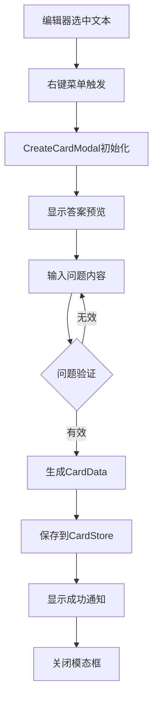
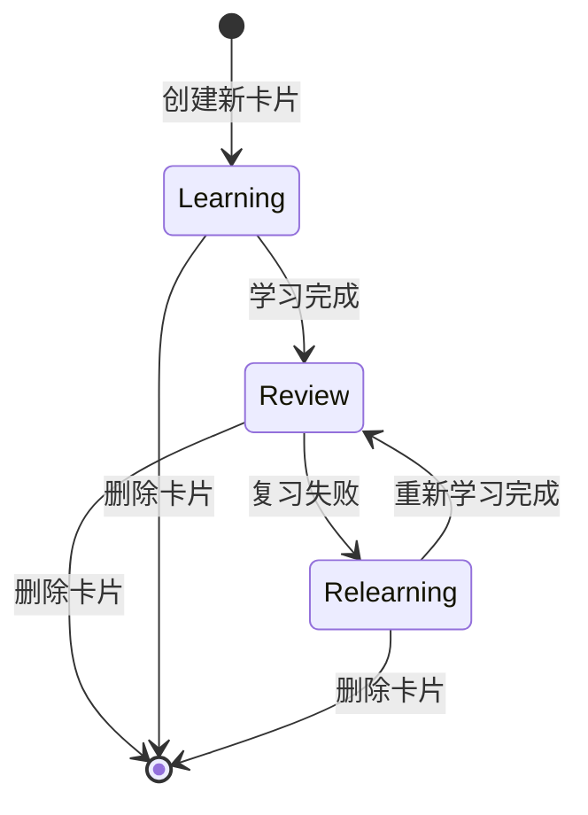

本文档详细介绍了 NewAnki 插件中卡片创建与管理的核心功能实现。卡片系统是插件的核心，支持从 Obsidian 编辑器直接创建闪卡，并提供了完善的卡片管理机制。

## 卡片数据模型

卡片数据模型定义了闪卡的核心属性和状态管理机制。每个卡片包含学习状态、复习进度、源文件信息等关键数据。

```typescript
export interface CardData {
    cardId: string;           // 唯一标识符
    question: string;         // 问题内容
    answer: string;          // 答案内容
    sourceFile: string;      // 源文件路径
    lineStart: number;       // 起始行号
    lineEnd: number;         // 结束行号
    state: State;           // 学习状态
    step: number | null;     // 学习步骤
    ease: number | null;     // 难度系数
    due: string;            // 到期时间
    currentInterval: number | null; // 当前间隔
    createdAt: string;       // 创建时间
}
```

卡片状态使用枚举定义，支持四种学习状态：
- **New** (新建)：刚创建的卡片，尚未开始学习
- **Learning** (学习中)：正在执行学习步骤的卡片
- **Review** (复习中)：已掌握进入定期复习的卡片  
- **Relearning** (重新学习)：复习失败后重新学习的卡片

Sources: [models.ts](src/models.ts#L14-L27)

## 卡片创建流程

卡片创建通过编辑器右键菜单触发，采用模态框形式收集用户输入，确保创建过程的直观性和易用性。

### 创建模态框架构

`CreateCardModal` 类负责卡片创建界面的渲染和数据处理：



创建过程的关键步骤：
1. **文本选择检测**：自动获取编辑器选中的文本作为答案
2. **源文件定位**：记录卡片来源的文件路径和行号信息
3. **问题输入验证**：确保问题内容非空
4. **自动ID生成**：使用时间戳+随机数生成唯一卡片ID
5. **初始状态设置**：新卡片默认设置为学习状态

Sources: [createCardModal.ts](src/createCardModal.ts#L58-L78)

### 创建接口集成

卡片创建功能通过 Obsidian 的编辑器上下文菜单集成：

```typescript
// 注册编辑器右键菜单
this.registerEvent(
    this.app.workspace.on("editor-menu", (menu, editor, view) => {
        const selection = editor.getSelection();
        if (!selection) return;

        menu.addItem((item) => {
            item.setTitle("制作卡片")
                .setIcon("plus-circle")
                .onClick(() => {
                    // 创建卡片模态框
                    new CreateCardModal(...).open();
                });
        });
    })
);
```

Sources: [main.ts](src/main.ts#L61-L93)

## 卡片存储管理

`CardStore` 类负责卡片的持久化存储和数据管理，采用文件路径作为索引的层次化存储结构。

### 存储架构设计

```mermaid
graph TB
    A[PluginData] --> B[settings: PluginSettings]
    A --> C[cards: Record<string, CardData[]>]
    C --> D[file1.md: CardData[]]
    C --> E[file2.md: CardData[]]
    C --> F[...其他文件]
    D --> G[卡片1]
    D --> H[卡片2]
    E --> I[卡片3]
```

存储特点：
- **按文件组织**：卡片以源文件路径为键进行分组存储
- **自动初始化**：首次使用时自动创建存储结构
- **数据迁移**：支持文件重命名和删除时的卡片数据迁移

Sources: [store.ts](src/store.ts#L4-L11)

### 核心操作方法

卡片存储提供完整的 CRUD 操作接口：

| 方法名 | 功能描述 | 参数说明 | 返回值 |
|--------|----------|----------|---------|
| `addCard()` | 添加新卡片 | `card: CardData` | `Promise<void>` |
| `updateCard()` | 更新卡片数据 | `card: CardData` | `Promise<void>` |
| `deleteCard()` | 删除指定卡片 | `cardId, filePath` | `Promise<void>` |
| `getCardsForFile()` | 获取文件所有卡片 | `filePath: string` | `CardData[]` |
| `getDueCardsForFile()` | 获取到期卡片 | `filePath: string` | `CardData[]` |

Sources: [store.ts](src/store.ts#L85-L115)

## 卡片生命周期管理

卡片从创建到删除的完整生命周期管理，包括状态转换和数据清理。

### 状态转换流程



### 文件操作联动

卡片存储与 Obsidian 文件系统深度集成，自动处理文件变更：

1. **文件重命名**：自动更新卡片中的源文件路径
2. **文件删除**：自动清理关联的卡片数据
3. **进度重置**：支持按文件重置所有卡片的学习进度

```typescript
// 文件重命名处理
async handleFileRename(oldPath: string, newPath: string): Promise<boolean> {
    // 更新所有相关卡片的sourceFile字段
    const migrated = cards.map((c) => ({
        ...c,
        sourceFile: targetPath,
    }));
}
```

Sources: [store.ts](src/store.ts#L134-L167)

## 卡片查询与统计

提供丰富的查询接口支持各种使用场景：

### 查询功能对比

| 查询类型 | 方法名 | 使用场景 | 性能特点 |
|----------|--------|----------|----------|
| 单文件查询 | `getCardsForFile()` | 文件内卡片管理 | O(1) 哈希查找 |
| 全局查询 | `getAllCards()` | 全局复习视图 | O(n) 遍历所有文件 |
| 到期卡片查询 | `getDueCardsForFile()` | 复习提醒 | O(n) 过滤检查 |
| 统计计数 | `getCardCount()` | 状态栏显示 | O(1) 长度获取 |

### 到期时间计算

卡片到期判断采用智能算法，区分学习卡片和复习卡片：

- **学习卡片**：精确到分钟的时间判断
- **复习卡片**：按天计算，到期后全天显示

```typescript
private isCardDue(card: CardData, now: Date): boolean {
    if (card.state === State.Review) {
        // 复习卡片：按天计算
        return this.getLocalDayStartMs(new Date(dueMs)) <= this.getLocalDayStartMs(now);
    }
    // 学习卡片：精确时间判断
    return dueMs <= now.getTime();
}
```

Sources: [store.ts](src/store.ts#L60-L73)

## 用户界面集成

卡片创建与管理功能通过多种 UI 组件与 Obsidian 深度集成：

### 集成点分布

| 集成位置 | 功能描述 | 触发方式 | 目标用户 |
|----------|----------|----------|----------|
| 编辑器右键菜单 | 快速创建卡片 | 文本选择 + 右键 | 内容创作者 |
| 文件右键菜单 | 文件级卡片管理 | 文件右键 | 知识管理者 |
| 状态栏 | 卡片统计显示 | 实时更新 | 所有用户 |
| 功能区图标 | 全局复习入口 | 点击图标 | 复习用户 |

### 反馈机制

- **成功通知**：卡片创建后显示 Toast 通知
- **错误处理**：问题内容验证失败时阻止提交
- **状态同步**：卡片变更后自动更新相关UI组件

Sources: [main.ts](src/main.ts#L84-L86)

## 数据持久化与备份

卡片数据通过 Obsidian 插件 API 自动持久化，确保数据安全：

- **自动保存**：每次卡片操作后立即保存
- **数据恢复**：启动时自动加载保存的数据
- **容错处理**：损坏数据时使用默认值恢复
- **格式兼容**：支持旧版本数据格式迁移

Sources: [store.ts](src/store.ts#L13-L28)

通过这套完整的卡片创建与管理系统，用户可以方便地在 Obsidian 中创建和管理学习卡片，实现知识的高效记忆和复习。