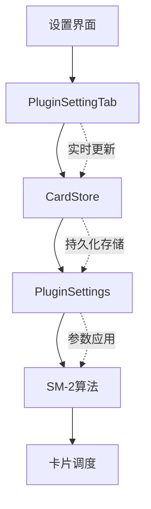

本页面详细介绍了 NewAnki 插件的复习系统配置功能。复习系统基于 SuperMemo-2 (SM-2) 算法，通过智能间隔重复来优化记忆效果。配置系统允许用户根据个人学习习惯和记忆能力调整算法参数，实现个性化的复习体验。

## 配置系统架构

复习配置系统采用分层架构设计，将用户界面、数据存储和算法实现清晰分离：



系统通过 `PluginSettingTab` 类提供配置界面，`CardStore` 类管理数据持久化，`PluginSettings` 接口定义配置结构，最终由 SM-2 算法应用这些参数进行卡片调度。Sources: [settings.ts](src/settings.ts#L4-L10)

## 学习阶段配置

学习阶段配置控制新卡片的初始学习流程，分为多个渐进式步骤：

### 学习步骤设置
- **参数**: `learningSteps` - 新卡片的学习步骤（分钟）
- **格式**: 逗号分隔的时间值，如 "1,10"
- **作用**: 定义新卡片在学习阶段的复习间隔时间序列
- **默认值**: [1, 10] 分钟

```typescript
// 示例：学习步骤配置
learningSteps: [1, 10]  // 第一次复习1分钟后，第二次10分钟后
```

Sources: [settings.ts](src/settings.ts#L20-L35)

### 毕业间隔设置
- **参数**: `graduatingInterval` - 通过最后一个学习步骤后的复习间隔（天）
- **作用**: 控制卡片从学习阶段毕业进入复习阶段的首次间隔
- **默认值**: 1 天

### 简单间隔设置  
- **参数**: `easyInterval` - 在学习阶段直接按「简单」后的复习间隔（天）
- **作用**: 允许用户在学习阶段快速推进简单卡片
- **默认值**: 4 天

Sources: [settings.ts](src/settings.ts#L37-L67)

## 复习参数配置

复习参数控制卡片进入复习阶段后的调度行为：

### 重学步骤设置
- **参数**: `relearningSteps` - 遗忘卡片的重学步骤（分钟）
- **格式**: 逗号分隔的时间值，如 "10"
- **作用**: 定义遗忘卡片重新学习时的间隔序列
- **默认值**: [10] 分钟

### 难度因子设置
- **参数**: `startingEase` - 卡片毕业时的初始 ease 值
- **范围**: ≥ 1.3
- **作用**: 控制复习间隔的增长速度，值越大间隔增长越快
- **推荐值**: 2.5

Sources: [settings.ts](src/settings.ts#L71-L102)

### 间隔限制设置
| 参数 | 作用 | 默认值 | 范围 |
|------|------|--------|------|
| `maximumInterval` | 复习间隔的上限天数 | 36500 | > 0 |
| `minimumInterval` | 按「重来」后的最小间隔天数 | 1 | > 0 |

Sources: [settings.ts](src/settings.ts#L104-L134)

## 算法调节参数

这些参数精细控制 SM-2 算法的行为：

### 响应系数设置
- **简单奖励系数** (`easyBonus`): 按「简单」时额外乘以的系数，推荐 1.3
- **困难间隔系数** (`hardInterval`): 按「困难」时乘以的间隔系数，推荐 1.2  
- **间隔修改器** (`intervalModifier`): 全局间隔倍率，1.0 表示不修改

### 遗忘处理设置
- **参数**: `newInterval` - 按「重来」后保留原间隔的比例
- **范围**: 0-1（0 表示从头开始）
- **作用**: 控制遗忘卡片重新学习时的进度保留程度

Sources: [settings.ts](src/settings.ts#L136-L198)

## 配置数据模型

配置系统使用 TypeScript 接口定义严格的数据结构：

```typescript
export interface PluginSettings {
    learningSteps: number[];           // 学习步骤（分钟）
    graduatingInterval: number;        // 毕业间隔（天）
    easyInterval: number;              // 简单间隔（天）
    relearningSteps: number[];         // 重学步骤（分钟）
    minimumInterval: number;           // 最小间隔（天）
    maximumInterval: number;           // 最大间隔（天）
    startingEase: number;              // 初始难度因子
    easyBonus: number;                 // 简单奖励系数
    intervalModifier: number;          // 间隔修改器
    hardInterval: number;              // 困难间隔系数
    newInterval: number;               // 遗忘后新间隔系数
}
```

Sources: [models.ts](src/models.ts#L38-L50)

## 默认配置值

系统提供经过优化的默认配置，适合大多数用户：

| 参数 | 默认值 | 说明 |
|------|--------|------|
| 学习步骤 | [1, 10] | 1分钟和10分钟两次学习 |
| 毕业间隔 | 1天 | 学习完成后首次复习间隔 |
| 简单间隔 | 4天 | 学习阶段按简单的间隔 |
| 重学步骤 | [10] | 遗忘后10分钟重学 |
| 最小间隔 | 1天 | 重来后的最小间隔 |
| 最大间隔 | 36500天 | 约100年的上限 |
| 初始难度 | 2.5 | 标准的初始ease值 |
| 简单奖励 | 1.3 | 30%的额外间隔奖励 |
| 间隔修改 | 1.0 | 不修改全局间隔 |
| 困难系数 | 1.2 | 20%的间隔缩减 |
| 新间隔系数 | 0.0 | 遗忘后从头开始 |

Sources: [models.ts](src/models.ts#L52-L64)

## 配置验证机制

系统内置了完整的参数验证逻辑，确保配置值的合理性：

- **数值范围检查**: 所有数值参数都有最小值和合理性验证
- **格式验证**: 学习步骤支持逗号分隔格式并自动解析
- **类型安全**: TypeScript 接口确保类型正确性
- **实时保存**: 配置变更立即持久化到本地存储

```typescript
// 示例：学习步骤验证逻辑
const steps = value
    .split(",")
    .map((s) => parseFloat(s.trim()))
    .filter((n) => !isNaN(n) && n > 0);  // 过滤无效值
```

Sources: [settings.ts](src/settings.ts#L28-L31)

## 配置界面设计

配置界面采用分组式布局，清晰区分不同功能区域：

- **学习阶段分组**: 集中管理新卡片的学习流程
- **复习参数分组**: 控制复习阶段的算法行为  
- **直观的描述文本**: 每个参数都有详细的功能说明
- **实时预览**: 输入框显示当前值，便于调整

这种设计使初学者能够快速理解每个参数的作用，同时为高级用户提供精细的控制能力。

## 下一步学习建议

完成复习系统配置的了解后，建议继续学习：

- **[SM-2算法实现](8-sm-2suan-fa-shi-xian)**: 深入了解配置参数如何影响算法行为
- **[存储与状态管理](9-cun-chu-yu-zhuang-tai-guan-li)**: 学习配置数据的持久化机制
- **[全局复习系统](18-quan-ju-fu-xi-xi-tong)**: 了解配置如何应用于实际的复习流程

通过合理配置这些参数，您可以创建完全符合个人学习习惯的智能复习系统。