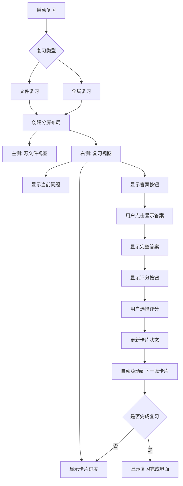
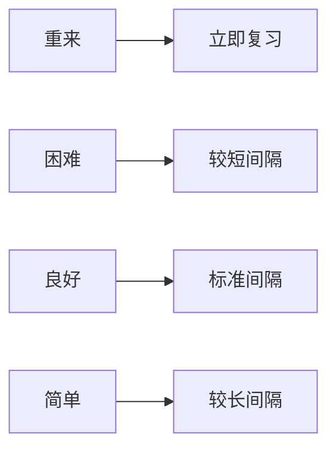

NewAnki 插件提供了多种界面导航方式和用户操作入口，让用户能够方便地创建、管理和复习卡片。本页面详细介绍了插件的界面布局、导航方式和操作流程。

## 界面入口与导航结构

NewAnki 插件通过多种方式集成到 Obsidian 界面中，提供灵活的卡片管理入口：

### 1. 侧边栏工具栏
插件在 Obsidian 左侧工具栏添加了两个图标按钮：
- **图层图标 (layers)**：全局复习入口，显示待复习卡片数量徽章
- **列表图标 (list)**：全局卡片预览器，查看所有卡片信息

这些工具栏按钮提供了一键访问核心功能的便捷方式。Sources: [main.ts](src/main.ts#L28-L34)

### 2. 编辑器右键菜单
在编辑器中选中文本后，右键菜单会出现"制作卡片"选项，点击即可打开卡片创建模态框。Sources: [main.ts](src/main.ts#L61-L93)

### 3. 文件右键菜单
对于 Markdown 文件，右键菜单提供两个选项：
- **卡片预览**：显示该文件的所有卡片
- **复习卡片**：启动该文件的卡片复习（仅当有卡片时显示）

菜单项会动态显示卡片数量信息。Sources: [main.ts](src/main.ts#L96-L123)

### 4. 视图操作按钮
在活动 Markdown 文件的右上角工具栏区域，插件会动态添加两个操作按钮：
- **局部卡片预览**：显示当前文件的卡片预览
- **复习卡片**：启动当前文件的卡片复习（带到期数量徽章）

这些按钮会根据当前文件状态自动更新。Sources: [main.ts](src/main.ts#L218-L254)

### 5. 命令面板
通过命令面板可以访问所有核心功能：
- **制作卡片**：快速创建卡片命令
- **复习当前文件的卡片**：智能检查并启动复习
- **全局复习**：启动所有文件的卡片复习

命令面板提供了键盘操作的便捷方式。Sources: [main.ts](src/main.ts#L142-L197)

## 复习界面导航流程

复习界面采用分屏布局，左侧显示源文件，右侧显示复习面板：

### 复习界面组件
复习视图包含以下关键组件：

#### 进度显示
- 显示已完成/总卡片数和剩余卡片数
- 可视化进度条显示完成百分比
- 实时更新进度状态

Sources: [reviewView.ts](src/reviewView.ts#L111-L125)

#### 卡片内容显示
- **问题部分**：可编辑的 Markdown 预览区域
- **答案部分**：点击"显示答案"后显示
- **源文件信息**：全局复习时显示卡片来源文件路径
- **删除按钮**：允许删除当前正在复习的卡片

Sources: [reviewView.ts](src/reviewView.ts#L127-L181)

#### 评分系统
评分按钮显示四个选项，每个选项包含：
- **间隔时间标签**：显示下次复习的时间间隔
- **难度评级**：重来、困难、良好、简单
- **颜色编码**：不同难度对应不同颜色

Sources: [reviewView.ts](src/reviewView.ts#L312-L346)

## 智能导航功能

### 1. 自动源文件定位
在复习过程中，插件会自动：
- 打开卡片对应的源文件
- 高亮显示卡片内容所在的行范围
- 滚动到卡片位置确保可见性

Sources: [reviewView.ts](src/reviewView.ts#L393-L433)

### 2. 动态界面更新
界面组件会根据卡片状态动态更新：
- 状态栏显示全局待复习卡片数量
- 工具栏徽章实时更新数字
- 文件操作按钮根据卡片存在性显示/隐藏

Sources: [main.ts](src/main.ts#L355-L384)

### 3. 响应式布局管理
复习界面采用智能分屏策略：
- 自动创建垂直分割布局
- 保持复习视图的焦点状态
- 正确处理视图切换和关闭

Sources: [main.ts](src/main.ts#L339-L353)

## 操作流程示例

### 创建卡片流程
1. 在编辑器中选中文本
2. 右键选择"制作卡片"或使用命令面板
3. 在模态框中编辑卡片内容
4. 确认保存，系统提示成功

### 启动复习流程
1. 通过文件右键菜单、视图操作按钮或命令面板启动
2. 系统检查是否有到期卡片
3. 自动创建分屏复习界面
4. 开始卡片复习流程

### 复习单张卡片流程
1. 查看问题内容
2. 点击"显示答案"查看完整内容
3. 根据记忆程度选择评分
4. 系统自动处理下一张卡片

这种多层次、智能化的界面导航设计确保了用户能够以最自然的方式与 NewAnki 插件进行交互，提高了学习效率和使用体验。