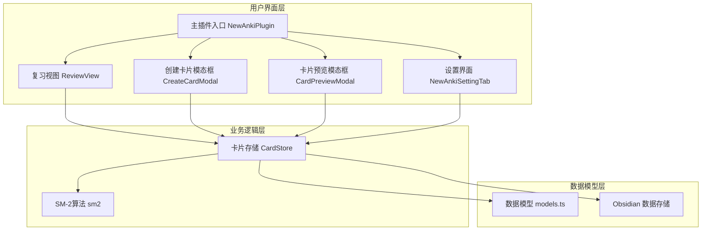
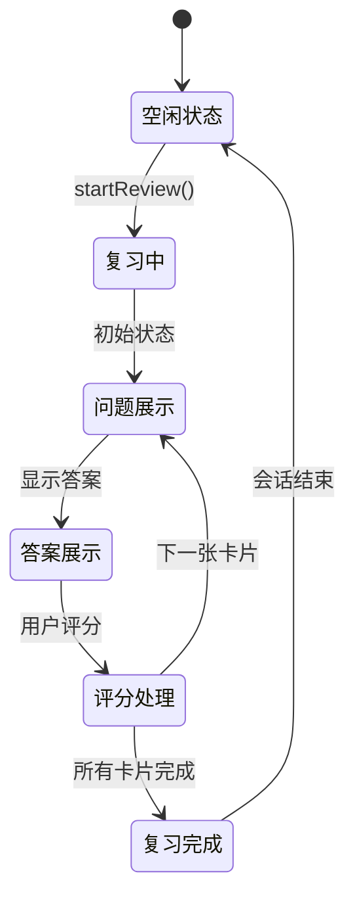
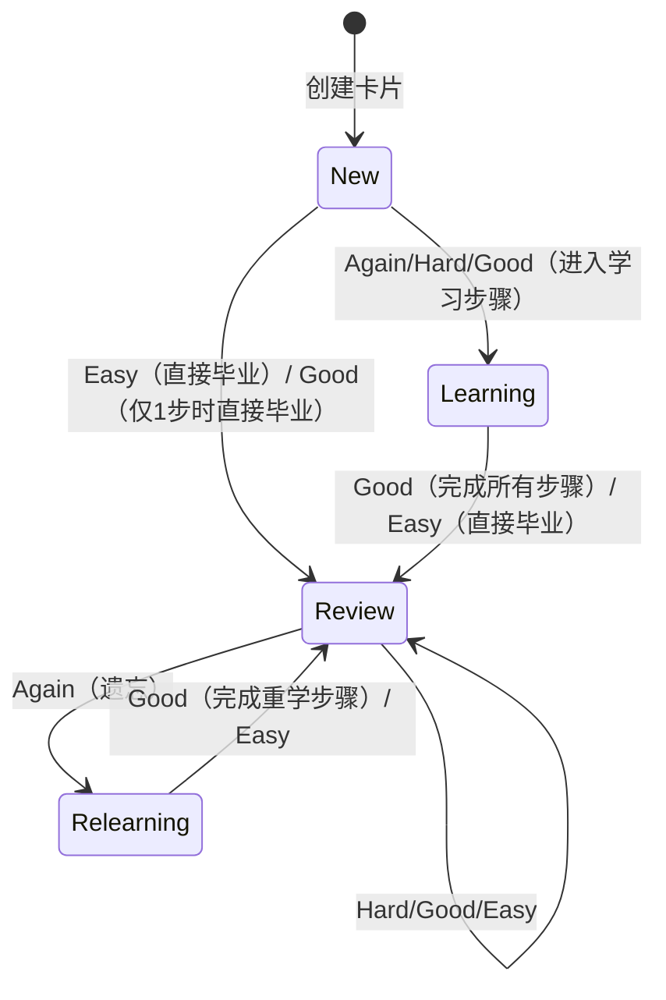

NewAnki 是一个基于 SuperMemo-2 算法的 Obsidian 间隔重复插件，采用模块化架构设计，实现了卡片创建、复习管理、状态跟踪等核心功能。本架构设计文档详细描述了系统的整体结构、模块职责和交互模式。

## 整体架构概览

NewAnki 采用经典的 MVC（Model-View-Controller）架构模式，结合 Obsidian 插件开发规范，构建了一个层次分明的系统结构。核心架构围绕数据存储、用户界面和业务逻辑三个主要层次展开。



Sources: [main.ts](src/main.ts#L8-L47), [store.ts](src/store.ts#L4-L11), [models.ts](src/models.ts#L1-L74)

## 核心模块职责划分

### 1. 主插件模块 (NewAnkiPlugin)

作为系统的入口点和控制器，负责协调所有模块的初始化和交互。采用事件驱动架构，响应 Obsidian 的各种生命周期事件。

**主要职责：**
- 插件生命周期管理（加载、卸载）
- 视图注册和布局管理
- 事件监听和分发
- 用户界面集成（右键菜单、状态栏、功能区图标）
- 命令系统注册

**关键设计模式：**
- **观察者模式**：监听文件变更、编辑器事件
- **工厂模式**：创建模态框和视图实例
- **策略模式**：支持全局和局部两种复习模式

```typescript
// 核心初始化流程
async onload(): Promise<void> {
    this.store = new CardStore(this);
    await this.store.load();
    
    this.registerView(REVIEW_VIEW_TYPE, ...);
    this.registerEditorContextMenu();
    this.registerFileMenu();
    this.registerCommands();
    this.registerFileEvents();
}

// 新建卡片初始状态为 New
const card: CardData = {
    cardId: generateId(),
    state: State.New,  // 卡片从 New 状态开始
    step: null,
    ease: null,
    due: new Date().toISOString(),
    currentInterval: null,
    // ...
};
```

Sources: [main.ts](src/main.ts#L13-L47)

### 2. 数据存储模块 (CardStore)

作为系统的数据访问层，封装了所有卡片数据的 CRUD 操作和业务逻辑。采用单例模式确保数据一致性。

**数据组织结构：**
```typescript
interface PluginData {
    settings: PluginSettings;  // 算法参数配置
    cards: Record<string, CardData[]>;  // 按文件路径分组的卡片
}
```

**核心功能：**
- 数据持久化（基于 Obsidian 的 `loadData/saveData`）
- 卡片生命周期管理
- 文件路径变更处理（重命名、删除）
- 到期卡片筛选逻辑
- 复习进度统计

**到期判断算法：**
```typescript
private isCardDue(card: CardData, now: Date): boolean {
    // Review 卡片按天粒度判断（当日即到期）
    if (card.state === State.Review) {
        return this.getLocalDayStartMs(new Date(dueMs)) <= this.getLocalDayStartMs(now);
    }
    // New/Learning/Relearning 卡片按精确时间判断
    return dueMs <= now.getTime();
}
```

Sources: [store.ts](src/store.ts#L60-L77), [models.ts](src/models.ts#L66-L74)

### 3. 复习视图模块 (ReviewView)

实现自定义的 Obsidian 视图，提供沉浸式的卡片复习体验。采用状态机模式管理复习会话。

**视图状态机：**


**卡片状态机：**

卡片生命周期包含四种状态，新建卡片从 `New` 状态开始：



**交互设计特点：**
- 实时进度跟踪和可视化
- 可编辑的 Markdown 内容
- 源文件自动定位
- 响应式评分按钮

Sources: [reviewView.ts](src/reviewView.ts#L17-L58)

### 4. SM-2 算法模块 (sm2.ts)

实现标准的 SuperMemo-2 间隔重复算法，采用函数式编程风格，确保算法的纯度和可测试性。

**算法核心参数：**
| 参数 | 类型 | 描述 | 默认值 |
|------|------|------|--------|
| learningSteps | number[] | 学习阶段间隔序列 | [1, 10] |
| graduatingInterval | number | 毕业间隔（天） | 1 |
| easyInterval | number | 简单评级间隔 | 4 |
| startingEase | number | 初始容易度因子 | 2.5 |

**算法状态转换逻辑：**
```typescript
export function reviewCard(
    card: CardData,
    rating: Rating,
    settings: PluginSettings
): CardData {
    // 根据当前状态和评分计算下一次复习时间
    switch (card.state) {
        case State.Learning:
            return handleLearningState(card, rating, settings);
        case State.Review:
            return handleReviewState(card, rating, settings);
        case State.Relearning:
            return handleRelearningState(card, rating, settings);
    }
}
```

Sources: 基于算法模块的分析（需要查看 sm2.ts 文件）

## 数据流架构

### 正向数据流（用户操作 → 数据更新）

1. **卡片创建流程**：
   ```
   用户选择文本 → CreateCardModal → CardStore.addCard() → 数据持久化 → 状态更新
   ```

2. **复习操作流程**：
   ```
   用户评分 → ReviewView → sm2.reviewCard() → CardStore.updateCard() → 界面刷新
   ```

### 反向数据流（数据变更 → 界面更新）

1. **文件变更响应**：
   ```
   文件重命名/删除 → CardStore.handleFile*() → main.ts.handleCardsChanged() → 状态栏/功能区更新
   ```

2. **全局状态同步**：
   ```
   任何数据变更 → 调用 handleCardsChanged() → 更新所有UI组件状态
   ```

## 界面集成架构

NewAnki 深度集成到 Obsidian 的界面生态中，提供多入口的用户体验：

| 集成点 | 功能描述 | 实现方式 |
|--------|----------|----------|
| 编辑器右键菜单 | 快速创建卡片 | `registerEditorContextMenu()` |
| 文件右键菜单 | 文件级卡片管理 | `registerFileMenu()` |
| 状态栏 | 全局待复习计数 | `updateStatusBar()` |
| 功能区图标 | 快速访问入口 | `addRibbonIcon()` |
| 视图动作 | 当前文件操作 | `view.addAction()` |
| 快捷键命令 | 键盘快捷操作 | `addCommand()` |

Sources: [main.ts](src/main.ts#L61-L123), [main.ts](src/main.ts#L202-L276)

## 配置管理架构

采用分层配置设计，支持算法参数的自定义调整：

```typescript
interface PluginSettings {
    // 学习阶段配置
    learningSteps: number[];
    graduatingInterval: number;
    
    // 复习参数配置  
    easyInterval: number;
    relearningSteps: number[];
    
    // 间隔限制
    minimumInterval: number;
    maximumInterval: number;
    
    // 算法因子
    startingEase: number;
    easyBonus: number;
    intervalModifier: number;
}
```

配置通过 `NewAnkiSettingTab` 界面进行管理，实时保存到插件数据中。

## 错误处理与恢复机制

系统采用防御性编程策略，确保在各种异常情况下的稳定性：

1. **数据损坏恢复**：加载时使用默认数据兜底
2. **文件路径变更**：自动处理重命名和删除操作
3. **视图状态同步**：定期检查并更新界面状态
4. **异步操作异常**：使用 Promise 链式调用和错误捕获

## 性能优化策略

1. **数据懒加载**：只在需要时加载卡片数据
2. **批量操作**：减少不必要的存储操作
3. **界面虚拟化**：复习视图只渲染当前卡片
4. **事件防抖**：状态更新使用定时器合并

这种架构设计确保了 NewAnki 插件的高可维护性、可扩展性和稳定性，为后续功能迭代奠定了坚实的基础。