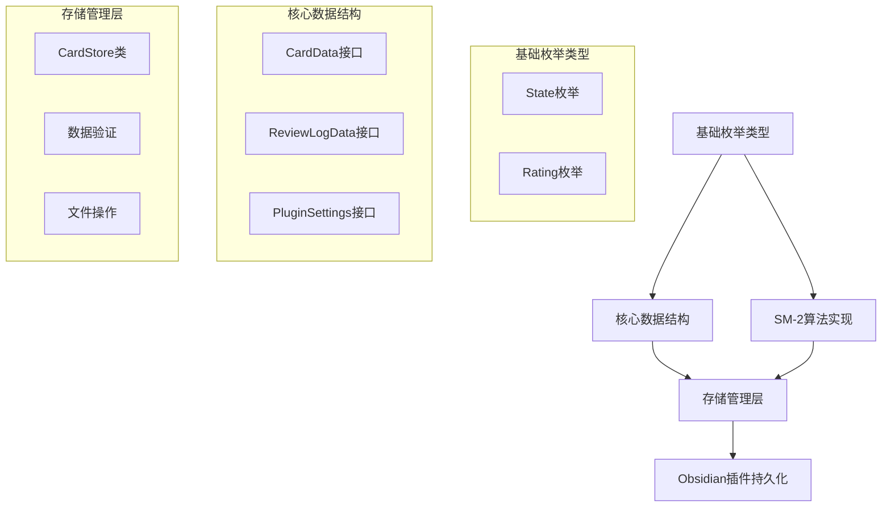

本文档详细分析 NewAnki 插件的核心数据模型架构，涵盖卡片状态管理、复习算法数据结构、存储机制以及数据流处理。通过系统性的代码分析，揭示插件如何实现基于 SM-2 算法的间隔重复系统。

## 数据模型架构概览

NewAnki 插件采用分层数据架构，将核心业务逻辑与存储机制分离。数据模型主要分为三个层次：**基础枚举类型**定义状态机、**核心数据结构**承载业务逻辑、**存储管理层**处理持久化操作。这种设计确保了数据的一致性和可维护性。



Sources: [models.ts](src/models.ts#L1-L74)

## 基础枚举类型定义

### 卡片状态枚举 (State)

插件定义了三种核心卡片状态，形成完整的学习周期状态机：

| 状态 | 值 | 描述 |
|------|----|------|
| Learning | 1 | 学习阶段，卡片处于初始学习状态 |
| Review | 2 | 复习阶段，卡片已进入间隔重复周期 |
| Relearning | 3 | 重新学习阶段，复习失败后返回学习状态 |

```typescript
export enum State {
    Learning = 1,
    Review = 2,
    Relearning = 3,
}
```

### 用户评分枚举 (Rating)

SM-2 算法核心的四种评分机制，直接影响卡片的下次复习间隔：

| 评分 | 值 | 算法影响 |
|------|----|----------|
| Again | 1 | 重新学习，难度系数降低 |
| Hard | 2 | 困难，间隔增长较慢 |
| Good | 3 | 良好，标准间隔增长 |
| Easy | 4 | 简单，间隔快速增长，难度系数提升 |

Sources: [models.ts](src/models.ts#L7-L12)

## 核心数据结构设计

### 卡片数据接口 (CardData)

卡片是系统的核心实体，包含完整的学习状态和复习历史信息：

```typescript
export interface CardData {
    cardId: string;           // 唯一标识符
    question: string;         // 问题内容
    answer: string;           // 答案内容
    sourceFile: string;       // 源文件路径
    lineStart: number;        // 起始行号
    lineEnd: number;          // 结束行号
    state: State;             // 当前状态
    step: number | null;      // 学习步骤索引
    ease: number | null;      // 难度系数（SM-2核心参数）
    due: string;              // 下次复习时间（ISO格式）
    currentInterval: number | null; // 当前间隔天数
    createdAt: string;        // 创建时间
}
```

**关键字段说明**：
- `ease` 字段是 SM-2 算法的核心参数，初始值为 2.5，根据用户评分动态调整
- `step` 字段在学习阶段记录当前学习步骤，复习阶段为 null
- `due` 字段使用 ISO 8601 格式确保时间序列化的一致性

### 复习日志接口 (ReviewLogData)

完整的复习历史记录，支持算法分析和数据追溯：

```typescript
export interface ReviewLogData {
    cardId: string;           // 关联卡片ID
    rating: Rating;           // 用户评分
    reviewDatetime: string;   // 复习时间
    prevState: State;         // 复习前状态
    prevEase: number | null;  // 复习前难度系数
    prevInterval: number | null; // 复习前间隔
}
```

Sources: [models.ts](src/models.ts#L14-L36)

## 插件配置数据结构

### 算法参数配置 (PluginSettings)

SM-2 算法的完整可配置参数集，支持深度定制化：

```typescript
export interface PluginSettings {
    learningSteps: number[];      // 学习阶段间隔（分钟）
    graduatingInterval: number;   // 毕业间隔（天）
    easyInterval: number;         // 简单评分初始间隔
    relearningSteps: number[];    // 重新学习间隔
    minimumInterval: number;      // 最小间隔
    maximumInterval: number;       // 最大间隔（100年）
    startingEase: number;         // 初始难度系数
    easyBonus: number;            // 简单评分奖励系数
    intervalModifier: number;     // 间隔调整系数
    hardInterval: number;         // 困难评分间隔系数
    newInterval: number;          // 重新学习间隔系数
}
```

### 默认配置值

系统提供经过优化的默认参数，平衡学习效率和记忆保持：

```typescript
export const DEFAULT_SETTINGS: PluginSettings = {
    learningSteps: [1, 10],       // 1分钟和10分钟两次学习
    graduatingInterval: 1,        // 毕业后1天第一次复习
    easyInterval: 4,              // 简单评分直接跳到4天
    relearningSteps: [10],        // 重新学习10分钟间隔
    minimumInterval: 1,            // 最小间隔1天
    maximumInterval: 36500,       // 最大间隔100年
    startingEase: 2.5,            // 标准初始难度系数
    easyBonus: 1.3,               // 简单评分额外30%奖励
    intervalModifier: 1.0,        // 标准间隔调整
    hardInterval: 1.2,            // 困难评分间隔增长20%
    newInterval: 0.0,             // 重新学习从0开始
};
```

Sources: [models.ts](src/models.ts#L38-L64)

## 存储管理架构

### CardStore 类设计

存储管理层采用单例模式，封装所有数据操作逻辑：

```typescript
export class CardStore {
    private plugin: Plugin;        // Obsidian插件实例
    private data: PluginData;     // 内存中的数据副本
    
    constructor(plugin: Plugin) {
        this.plugin = plugin;
        this.data = { ...DEFAULT_PLUGIN_DATA };
    }
}
```

### 数据持久化机制

插件利用 Obsidian 的内置数据存储 API 实现跨会话持久化：

```typescript
async load(): Promise<void> {
    const saved = await this.plugin.loadData();
    if (saved) {
        this.data = Object.assign({}, DEFAULT_PLUGIN_DATA, saved);
        // 数据完整性校验和修复
        if (!this.data.cards) this.data.cards = {};
        if (!this.data.settings) this.data.settings = DEFAULT_SETTINGS;
    }
}

async save(): Promise<void> {
    await this.plugin.saveData(this.data);
}
```

Sources: [store.ts](src/store.ts#L13-L28)

## 文件级卡片管理

### 基于文件路径的组织结构

卡片数据按源文件路径进行组织，支持 Obsidian 的笔记结构：

```typescript
export interface PluginData {
    settings: PluginSettings;
    cards: Record<string, CardData[]>;  // 文件路径 → 卡片数组
}
```

### 文件操作集成

存储层深度集成 Obsidian 文件系统操作：

| 操作类型 | 方法 | 描述 |
|---------|------|------|
| 文件重命名 | `handleFileRename()` | 自动更新卡片源文件路径 |
| 文件删除 | `handleFileDelete()` | 清理关联卡片数据 |
| 进度重置 | `resetReviewProgressForFile()` | 文件级学习进度重置 |

```typescript
async handleFileRename(oldPath: string, newPath: string): Promise<boolean> {
    // 处理精确匹配和子路径匹配
    const oldPrefix = `${oldPath}/`;
    const newPrefix = `${newPath}/`;
    
    for (const [path, cards] of Object.entries(this.data.cards)) {
        const isExact = path === oldPath;
        const isChild = path.startsWith(oldPrefix);
        if (!isExact && !isChild) continue;
        
        // 迁移卡片数据到新路径
        const targetPath = isExact ? newPath : path.replace(oldPrefix, newPrefix);
        const migrated = cards.map(c => ({ ...c, sourceFile: targetPath }));
        
        // 合并或创建新路径的数据
        if (this.data.cards[targetPath]) {
            this.data.cards[targetPath] = [...this.data.cards[targetPath], ...migrated];
        } else {
            this.data.cards[targetPath] = migrated;
        }
        delete this.data.cards[path];
    }
}
```

Sources: [store.ts](src/store.ts#L134-L167)

## 复习调度算法数据结构

### 调度结果接口

SM-2 算法处理后的卡片更新结果：

```typescript
export interface ScheduleResult {
    card: CardData;           // 更新后的卡片数据
    rating: Rating;           // 用户评分
    reviewDatetime: string;   // 复习时间戳
}
```

### 间隔预览结构

为用户提供复习间隔的预览信息：

```typescript
export interface IntervalPreview {
    rating: Rating;           // 评分类型
    interval: number;         // 间隔数值
    unit: "minutes" | "days"; // 时间单位
    label: string;            // 显示标签
}
```

### 算法核心逻辑

SM-2 算法的状态机转换逻辑：

```typescript
function reviewCard(
    card: CardData,
    rating: Rating,
    settings: PluginSettings,
    reviewDatetime?: string
): ScheduleResult {
    const updated = deepCopyCard(card);
    const now = reviewDatetime ?? new Date().toISOString();
    
    // 根据当前状态和评分进行状态转换
    if (updated.state === State.Learning) {
        // 学习阶段状态转换逻辑
        handleLearningState(updated, rating, settings, now);
    } else if (updated.state === State.Review) {
        // 复习阶段间隔计算逻辑
        handleReviewState(updated, rating, settings, now);
    } else if (updated.state === State.Relearning) {
        // 重新学习阶段处理
        handleRelearningState(updated, rating, settings, now);
    }
    
    return { card: updated, rating, reviewDatetime: now };
}
```

Sources: [sm2.ts](src/sm2.ts#L69-L118)

## 数据查询与统计

### 多维度的卡片查询

存储层提供丰富的查询接口支持不同使用场景：

| 查询类型 | 方法 | 返回数据 |
|---------|------|----------|
| 文件卡片 | `getCardsForFile()` | 指定文件的所有卡片 |
| 到期卡片 | `getDueCardsForFile()` | 文件内到期的卡片 |
| 全局卡片 | `getAllCards()` | 所有文件的卡片集合 |
| 全局到期 | `getAllDueCards()` | 所有到期的卡片 |

### 统计计数功能

```typescript
getCardCount(filePath: string): number {
    return this.getCardsForFile(filePath).length;
}

getDueCardCount(filePath: string): number {
    return this.getDueCardsForFile(filePath).length;
}

getTotalCardCount(): number {
    return this.getAllCards().length;
}

getTotalDueCount(): number {
    return this.getAllDueCards().length;
}
```

### 到期判断逻辑

智能的到期判断机制，区分学习卡片和复习卡片：

```typescript
private isCardDue(card: CardData, now: Date): boolean {
    const dueMs = Date.parse(card.due);
    if (Number.isNaN(dueMs)) return false;

    // 复习卡片按天计算，学习卡片按分钟计算
    if (card.state === State.Review) {
        return this.getLocalDayStartMs(new Date(dueMs)) <= this.getLocalDayStartMs(now);
    }
    
    // Learning/Relearning 卡片保持时间精度
    return dueMs <= now.getTime();
}
```

Sources: [store.ts](src/store.ts#L60-L77)

## 数据模型设计原则

### 一致性原则

所有时间字段统一使用 ISO 8601 格式，确保序列化和反序列化的一致性。卡片ID采用字符串类型，支持各种生成策略的灵活性。

### 可扩展性原则

接口设计预留扩展空间，使用可选字段和空值处理未来功能扩展。配置参数完全可定制，支持不同学习策略的实验和优化。

### 错误恢复机制

数据加载时进行完整性校验，自动修复缺失字段。文件系统操作包含完整的错误处理和状态回滚机制。

NewAnki 的数据模型设计体现了专业级软件工程的严谨性，通过清晰的分层架构和完整的状态机管理，为间隔重复学习系统提供了可靠的数据基础。这种设计不仅确保了当前功能的稳定性，也为未来的功能扩展奠定了坚实的基础。

**建议继续阅读**：[SM-2算法实现](8-sm-2suan-fa-shi-xian) 深入了解算法核心逻辑，或 [存储与状态管理](9-cun-chu-yu-zhuang-tai-guan-li) 探索数据持久化机制。