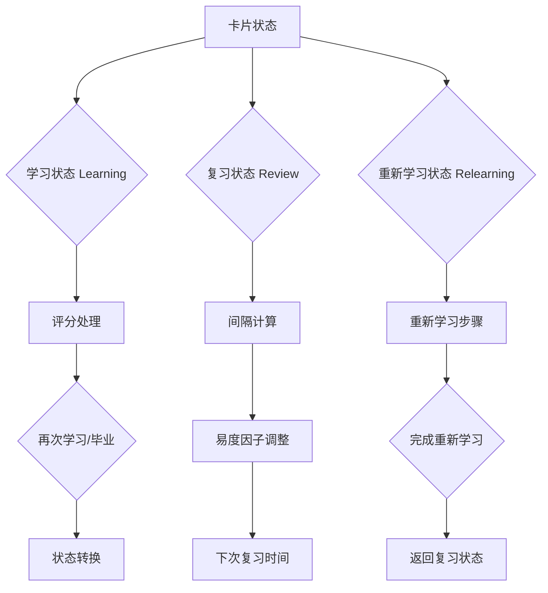

本文档详细解析NewAnki插件中SM-2间隔重复算法的完整实现。SM-2算法是SuperMemo记忆系统的核心算法，通过科学地安排复习间隔来优化记忆效果。本实现支持三种卡片状态（学习、复习、重新学习）和四种评分等级（重来、困难、良好、简单）。

## 算法核心架构

SM-2算法在NewAnki中的实现采用状态机模式，根据卡片当前状态和用户评分动态调整复习间隔。算法架构遵循以下核心流程：



Sources: [sm2.ts](src/sm2.ts#L69-L241)

## 核心数据结构

### 卡片状态与评分枚举
算法定义了三种卡片状态和四种评分等级，构成状态转换的基础：

| 状态类型 | 枚举值 | 描述 |
|---------|--------|------|
| Learning | 1 | 新卡片学习阶段 |
| Review | 2 | 正常复习阶段 |
| Relearning | 3 | 遗忘后重新学习 |

| 评分等级 | 枚举值 | 记忆难度 |
|---------|--------|----------|
| Again | 1 | 完全忘记 |
| Hard | 2 | 回忆困难 |
| Good | 3 | 正常回忆 |
| Easy | 4 | 轻松回忆 |

Sources: [models.ts](src/models.ts#L1-L12)

### 卡片数据模型
每个卡片包含完整的记忆参数，支持算法的状态追踪：

```typescript
interface CardData {
    cardId: string;           // 唯一标识
    state: State;             // 当前状态
    step: number | null;      // 学习步骤索引
    ease: number | null;      // 易度因子
    due: string;              // 下次复习时间
    currentInterval: number | null;  // 当前间隔
    // ...其他字段
}
```

Sources: [models.ts](src/models.ts#L14-L27)

## 学习状态处理逻辑

学习阶段针对新卡片，采用渐进式时间间隔：

### 学习步骤配置
```typescript
learningSteps: [1, 10]  // 分钟为单位的学习间隔
```

### 状态转换规则
- **Again（重来）**：重置到第一步，重新开始学习
- **Hard（困难）**：特殊处理第一步和最后一步的间隔
- **Good（良好）**：进入下一步，完成所有步骤后毕业
- **Easy（简单）**：直接毕业，跳过剩余学习步骤

毕业后的卡片进入复习状态，设置初始间隔和易度因子。

Sources: [sm2.ts](src/sm2.ts#L78-L118)

## 复习状态算法实现

复习阶段是SM-2算法的核心，根据记忆表现动态调整间隔：

### 间隔计算公式
| 评分 | 间隔计算公式 | 易度因子调整 |
|------|-------------|-------------|
| Again | `max(最小间隔, round(当前间隔 × 新间隔系数 × 间隔修正))` | `易度因子 × 0.8` |
| Hard | `min(最大间隔, round(当前间隔 × 困难间隔 × 间隔修正))` | `易度因子 × 0.85` |
| Good | `min(最大间隔, round(当前间隔 × 易度因子 × 间隔修正))` | 保持不变 |
| Easy | `min(最大间隔, round(当前间隔 × 易度因子 × 简单奖励 × 间隔修正))` | `易度因子 × 1.15` |

### 延迟复习补偿
当复习延迟时，算法会进行补偿计算：
- **Good评分**：`(当前间隔 + 延迟天数/2) × 易度因子`
- **Easy评分**：`(当前间隔 + 延迟天数) × 易度因子 × 简单奖励`

Sources: [sm2.ts](src/sm2.ts#L119-L186)

## 重新学习状态处理

当复习阶段选择"Again"时，卡片进入重新学习状态：

### 重新学习流程
1. 重置学习步骤，使用重新学习间隔配置
2. 完成重新学习步骤后返回复习状态
3. 保留原有的易度因子和间隔信息
4. 重新学习期间的评分处理与学习状态类似

Sources: [sm2.ts](src/sm2.ts#L187-L238)

## 间隔模糊化算法

为防止模式化记忆，算法实现了间隔模糊化：

### 模糊化规则
```typescript
const FUZZ_RANGES = [
    { start: 2.5, end: 7.0, factor: 0.15 },    // 短期间隔：15%波动
    { start: 7.0, end: 20.0, factor: 0.1 },    // 中期间隔：10%波动  
    { start: 20.0, end: Infinity, factor: 0.05 } // 长期间隔：5%波动
];
```

模糊化确保每次复习间隔有小幅随机变化，增强记忆效果。

Sources: [sm2.ts](src/sm2.ts#L20-L49)

## 预览功能实现

算法提供预览功能，显示四种评分对应的下次复习时间：

### 预览间隔格式化
```typescript
function formatInterval(minutes: number): string {
    if (minutes < 60) return `${Math.round(minutes)}分钟`;
    else if (minutes < 60*24) return `${Math.round(minutes/60)}小时`;
    else if (minutes < 60*24*30) return `${Math.round(minutes/(60*24))}天`;
    // ...更多时间单位
}
```

预览功能帮助用户了解不同评分选择的影响。

Sources: [sm2.ts](src/sm2.ts#L262-L291)

## 配置参数详解

SM-2算法的行为通过以下配置参数精细控制：

| 参数 | 默认值 | 描述 |
|------|--------|------|
| startingEase | 2.5 | 初始易度因子 |
| easyBonus | 1.3 | Easy评分的额外奖励系数 |
| intervalModifier | 1.0 | 全局间隔修正系数 |
| hardInterval | 1.2 | Hard评分的间隔系数 |
| newInterval | 0.0 | Again评分的新间隔系数 |
| minimumInterval | 1 | 最小复习间隔（天） |
| maximumInterval | 36500 | 最大复习间隔（天） |

Sources: [models.ts](src/models.ts#L52-L64)

## 算法特性总结

NewAnki的SM-2实现具有以下技术特点：

1. **完整的状态机支持**：覆盖学习、复习、重新学习全流程
2. **科学的间隔计算**：基于易度因子的指数增长模型
3. **延迟复习补偿**：智能处理逾期复习情况
4. **间隔模糊化**：防止模式化记忆，增强记忆效果
5. **高度可配置**：所有关键参数均可自定义调整
6. **预览功能**：实时显示评分选择的影响

该实现严格遵循SM-2算法的数学原理，同时针对Obsidian环境进行了优化适配，为知识记忆提供了科学有效的间隔重复解决方案。