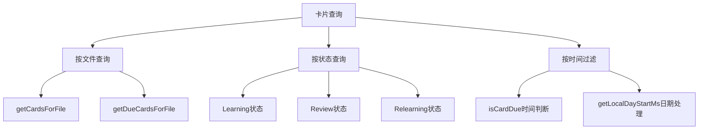

NewAnki 插件的存储与状态管理系统负责管理用户创建的卡片数据、复习进度和插件配置。该系统采用分层架构设计，通过 Obsidian 插件 API 实现数据持久化，并提供完整的状态管理功能。Sources: [store.ts](src/store.ts#L1-L11)

## 核心数据模型

NewAnki 采用类型化的数据模型来管理卡片状态和插件配置，确保数据的完整性和一致性。

### 卡片状态枚举
系统定义了三种卡片状态来跟踪学习进度：
- **Learning** (学习阶段)：新卡片的学习阶段
- **Review** (复习阶段)：已毕业卡片的定期复习
- **Relearning** (重学阶段)：遗忘卡片的重新学习

```typescript
export enum State {
    Learning = 1,
    Review = 2,
    Relearning = 3,
}
```
Sources: [models.ts](src/models.ts#L1-L5)

### 评分系统
复习评分系统采用四级评分机制，与 SM-2 算法紧密集成：
- **Again** (重来)：完全遗忘，重置学习进度
- **Hard** (困难)：记忆困难，轻微调整间隔
- **Good** (良好)：正常记忆，标准间隔增长
- **Easy** (简单)：轻松记忆，加速间隔增长

```typescript
export enum Rating {
    Again = 1,
    Hard = 2,
    Good = 3,
    Easy = 4,
}
```
Sources: [models.ts](src/models.ts#L7-L12)

### 卡片数据结构
每个卡片包含完整的元数据和复习状态信息：

| 字段 | 类型 | 描述 |
|------|------|------|
| cardId | string | 唯一标识符 |
| question | string | 问题内容 |
| answer | string | 答案内容 |
| sourceFile | string | 源文件路径 |
| lineStart | number | 起始行号 |
| lineEnd | number | 结束行号 |
| state | State | 当前状态 |
| step | number | null | 学习步骤索引 |
| ease | number | null | 难度因子 |
| due | string | 到期时间 |
| currentInterval | number | null | 当前间隔 |
| createdAt | string | 创建时间 |

```typescript
export interface CardData {
    cardId: string;
    question: string;
    answer: string;
    sourceFile: string;
    lineStart: number;
    lineEnd: number;
    state: State;
    step: number | null;
    ease: number | null;
    due: string;
    currentInterval: number | null;
    createdAt: string;
}
```
Sources: [models.ts](src/models.ts#L14-L27)

## 存储架构设计

NewAnki 采用单一存储类 `CardStore` 管理所有数据，通过 Obsidian 插件 API 实现数据持久化。

### 存储类初始化
存储类在插件加载时初始化，确保数据的一致性和默认值：

```typescript
export class CardStore {
    private plugin: Plugin;
    private data: PluginData;

    constructor(plugin: Plugin) {
        this.plugin = plugin;
        this.data = { ...DEFAULT_PLUGIN_DATA };
    }
}
```
Sources: [store.ts](src/store.ts#L4-L11)

### 数据加载与保存
系统采用懒加载策略，在需要时加载数据，并通过异步保存确保数据一致性：

```typescript
async load(): Promise<void> {
    const saved = await this.plugin.loadData();
    if (saved) {
        this.data = Object.assign({}, DEFAULT_PLUGIN_DATA, saved);
        // 数据完整性检查
        if (!this.data.cards) {
            this.data.cards = {};
        }
        if (!this.data.settings) {
            this.data.settings = { ...DEFAULT_PLUGIN_DATA.settings };
        }
    }
}

async save(): Promise<void> {
    await this.plugin.saveData(this.data);
}
```
Sources: [store.ts](src/store.ts#L13-L28)

## 状态管理功能

### 卡片查询与过滤
系统提供多种卡片查询方法，支持按文件、状态和时间进行过滤：



```typescript
// 文件级查询
getCardsForFile(filePath: string): CardData[] {
    return this.data.cards[filePath] ?? [];
}

getDueCardsForFile(filePath: string): CardData[] {
    const now = new Date();
    return this.getCardsForFile(filePath).filter((c) => this.isCardDue(c, now));
}

// 全局查询
getAllCards(): CardData[] {
    const all: CardData[] = [];
    for (const cards of Object.values(this.data.cards)) {
        all.push(...cards);
    }
    return all;
}

getAllDueCards(): CardData[] {
    const now = new Date();
    return this.getAllCards().filter((c) => this.isCardDue(c, now));
}
```
Sources: [store.ts](src/store.ts#L38-L58)

### 到期时间计算
系统采用智能的到期时间判断逻辑，区分学习阶段和复习阶段的时间处理：

```typescript
private isCardDue(card: CardData, now: Date): boolean {
    const dueMs = Date.parse(card.due);
    if (Number.isNaN(dueMs)) {
        return false;
    }

    // 复习卡片按天计算：到期日整天都显示
    if (card.state === State.Review) {
        return this.getLocalDayStartMs(new Date(dueMs)) <= this.getLocalDayStartMs(now);
    }

    // 学习/重学卡片按时间计算
    return dueMs <= now.getTime();
}

private getLocalDayStartMs(date: Date): number {
    return new Date(date.getFullYear(), date.getMonth(), date.getDate()).getTime();
}
```
Sources: [store.ts](src/store.ts#L60-L77)

## 配置管理系统

### SM-2 算法参数配置
系统提供完整的 SM-2 算法参数配置，支持高度自定义的学习策略：

| 参数 | 默认值 | 描述 |
|------|--------|------|
| learningSteps | [1, 10] | 学习步骤（分钟） |
| graduatingInterval | 1 | 毕业间隔（天） |
| easyInterval | 4 | 简单间隔（天） |
| relearningSteps | [10] | 重学步骤（分钟） |
| minimumInterval | 1 | 最小间隔（天） |
| maximumInterval | 36500 | 最大间隔（天） |
| startingEase | 2.5 | 初始难度因子 |
| easyBonus | 1.3 | 简单奖励系数 |
| intervalModifier | 1.0 | 间隔修改器 |
| hardInterval | 1.2 | 困难间隔系数 |
| newInterval | 0.0 | 遗忘后新间隔系数 |

```typescript
export interface PluginSettings {
    learningSteps: number[];
    graduatingInterval: number;
    easyInterval: number;
    relearningSteps: number[];
    minimumInterval: number;
    maximumInterval: number;
    startingEase: number;
    easyBonus: number;
    intervalModifier: number;
    hardInterval: number;
    newInterval: number;
}
```
Sources: [models.ts](src/models.ts#L38-L50)

### 配置界面集成
配置系统通过 Obsidian 设置界面提供直观的用户配置体验：

```typescript
new Setting(containerEl)
    .setName("学习步骤（分钟）")
    .setDesc("新卡片的学习步骤，用逗号分隔。例如: 1,10")
    .addText((text) =>
        text
            .setPlaceholder("1,10")
            .setValue(this.plugin.store.settings.learningSteps.join(","))
            .onChange(async (value) => {
                const steps = value
                    .split(",")
                    .map((s) => parseFloat(s.trim()))
                    .filter((n) => !isNaN(n) && n > 0);
                this.plugin.store.settings.learningSteps = steps;
                await this.plugin.store.save();
            })
    );
```
Sources: [settings.ts](src/settings.ts#L20-L35)

## 文件系统集成

### 文件变更处理
系统智能处理文件重命名和删除操作，确保卡片数据的完整性：

```typescript
async handleFileRename(oldPath: string, newPath: string): Promise<boolean> {
    let changed = false;
    const entries = Object.entries(this.data.cards);
    const oldPrefix = `${oldPath}/`;
    const newPrefix = `${newPath}/`;

    for (const [path, cards] of entries) {
        const isExact = path === oldPath;
        const isChild = path.startsWith(oldPrefix);
        if (!isExact && !isChild) continue;

        const targetPath = isExact ? newPath : path.replace(oldPrefix, newPrefix);
        const migrated = cards.map((c) => ({
            ...c,
            sourceFile: targetPath,
        }));

        if (this.data.cards[targetPath]) {
            this.data.cards[targetPath] = [
                ...this.data.cards[targetPath],
                ...migrated,
            ];
        } else {
            this.data.cards[targetPath] = migrated;
        }
        delete this.data.cards[path];
        changed = true;
    }

    if (changed) {
        await this.save();
    }
    return changed;
}
```
Sources: [store.ts](src/store.ts#L134-L167)

### 进度重置功能
支持按文件重置学习进度，便于用户重新开始学习：

```typescript
async resetReviewProgressForFile(filePath: string): Promise<number> {
    const cards = this.data.cards[filePath];
    if (!cards || cards.length === 0) return 0;

    const now = new Date().toISOString();
    this.data.cards[filePath] = cards.map((card) => ({
        ...card,
        state: State.Learning,
        step: 0,
        ease: null,
        due: now,
        currentInterval: null,
    }));
    await this.save();
    return cards.length;
}
```
Sources: [store.ts](src/store.ts#L117-L132)

## 插件集成架构

### 主插件集成
存储系统通过插件主体与 Obsidian 生态系统深度集成：

```typescript
export default class NewAnkiPlugin extends Plugin {
    store: CardStore;

    async onload(): Promise<void> {
        this.store = new CardStore(this);
        await this.store.load();
        
        // 注册各种组件和事件
        this.registerView(REVIEW_VIEW_TYPE, (leaf) => 
            new ReviewView(leaf, this.store, () => this.handleCardsChanged())
        );
        
        this.addSettingTab(new NewAnkiSettingTab(this.app, this));
    }
}
```
Sources: [main.ts](src/main.ts#L8-L20)

### 状态变更通知
系统通过回调机制实现状态变更的实时通知：

```typescript
private handleCardsChanged(): void {
    this.updateStatusBar();
    this.updateReviewAction();
    this.updateGlobalReviewRibbonBadge();
}
```
Sources: [main.ts](src/main.ts#L54-L58)

## 总结

NewAnki 的存储与状态管理系统采用了模块化、类型安全的设计理念，通过清晰的接口分离和智能的数据管理策略，为插件提供了稳定可靠的数据基础。系统的设计充分考虑了 Obsidian 插件的特性和用户的学习需求，实现了高效、灵活的数据管理解决方案。

通过继续阅读[用户界面组件](10-yong-hu-jie-mian-zu-jian)可以了解存储系统如何与前端组件交互，或查看[插件集成与事件处理](11-cha-jian-ji-cheng-yu-shi-jian-chu-li)了解更深入的系统集成细节。